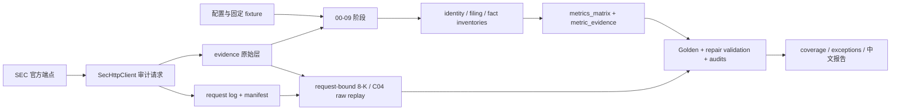
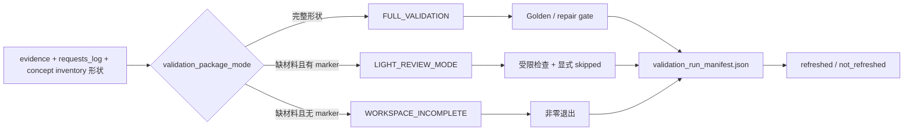

# SEC_metrics 架构说明

本文档描述当前可运行的 SEC-only 单财年指标批处理管道。它以代码、配置、测试和已落盘产物为事实依据，不把尚未启用的 vNext、Databricks、前端或数据库方案写成当前能力。

本文档不负责：

- agent 工作规则：见 `AGENTS.md`
- PR 流程：见 `PR_Checklist.md`
- 测试策略：见 `TESTING.md`
- 能力与责任边界：见 `capability_contract.json`
- 用户可见行为：见 `interact.md`
- 业务人员教学：见 `docs/business_user_guide.md`
- 标准操作流程：见 `SOP.md`

## 0. 更新触发条件

以下变化必须同步更新本文档：

- 新增、删除或重排 `scripts/00_*.py` 至 `scripts/12_*.py` 的阶段
- `scripts/sec_pipeline.py` 的调用链、状态模型、数据 schema 或最终 gate 变化
- SEC endpoint、User-Agent、限速、重试或证据落盘方式变化
- `config/` 中公司、CIK role、行业 profile 或 extractor 路由变化
- `evidence/`、`outputs/` 的权威边界或生命周期变化
- full/light validation 判定、错误模型或扩展入口变化

## 1. 系统目的与边界

SEC_metrics 是一个本地 Python CLI 批处理研究项目，面向需要复核 SEC 申报数据的分析、财务方法和审计人员。它对 `config/company_registry.csv` 中配置的逻辑公司定位最新年度申报，计算适用的财务指标，并抽取治理、风险和财年窗口事件信号。

输入包括三份配置、SEC 官方公开端点、前序阶段文件，以及测试 fixture。输出包括原始响应与请求审计、规范化 inventory、指标与证据矩阵、coverage、Golden、repair validation、分层审计和中文报告。

当前运行时不是 API、Web 前端、聊天系统、daily scheduler、报价模型、数据库服务或已切换的 vNext 发布系统。13 个阶段脚本每次只运行一个阶段；完整批次由操作者按照 `README_RUN.md` 的顺序执行。

## 2. 架构不变量

| 不变量 | 正向陈述 | 禁止情况 | Review / 自动检测 | 违反后果 |
|---|---|---|---|---|
| SEC 官方来源 | 每次显式网络请求只访问精确的 `https://www.sec.gov` 或 `https://data.sec.gov` origin，并统一经过 `SecHttpClient`；HTTP redirect 不自动跟随 | 生产脚本直连第三方数据源、绕过请求日志，或由 urllib 隐式发出未单独审计的下一跳 | 检查 `scripts/sec_urls.py`、`scripts/sec_http.py` 与 repair gate 的 SEC-only 检查 | 来源边界失真，批次不得验收 |
| 请求可审计 | 发出前验证可预知的 working/log/snapshot-root 目标，读完 body 后验证 content-hash 动态路径；immutable body/header 先完整写同目录 exclusive 临时 inode，再以 no-overwrite hardlink 发布最终名并用 descriptor 校验 regular/single-link/inode/bytes；同一 repository 的 ledger publication 在 cooperating threads / POSIX processes 间串行化，每次已发请求都记录 UTC 时间、URL、状态、用途、User-Agent、重试次数；请求后持久化失败也先写明确 failure observation 再 fail fast；严格 manifest schema、base/HEAD 每条 current/legacy row 的精确行形状、已审核 Git ledger 的有序前缀、下游 locator 与已存 sidecar 共同约束 request row 完整集合 | 已发请求零日志、并发丢行、symlink/hardlink/别名覆盖审计状态、删行或重排后重签并把旧响应重新定义为最新、畸形 JSON/CSV 冒充 exact schema，或用后续响应覆盖前次 attempt 的唯一证据 | 核对 `evidence/requests_log_manifest.json`、HEAD/base 严格行形状与有序前缀、下游反向覆盖、request log、body hash 及响应侧车 | manifest/行形状/顺序/身份/反向覆盖不一致为 FAIL；Git history baseline 或历史 bytes 缺失为 NOT_EVALUATED；批次不得验收 |
| 8-K 事件链闭合 | full validation 从 manifest 验证后的有序 request ledger 取得 request-bound 原始 bytes；mutable submissions 必须匹配同 URL/document 的最新成功 200，再由 submissions 推导 FY inventory；filing-bound hdr/primary 的所有成功 bodies 必须一致，随后重放 item 并与 `events.csv` 做 exact multiset。阶段 07 与 repair 共用 event→metric/evidence 实现，正向 count 每个组件各保留一行 filing identity，零值必须有完整 scan evidence | 回滚到旧成功 submissions 后同步缩减 inventory/events、由删减后的 events 自证完整、只保留第一个正向 evidence、伪增 value/accession，或把真实命中改成零 | `eightk_event_chain_exact_set` 与 `eightk_event_outputs_match_events` | 任一 request/submissions/filing/item/component 缺失、重复、多余、版本/身份不匹配或输出漂移均使 full gate 失败 |
| C04 双 filing 原始重放 | repair 先检查 filed `target_10k`（含 amendment），只有 AuditorName 不可用时才回退同 CIK、同期间原始 10-K；比较期间只能由同 CIK prior 定义。full validation 对当期候选 filing 与上期 10-K 分别从 request-bound accession index 重建实例文档集；filing-bound index/instance 的所有成功 bodies 必须一致，再解析官方 DEI `AuditorName`。validator 不复用生产 row builder，并对成功、缺失、冲突分支分别重建完整 metric/evidence 行 | 原始 10-K 抢先覆盖 amendment、跨 successor/predecessor CIK 拼接期间、用可缩减的 material/concept inventory 定义证据集、共享生产 builder 自证，或把降级 evidence 换成同 accession 的无关文档 | `check_c04_auditorname_all_companies` | 缺原始材料时 NOT_EVALUATED；损坏 row schema、请求版本/身份、派生输出、降级状态或 scan locator 不一致时 FAIL；真实缺失/冲突只有在正确降级且绑定对应 raw scan 时才可通过该一致性 gate |
| 配置驱动范围 | 公司身份、CIK role、行业 profile 与能力路由来自 `config/`；metrics matrix 必须等于 registry/profile/applicability contract 推导的 unique key set，coverage 必须与 matrix exact key set 对齐 | 在 `scripts/` 或 `tools/` 中按公司名、CIK、ticker、固定 accession 或固定财年日期写业务分支，或用固定行数/剩余行合法替代完整集合 | `tools/check_no_company_literals.py`、第 11 家公司 fixture 与 matrix/coverage exact-set gate | 新公司扩展需改生产分支或集合缺失/重复/多余，gate 失败 |
| 数值与证据闭合 | 可采信的非空数值状态必须追溯到 value、unit、period、accession、SEC source、concept/section 与 extraction method 均匹配的 evidence | 为填满矩阵而猜数，或只给 `(company, metric_id)` 空壳证据 | Golden、coverage join、numeric-evidence repair checks | 结果降级或最终 gate 失败 |
| 不可比必须显式降级 | 实体连续性、期间、unit、accession、context 或 dimension 不满足条件时使用明确状态与说明 | 静默跨主体、跨期间或跨口径拼接 | continuity、debt、Basel、stub-period 等 validation checks | 指标不得作为正常值发布 |
| 验证模式不冒充 | raw evidence 不完整时不得默认为 full；light 必须显式声明，否则为 `WORKSPACE_INCOMPLETE` | 把空 failure list、skipped 或 `NOT_EVALUATED` 写成 PASS | `validation_package_mode()`、五值 validation status 与 `ReportVerdictTest` | full 非零退出；light 只能给显式 caveat |
| 运行证据不复用旧文件 | reviewer 先读 `validation_run_manifest.json` 的 refreshed/not-refreshed 清单 | 因 CSV 文件存在就声称本次已刷新 | validation manifest 回归与 report freshness gate | stale artifact 不进入本次报告判定 |
| 最终态有顺序 | 从干净工作区依序完成 `00` 至 `11`，再运行 `12_validate_repair.py`；阶段 11/12 先以原子 lexical replace 写入非 symlink 的 regular report/README，确认报告 run_id/result 后才发布 terminal manifest | 把中间阶段、旧报告或仅有成功 manifest 视为最终通过 | 阶段级 report/manifest 回归；阶段 10 与 12 gate | 产物可能仍是中间态、跨 run 错配或带 P0 失败 |

适用边界：上述不变量描述当前本地批处理实现。进程内限速不等于多进程全局限速；已落盘报告也不等于独立 repair gate 已通过。

## 3. 模块职责边界

| 模块 / 目录 | 职责 | 非职责 | 依赖 |
|---|---|---|---|
| `scripts/00_*.py`—`scripts/12_*.py` | 无参数的单阶段 CLI 入口，将固定 `stage_name` 交给 `run_stage()` | 全链路编排、业务计算 | `scripts/sec_pipeline.py` |
| `scripts/sec_pipeline.py` | 当前单体内核：阶段调度、解析、计算、富化、修复、验证、审计与报告 | Web/API 服务、事务存储、分布式调度 | `config/`、本地文件、`sec_http`、`sec_urls` |
| `scripts/sec_http.py` | SEC 域名限制、进程内节流、重试、写前 containment、raw body/headers/hash、请求日志与 exact-set manifest | 跨进程限速、第三方数据、业务语义 | `config/sec_config.json`、Python 标准库 |
| `scripts/sec_urls.py` | 集中构造官方 SEC endpoint URL | 发请求、解析响应 | 显式 CIK、accession、document name |
| `scripts/git_workspace.py` | 清理会重定向仓库或 object lookup 的 Git 环境/配置，并在解析前逐级校验普通 checkout 与已登记 linked worktree 的 gitdir/commondir locator，再校验 metadata、object store 和 refs 不含检查时已存在的 symlink/alternate 借用 | Git 业务历史解释、完整仓库取证、对抗主动同 UID namespace 切换或工作树修复 | Python 标准库、Git CLI |
| `config/` | HTTP 参数、公司与 CIK role、SIC/profile 与 extractor 路由 | 运行结果或临时状态 | 人工维护与结构校验 |
| `evidence/` | 原始 SEC 响应、请求日志、请求 exact-set manifest 与响应侧车 | 指标业务结论 | `SecHttpClient` 与阶段下载逻辑 |
| `outputs/` | inventory、矩阵、证据、coverage、Golden、validation 与审计产物 | 独立于代码的永久真相源 | 前序阶段文件与当前代码版本 |
| `tools/check_no_company_literals.py` | 生产 Python identity literal 的静态扩展性 gate | 完整业务回归 | registry 与 AST 扫描 helper |
| `tools/check_capability_contract_alignment.py` | 清除仓库重定向 Git 环境变量，要求 repo root 等于实际 Git toplevel；禁用 replacement refs 后，对 HEAD regular blob、工作树 bytes、entry/Markdown anchor grammar、枚举、document path 与 `file::symbol` 做机械对齐；提供 base 时同时约束 tombstone，先验证 base/HEAD 每条 current/legacy request row 的精确行形状，再把 legacy row 独立规范化为 portable 完整字段、对 current row 执行逐字段有序前缀检查 | claim 语义或证据强度证明 | capability contract、Git object、request ledger、Markdown 与 Python AST |
| `tests/`、`tests/fixtures/` | 快速回归、篡改检测与确定性边界样本 | 替代 full evidence 或 live SEC 场景 | 临时工作区、固定 fixture、部分本地 evidence |

### 3.1 边界规则

- `sec_pipeline.py` 中的 extractor 类目前是 marker 与配置校验入口，不是具有统一 `extract()` 协议的插件对象；真实执行仍由函数和 `has_extractor(...)` 分支完成。
- 新增同行业公司应优先只改 registry 与 fixture；新增一种 extractor 能力仍需代码、registry、profile 配置和验证共同变化。
- `outputs/` 和最终报告是可再生成的派生产物。报告只解释矩阵、证据和 gate，不独立定义指标口径。
- 新写入的 locator-bearing artifact 使用 `source_url`、`repo_relative_path`、`content_sha256`、`accession` 与 `document_name`。对 filing raw material，这五项必须联合指向同一 accession/document，fallback 不得借用另一 accession 的同名同 hash 文件；多 source/accession 对单一 path/hash/document 的派生豁免只属于显式 `eightk_zero_item_scan` 产生的 `outputs/events.csv`，不允许根据字段数量猜测 artifact 类型。`evidence/requests_log.csv` 的 response body 使用同一组字段，headers 使用 `headers_repo_relative_path`；新 attempt 的 locator 指向 `evidence/request_attempts/<hash>/...` 下的 immutable copy，调用者的稳定 working path仍供当次 parser 消费。working body/header、log 与 manifest 都通过同目录 UUID exclusive 临时 inode 后 lexical replace，避免既有 hardlink 被原地改写。`evidence/requests_log_manifest.json` 绑定整份 CSV 的 row count 与 hash，client 在 append 前校验 predecessor、append 后原子刷新；validation 要求 working ledger 保留 Git HEAD 已审核 ledger 的有序前缀，并以同一严格 current-schema parser 读取 working 与 committed HEAD rows。PR checker 独立要求 base/HEAD 的每条 legacy/current row 精确同宽，再对 legacy base 规范化 portable path、hash、URL-derived accession/document、对 current base 比较完整 row，之后只允许合法尾部追加；下游 locator 与磁盘 response sidecar 提供反向覆盖。对会变化的 submissions，重放使用该受保护顺序中的最新成功 200；对 accession index、instance、hdr 与 primary filing 文档，多个成功 observation 必须只有一个 body identity。常规 client/阶段路径不会为缺 manifest 的 legacy log 自动重签；一次性 legacy bootstrap 必须在独立边界显式授权。历史 `url` / `local_path` / `source_path` / `sha256` 只作为该显式迁移或其他 artifact relocation 的 hint；读取优先当前 clone 的仓库相对路径。绝对 hint 出现多个 `evidence` / `outputs` / `tests` / `config` anchor 时，生产迁移枚举所有候选，并以当前 clone 中的 hash、URL、accession、document 和 filing directory 选择唯一身份；request body 与 headers 还必须从同一个 lexical 旧仓库根迁移，不能把两个候选根各自命中的文件拼成一条 observation。无匹配、多匹配或跨根拼接均 fail closed。PR checker 对 legacy request path 独立执行同一不变量，不复用生产选择函数。原作者机器路径绝不是权威地址；历史 attempt 若已被覆盖且记录 hash 无法对应当前 bytes，只能是 `NOT_EVALUATED_MISSING_EVIDENCE`。

## 4. 运行时调用链

```text
单阶段 wrapper
  -> sec_pipeline.run_stage(stage_name=...)
  -> 对应 stage_* 函数
  -> 配置 + 前序 CSV/JSON/XML/HTML
  -> sec_urls + SecHttpClient（阶段需要网络时）
  -> raw evidence / normalized inventory / derived outputs
  -> 后续富化、Golden、repair validation 与报告
```

| 阶段 | 主要职责 | 关键产物或结果 |
|---|---|---|
| `00`—`01` | SEC 连通性、公司与 CIK role 解析 | 请求日志、submissions、`company_resolution.csv` |
| `02`—`03` | filing 与 companyfacts inventory | `latest_filings_inventory.csv`、companyfacts inventories |
| `04` | 标准指标与初始覆盖行 | `metrics_matrix.csv`、`metric_evidence.csv` |
| `05`—`06` | accession material 下载与 XBRL/iXBRL 解析 | raw materials、instance inventories |
| `07`—`09` | 8-K、DEF 14A、MD&A/风险/行业 KPI 富化；阶段 07 将 raw filing 规范化为 event components，再由共享函数生成指标与逐组件 evidence | events、governance、risk 与更新后的矩阵/证据 |
| `10` | Golden assertions | full 模式可能联网并重写 Golden outputs；失败非零退出 |
| `11` | 先迁移 portable locator，再应用 primarily-local bounded repair，生成 coverage、审计、报告与 validation manifest；C04 repair 仅在有序本地候选均不足时条件式补抓 SEC XBRL material，full gate 则对当期/上期原始材料双重放 | 可能追加 request log/manifest、raw response、headers/hash 与 material/instance inventory；报告可以生成，即使内部 validation 存在失败 |
| `12` | 独立最终 repair gate；先以 projected terminal state 刷新报告，报告写入后再发布 manifest 终态 | P0 FAIL、workspace 不完整或 full 关键 NOT_EVALUATED 时非零退出；报告失败则 manifest 保持 `IN_PROGRESS` |

阶段依赖通过文件系统传递，没有统一 orchestrator、数据库事务、checkpoint 或跨阶段锁。多个阶段不得并发运行；同一 repository 的 `requests_log.csv` publication 由线程锁与 POSIX 进程锁串行化，但其他阶段 artifact 没有并发事务。需要可重复的完整结果时，应从干净工作区按顺序执行。

## 5. 数据流主干



验证包状态是独立子链：



## 6. 数据与状态模型

- 源响应层：`evidence/` 保存请求观察、整表 exact-set manifest、raw bytes 和 headers/hash 侧车。
- 规范化中间层：company resolution、filing、companyfacts、accession 与 instance inventories。
- 指标层：`metrics_matrix.csv` 保存 value、unit、status、formula、期间、来源类别与说明；`metric_evidence.csv` 保存逐指标 provenance。
- 解释与验证层：coverage、Golden、repair validation、implementation map、scalability audit、stratified audit 与 `validation_run_manifest.json`。manifest 只回答本次刷新范围，不恢复 runtime state；`source_commit` 后缀 `+dirty` 明示运行时工作树含未提交改动。
- 展示层：`REPORT_十公司财务指标.md` 和异常清单是派生阅读入口。

指标状态包含精确/近似/结构化/文本成功状态，以及 `NOT_AVAILABLE_SEC`、`NOT_EXTRACTED`、`NOT_MEANINGFUL`、`N_A_STRUCTURAL`、`PARSE_FAILED`、`NEEDS_REVIEW`。repair validation 另只允许 `PASS`、`FAIL`、`SKIPPED_LIGHT_PACKAGE`、`NOT_EVALUATED_MISSING_EVIDENCE`、`WORKSPACE_INCOMPLETE`；mode 和 manifest result 不复用 status 列。两类状态都不能折叠成简单的“有值/没值”或“没有发现失败”。

## 7. 错误模型

| 场景 | 当前行为 |
|---|---|
| 缺配置、缺 required key、未知 profile/extractor、非法状态或未知 stage | 抛异常并终止当前进程 |
| 关键 JSON 请求非预期 HTTP 状态 | `RuntimeError`，当前阶段失败 |
| 403、429、500、502、503、504 | 在单个 client 实例内指数退避；耗尽后返回最终状态 |
| HTTP 3xx | 禁止 urllib 自动跟随；保留首跳 body、headers、Location、`RedirectDisabled` error 与一条 observation，目标 URL 如需访问必须重新显式调用并通过官方 origin 校验 |
| response read 的 `HTTPException`（含 `IncompleteRead`）、`TimeoutError`、`URLError` 或其他 transport `OSError` | 已发 attempt 记录 `status_code=0` 与具体错误；当前不进入 HTTP 状态重试集合 |
| 可预知的 response working/log/snapshot-root 路径越界、别名或经过 symlink | transport 前 fail fast，不发请求、不改写审计文件 |
| 读取响应后才能确定的 content-hash snapshot 路径不可写 | 首次 artifact 写入前拒绝；追加 `status_code=0` persistence-failure observation 后原异常 fail fast |
| immutable 最终文件名在预检后被 symlink/hardlink 占用 | no-overwrite publication 不跟随别名，descriptor 校验失败；victim 不被覆盖，并追加 persistence-failure observation |
| request-log manifest 缺失、row count/hash/CSV 行形状不一致、HEAD 历史行缺失，或下游/sidecar observation 无反向覆盖 | manifest missing 为 `NOT_EVALUATED_MISSING_EVIDENCE`；其余完整性缺口为 FAIL；client 不允许在失配 predecessor 上继续 append |
| accession 文档非 200 | 保存请求结果，由后续阶段过滤或降级，不一定立即终止 |
| 阶段 11 补抓 AuditorName material 非 200 | 保留请求与 material 审计证据，并将相关结果降级为 `NEEDS_REVIEW`；报告构建仍可能继续 |
| 历史 request row 的 hash 无法对应 body/header | `requests_log_sec_only` 写成 `NOT_EVALUATED_MISSING_EVIDENCE`；full gate 失败，禁止把旧 observation 冒充可复现证据 |
| legacy 绝对 locator 含多个仓库 anchor | 枚举候选并要求当前 clone 联合身份唯一命中；同一 request 的 body/header 必须来自同一旧仓库根；无匹配、多匹配或跨根拼接立即失败，不猜测仓库根 |
| CSV 缺失 | `read_csv_file()` 对通用阶段仍打印提示并返回空集合；repair gate 的 required-input 与 evidence check 必须把关键缺口写成 `WORKSPACE_INCOMPLETE` 或 `NOT_EVALUATED_MISSING_EVIDENCE`，不能由空列表形成 PASS |
| 阶段中途失败 | 无通用事务回滚；request attempt 仍以日志/manifest fail-closed，请求后 persistence failure 记为 `status_code=0` observation 并保留响应 status/length/hash 诊断；其他阶段可能留下部分派生产物 |
| `11_build_report` 内部 P0 失败 | 仍生成基于本次 manifest 的 NO-GO 报告；不能替代阶段 12 |
| 阶段 11/12 报告或 README 写入失败 | validation manifest 保持 `IN_PROGRESS`，不得留下“成功 manifest + 旧/缺报告”终态 |

## 8. 外部依赖与配置

- 运行时代码当前只使用 Python 标准库与本地模块；支持边界为 POSIX 本地文件系统上的 Python 3.9+，由 `TESTING.md` 的双解释器回归维护，仓库尚无 CI 或第三方依赖清单。
- 外部网络依赖仅为 `www.sec.gov` 和 `data.sec.gov`。
- `config/sec_config.json` 管理 organization、contact email、每秒请求数、重试次数和退避初值。当前联系邮箱是示例值；live 运行前必须由运行负责人替换为有效联系信息。
- 限速状态保存在单个 `SecHttpClient` 实例中，只提供进程内 pacing，不是跨阶段进程或多进程协调器；request-ledger publication 的 POSIX 锁只防丢行，不提供全局限速，也不承诺网络文件系统锁语义。
- `config/metric_applicability.yaml` 由 `json.load` 读取，虽然后缀为 YAML，内容必须保持 JSON 兼容语法。

## 9. 扩展点

- 新增同行业公司：更新 `config/company_registry.csv` 和对应 fixture，并证明无需修改生产 pipeline。
- 新增行业 profile：更新 SIC/profile 配置、extractor 列表与相应回归。
- 新增 extractor 能力：实现代码路径、登记 marker/registry、接入 profile、更新状态/证据与 validation。
- 新增 SEC endpoint：只在 `scripts/sec_urls.py` 建模，并通过 `SecHttpClient` 请求。
- 新增字段或状态：同步 CSV schema、写入/读取方、coverage、Golden/repair checks、报告和用户文档。

## 10. 当前约束与架构债务

- `scripts/sec_pipeline.py` 是职责集中的单体流水线内核。
- extractor 只是 marker/config gate，尚未形成统一插件协议。
- 文件状态机没有通用的跨 artifact 事务或幂等保证；只有同一 repository 的 request-log CSV/manifest publication 在 cooperating threads / POSIX processes 间串行化，富化阶段的其他 evidence 追加仍可能在局部重跑时重复。
- immutable snapshot 假设一次调用期间父目录 namespace 稳定；它防预存和最终名竞态别名，但不是对抗恶意同 UID 进程的 WORM。Git workspace guard 会在 `resolve()` 前拒绝检查时已存在的 gitdir/commondir 路径 component alias，但检查与后续 Git CLI 不是同一原子操作，不宣称抵御主动同 UID 进程在两者之间切换 namespace。Git HEAD baseline 也不能恢复尚未提交、无 body 的 `status_code=0` observation 被人工删除并重新签名后的历史。
- 非 validation 的通用阶段仍可能因缺 CSV 返回空集合而把错误推迟；关键 validation 输入已由显式状态 gate 收口。
- `status_code=0` transport failure 当前不参与 retryable HTTP status 重试。
- 报告生成与最终通过判定是两个步骤，操作者必须显式运行阶段 12。
- `outputs/` 是可发布 snapshot 还是纯可再生产物，仓库尚未冻结长期生命周期策略。
- 8-K full gate 与生产路径共用 item parser；固定 hdr/primary fixture 只是已支持格式的行为锚点，不是独立的通用 SEC 文档 parser oracle。因此该 gate 能捕获 request/raw/derived 链的集合与交接漂移，但不能单独证明未见格式的解析完整性。
