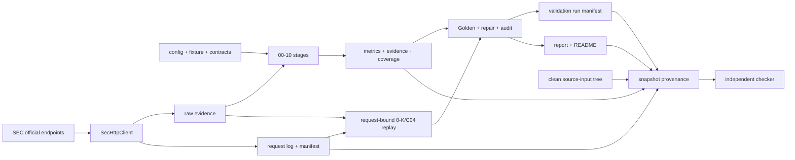

# SEC_metrics 架构说明

本文档描述当前可运行的 SEC-only 单财年指标批处理管道。它以代码、配置、测试和可复核 artifact 为事实依据，不把尚未启用的 vNext、Databricks、前端、数据库、CI 或调度方案写成当前能力。

本文档不负责：agent 规则见 `AGENTS.md`；PR 流程见 `PR_Checklist.md`；测试命令见 `TESTING.md`；能力边界见 `capability_contract.json`；用户行为见 `interact.md`；业务教学见 `docs/business_user_guide.md`；操作步骤见 `SOP.md`。

## 0. 更新触发条件

以下变化必须同步更新本文档：

- `scripts/00_*.py` 至 `scripts/12_*.py` 的阶段、wrapper 或 terminal publication 变化；
- `sec_pipeline.py` 的调用链、数据 schema、状态模型、Golden/repair/report verdict 变化；
- SEC endpoint、User-Agent、pacing、retry、redirect 或 evidence persistence 变化；
- `config/` 中公司、CIK role、profile、extractor 或指标适用性变化；
- request ledger、validation manifest、snapshot provenance 或 artifact 生命周期变化；
- full/light/workspace-incomplete 判定、错误模型、测试边界或扩展入口变化。

## 1. 系统目的与边界

SEC_metrics 是本地 Python CLI 批处理研究项目。它对 `config/company_registry.csv` 中配置的逻辑公司定位最新年度 SEC filing，计算适用财务指标，并抽取治理、风险、法律和财年窗口事件信号。

输入包括：

- HTTP、公司 registry 与指标适用性配置；
- SEC 官方公开端点；
- 前序阶段的 CSV/JSON/XML/HTML；
- Golden 与行为 fixture；
- 能力契约、指标定义和验收文档构成的 source-input closure。

输出包括：

- request ledger、整表 manifest、raw body/header attempts；
- identity、filing、companyfacts、accession 和 instance inventories；
- metrics、evidence、coverage、Golden、repair validation 与分层审计；
- validation run manifest、snapshot provenance sidecar 和中文报告。

当前运行时不是 API、Web 前端、聊天系统、daily scheduler、报价模型、数据库服务或已切换的 vNext 产品。13 个编号脚本每次只运行一个阶段；完整批次由操作者按 `README_RUN.md` 顺序执行。

## 2. 架构不变量

| 不变量 | 正向陈述 | 禁止情况 | 检测 | 违反后果 |
|---|---|---|---|---|
| SEC 官方来源 | 每次显式网络请求只访问精确 `https://www.sec.gov` 或 `https://data.sec.gov` origin，并统一经过 `SecHttpClient`；redirect 不自动跟随 | 直连第三方、绕过日志、隐式下一跳 | HTTP 单元/repair checks | 批次不得验收 |
| Request 可审计 | 每个已发 attempt 写 UTC observation；有 body 时发布 immutable body/header；CSV 与整表 manifest、Git prefix、下游 locator 和 sidecar 共同约束完整集合 | 零日志、丢行、删改/重排后重签、跨 filing 错绑、alias 覆盖 | `requests_log_sec_only`、PR checker | FAIL 或 NOT_EVALUATED；full 阻断 |
| Portable identity | locator 联合绑定 URL、repo-relative path、hash、accession、document | 绝对路径当权威、同名文件替代、跨 clone/root 拼接 | portable locator gate | FAIL/NOT_EVALUATED |
| 8-K exact chain | 从 request-bound submissions 定义财年 inventory，重放 raw hdr/primary item，与 events 和逐组件 evidence exact-set 对齐 | 用缩减后的派生文件自证、回滚旧 submissions、伪零值 | 8-K 两个 P0 gate | full FAIL |
| C04 双 filing 重放 | current candidate/prior 10-K 从 request-bound accession index 重建官方 DEI `AuditorName`；同 CIK 期间；validator 不复用生产 builder | amendment 被原始 10-K 抢先、跨 CIK、derived inventory 自证、错 locator | C04 P0 gate | FAIL/NOT_EVALUATED |
| 配置驱动范围 | 公司身份、CIK role、profile 与适用性来自 `config/`；matrix/coverage 使用配置派生 exact key set | 公司名/CIK/ticker/fixed accession/fixed date 业务分支 | AST scanner、第 11 家 fixture、exact-set gate | FAIL |
| 数值与证据闭合 | 可采信值必须匹配 value、unit、period、accession、SEC source、concept/section、method | 猜数或空壳 evidence | Golden、coverage join、numeric evidence gate | 降级或 FAIL |
| 状态不冒充 | 缺材料使用五态 validation 语义；light 不冒充 full | 空 failure list、skip/NOT_EVALUATED 写 PASS | package mode、verdict tests | 非零或 caveat |
| Manifest 控制本轮刷新 | reviewer 只把本轮 refreshed validation/audit artifact 视为新鲜 | 因旧 CSV 存在就声称本轮评估 | manifest/report tests | stale artifact 不进入 verdict |
| Snapshot 绑定 source/artifact | stage 12 成功前要求 clean source-input closure，发布 source tree digest 和关键 artifact SHA-256/size；stage 11/12 开始时删除可安全识别的旧 regular sidecar，alias/非 regular 目标提前失败 | 新报告复用旧 proof、dirty source 跑成 PASS、post-run artifact tamper、只比较 commit 字符串 | `test_validation_provenance.py`、`check_validation_snapshot.py` | stage 12 非零；manifest FAILED；report NO-GO |
| 最终态有顺序 | `00`–`11` 完成后单独运行 `12`；report/manifest/provenance 按 publication 顺序完成 | 中间产物、stage 11 exit 0 或旧 sidecar 被当作完整成功 | wrapper 与 scenario tests | 不可验收 |

进程内 pacing 不等于多进程全局限速；request-log publication lock 也不等于所有 artifact 的跨进程事务。流水线自判不替代外部接受。

## 3. 模块职责

| 模块 / 目录 | 职责 | 非职责 |
|---|---|---|
| `scripts/00_*.py`—`scripts/10_*.py` | 固定单阶段 CLI 入口，调用 `run_stage()` | 全链路编排 |
| `scripts/11_build_report.py` | 删除旧 snapshot provenance，执行 bounded repair/report stage，向生成 README 注入角色化入口 | 独立终态验收 |
| `scripts/12_validate_repair.py` | 捕获 source snapshot，执行独立 repair gate，成功后发布/自验 provenance；postflight 失败时降为 FAILED/NO-GO | 数据采集、业务计算 |
| `scripts/sec_pipeline.py` | 当前单体内核：身份、inventory、计算、富化、Golden、repair、audit、manifest、report | Web/API、分布式调度、事务数据库 |
| `scripts/sec_http.py` | 精确 SEC origin、无隐式 redirect、per-client pacing、retry、immutable attempt、request ledger/manifest、publication lock | 跨进程全局限速、业务语义 |
| `scripts/sec_urls.py` | 构造官方 endpoint | 发请求、解析响应 |
| `scripts/git_workspace.py` | 清理 Git 重定向环境；校验 checkout/object/ref 边界 | 完整 Git 取证、对抗主动同 UID TOCTOU |
| `scripts/validation_provenance.py` | source closure、tree digest、artifact digest、sidecar schema、atomic publication、independent verify、fail-closed report/manifest fallback | 业务指标正确性、外部签名/WORM |
| `tools/check_validation_snapshot.py` | 对当前 checkout 独立复核 sidecar、source tree 和 artifact bytes | 重新运行 Golden/repair |
| `tools/check_capability_contract_alignment.py` | 能力契约 path/anchor/symbol、Git blob 与 request history 机械结构检查 | claim 语义证明 |
| `tools/check_no_company_literals.py` | 生产 Python identity literal 静态 gate | 指标数值验证 |
| `config/` | HTTP、公司/CIK role、profile、extractor 与参数 | 运行结果 |
| `evidence/` | request observation、raw response、headers/hash 与 exact-set manifest | 业务结论 |
| `outputs/` | inventory、metrics、evidence、coverage、Golden、validation、audit、provenance | 脱离 source/run 的永久真相 |
| `tests/` | 快速回归、对抗篡改与 fixture | full live evidence |

### 3.1 生成型文档

`README_RUN.md` 和报告是派生产物。stage 11 仍由 `sec_pipeline.build_readme()` 生成 README，随后 wrapper 用 marker-delimited、幂等 post-processor 注入“只读结果 / 执行批次 / provenance”入口。只手改 README 会在下一次 stage 11 被覆盖。

## 4. 运行时调用链

```text
单阶段 wrapper
→ sec_pipeline.run_stage(stage_name)
→ 对应 stage_* 函数
→ config + 前序 artifact + SEC（需要网络时）
→ raw / inventory / metrics / evidence / audit
```

| 阶段 | 主要职责 | 关键产物或结果 |
|---|---|---|
| `00`–`01` | SEC 连通性、公司与 CIK role 解析 | request log、submissions、company resolution |
| `02`–`03` | filing 与 companyfacts inventory | filing inventory、companyfacts inventories |
| `04` | 标准与派生指标、初始 evidence/coverage | metrics/evidence |
| `05`–`06` | accession material 下载与 XBRL/iXBRL 解析 | raw materials、instance inventories |
| `07`–`09` | 8-K、DEF 14A、MD&A/风险/行业 KPI 富化 | events、governance、risk、更新矩阵 |
| `10` | Golden assertions | full 可能联网；失败非零 |
| `11` | invalidates old provenance；portable migration；bounded repair；报告和 README | report 可在内部 validation 失败时生成 |
| `12` | capture clean source；独立 gate；terminal report/manifest；artifact binding | 成功才发布 sidecar并 exit 0；postflight 失败降为 FAILED/NO-GO |

阶段通过文件系统 handoff，没有统一 orchestrator、数据库事务、checkpoint 或跨 artifact 通用锁。多个阶段不得并发运行。

## 5. 数据流



## 6. 状态模型

### 指标状态

精确/近似/结构化/文本成功状态，以及 `NOT_AVAILABLE_SEC`、`NOT_EXTRACTED`、`NOT_MEANINGFUL`、`N_A_STRUCTURAL`、`PARSE_FAILED`、`NEEDS_REVIEW`。

### Validation 状态

只允许：`PASS`、`FAIL`、`SKIPPED_LIGHT_PACKAGE`、`NOT_EVALUATED_MISSING_EVIDENCE`、`WORKSPACE_INCOMPLETE`。

### Manifest 状态

- mode：`FULL_VALIDATION`、`LIGHT_REVIEW_MODE`、`WORKSPACE_INCOMPLETE`
- result：`IN_PROGRESS`、`PASSED`、`PASSED_WITH_CAVEATS`、`FAILED`

manifest 只记录 run identity、mode/result 与 refreshed partition。它不再被误用为 source/artifact byte binding；该职责由 provenance sidecar承担。

### Provenance 状态

- `GIT_CLEAN`：full/本地 Git source closure clean；
- `LIGHT_PACKAGE_NO_GIT`：显式 light package 的受限 source digest；
- checker warning：commit SHA 不同但完整 source-input tree 等价；
- checker failure：sidecar/schema/identity/source/artifact 任一不一致。

## 7. Source 与 artifact binding

source closure 由 `git ls-files` 对显式 path policy 求集合；dirty detection 分别检查 unstaged、staged 与 untracked source paths。tree digest 对排序后的 `path + size + file SHA-256` records 求 SHA-256。

full artifact closure绑定 manifest、报告、README、Golden、metrics/evidence/coverage/events、request CSV/manifest，以及 manifest refreshed artifacts。light closure 绑定随包可见集合，不包含明确省略的 raw evidence。

commit SHA 是 observation，不是唯一内容 identity。stage 12 同一次运行要求 HEAD 不变；后续 artifact commit 或 merge commit 可改变 SHA，但独立 checker 只在 source tree digest/file count 相同且当前 closure clean 时允许 warning。tree 或 artifact byte 变化永远失败。

详细 schema、publication 顺序和命令见 `docs/validation_snapshot_provenance.md`。

## 8. 错误模型

| 场景 | 当前行为 |
|---|---|
| 缺配置、required key、未知 profile/extractor/stage | 抛异常并终止 |
| 非预期关键 SEC 状态 | 当前阶段失败；可降级路径按专项逻辑处理 |
| 403/429/5xx | 单 client 指数退避；耗尽后返回最终 observation |
| HTTP 3xx | 不自动跟随；保存首跳 body/header/Location/error |
| transport/read failure | `status_code=0` observation；当前不进入 HTTP-status retry set |
| request path/alias/manifest predecessor 不安全 | transport 前 fail fast |
| response persistence 失败 | 写 failure observation 后 fail fast |
| request-log manifest/shape/prefix/downstream identity 不一致 | FAIL；历史 bytes 不可恢复为 NOT_EVALUATED |
| CSV 缺失 | 通用阶段可能返回空；required-input/repair gate 必须显式收口 |
| stage 中途失败 | 无通用回滚；request publication fail-closed，其他 artifact 可能部分更新 |
| stage 11 内部 P0 失败 | 可生成 NO-GO 报告；不替代 stage 12 |
| stage 11/12 开始 | 删除可安全识别的旧 regular provenance；alias/非 regular 目标在新写入前失败 |
| source closure dirty | stage 12 在主 gate 前非零退出；不发布新 sidecar |
| stage 12 gate 失败 | 既有逻辑发布 FAILED/NO-GO；不发布 sidecar |
| gate 成功但 provenance postflight 失败 | regular sidecar 删除；unsafe alias 保持不可验收；manifest→FAILED；report→NO-GO；非零退出 |
| 当前 HEAD 与 sidecar commit 不同但 source tree 等价 | checker warning，其他检查通过时可继续 |
| source tree 或 artifact hash/size 变化 | checker FAIL；snapshot 不可验收 |

## 9. 外部依赖与配置

- 运行时代码使用 Python 标准库和本地模块；声明边界为 POSIX 本地文件系统上的 Python 3.9+。
- 网络依赖仅为 `www.sec.gov` 与 `data.sec.gov`。
- `config/sec_config.json` 管理 organization、contact email、rate、retry 和 backoff；示例身份不是 live 合规证明。
- `config/metric_applicability.yaml` 由 JSON parser 读取，必须保持 JSON-compatible。
- 当前没有 CI workflow、requirements/pyproject/tox 或数据库依赖。

## 10. 扩展点

- 新增同行业公司：更新 registry/fixture，证明无需修改生产 pipeline。
- 新增 profile/extractor：更新配置、代码、状态/evidence 与 validation。
- 新增 SEC endpoint：只在 `sec_urls.py` 建模，并通过 `SecHttpClient`。
- 新增 source 输入路径：更新 provenance closure 和负例测试。
- 新增关键 artifact：更新 manifest/refreshed policy或 artifact closure，并补删改/多余 key 测试。
- 新增字段/status：同步 schema、读写方、coverage、Golden/repair、报告和用户文档。

## 11. 当前约束与架构债务

- `sec_pipeline.py` 仍是职责集中的单体内核，extractor 仍主要是 marker/config gate。
- 没有统一 orchestrator、跨 artifact 事务或通用幂等保证；provenance 只收口终态，不回滚前序部分写入。
- validation manifest 仍是最小 run/freshness manifest；source/artifact binding 位于独立 sidecar，消费者必须运行 checker，不能只解析 manifest。
- sidecar 是仓库内自证明，不是外部签名、透明日志或 WORM；具备同时改写全部文件并重签权限的主体仍在本地信任边界内。
- Git workspace guard 与后续 Git CLI 不是同一原子系统调用；不宣称抵御恶意同 UID 进程的主动 namespace TOCTOU。
- immutable request snapshot 假设单次调用期间父目录 namespace 稳定。
- `status_code=0` transport failure 当前不参与 retryable HTTP status 重试。
- `FULL_VALIDATION` package-shape 分类仍缺少独立临时工作区单元测试。
- 尚无使用录制 SEC fixture、在临时工作区贯穿阶段 00–12 handoff 的离线端到端 scenario。
- 8-K full gate 与生产路径共用 item parser；固定 fixture 不是未见 SEC 格式的独立 parser oracle。
- 仓库没有 CI；Python 版本、快速回归、capability alignment 和 snapshot tests 依赖人工执行纪律。
