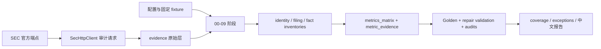
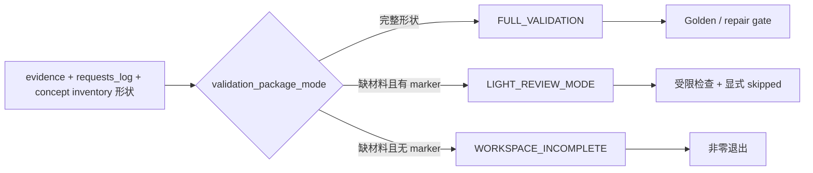

# SEC_metrics 架构说明

本文档描述当前可运行的 SEC-only 单财年指标批处理管道。它以代码、配置、测试和已落盘产物为事实依据，不把尚未启用的 vNext、Databricks、前端或数据库方案写成当前能力。

本文档不负责：

- agent 工作规则：见 `AGENTS.md`
- PR 流程：见 `PR_Checklist.md`
- 测试策略：见 `TESTING.md`
- 能力与责任边界：见 `capability_contract.json`
- 用户可见行为：见 `interact.md`
- 业务人员教学：见 `docs/business_user_guide.md`
- 标准操作流程：见 `SOP.md`

## 0. 更新触发条件

以下变化必须同步更新本文档：

- 新增、删除或重排 `scripts/00_*.py` 至 `scripts/12_*.py` 的阶段
- `scripts/sec_pipeline.py` 的调用链、状态模型、数据 schema 或最终 gate 变化
- SEC endpoint、User-Agent、限速、重试或证据落盘方式变化
- `config/` 中公司、CIK role、行业 profile 或 extractor 路由变化
- `evidence/`、`outputs/` 的权威边界或生命周期变化
- full/light validation 判定、错误模型或扩展入口变化

## 1. 系统目的与边界

SEC_metrics 是一个本地 Python CLI 批处理研究项目，面向需要复核 SEC 申报数据的分析、财务方法和审计人员。它对 `config/company_registry.csv` 中配置的逻辑公司定位最新年度申报，计算适用的财务指标，并抽取治理、风险和财年窗口事件信号。

输入包括三份配置、SEC 官方公开端点、前序阶段文件，以及测试 fixture。输出包括原始响应与请求审计、规范化 inventory、指标与证据矩阵、coverage、Golden、repair validation、分层审计和中文报告。

当前运行时不是 API、Web 前端、聊天系统、daily scheduler、报价模型、数据库服务或已切换的 vNext 发布系统。13 个阶段脚本每次只运行一个阶段；完整批次由操作者按照 `README_RUN.md` 的顺序执行。

## 2. 架构不变量

| 不变量 | 正向陈述 | 禁止情况 | Review / 自动检测 | 违反后果 |
|---|---|---|---|---|
| SEC 官方来源 | 网络请求只访问 `www.sec.gov` 与 `data.sec.gov`，并统一经过 `SecHttpClient` | 生产脚本直连第三方数据源或绕过请求日志 | 检查 `scripts/sec_urls.py`、`scripts/sec_http.py` 与 repair gate 的 SEC-only 检查 | 来源边界失真，批次不得验收 |
| 请求可审计 | 每次请求尝试记录 UTC 时间、URL、状态、用途、User-Agent、重试次数；有响应体时保存 bytes、headers 与 SHA-256 | 只保留派生数值，不保留来源响应或失败尝试 | 核对 `evidence/requests_log.csv` 及响应侧车 | 无法复现或证明来源 |
| 配置驱动范围 | 公司身份、CIK role、行业 profile 与能力路由来自 `config/` | 在 `scripts/` 或 `tools/` 中按公司名、CIK、ticker、固定 accession 或固定财年日期写业务分支 | `tools/check_no_company_literals.py` 与第 11 家公司 fixture | 新公司扩展需改生产分支，扩展性 gate 失败 |
| 数值与证据闭合 | 可采信的非空数值状态必须按 `(company, metric_id)` 追溯到 `outputs/metric_evidence.csv` | 为填满矩阵而猜数，或只给值不留 accession、期间、concept/section 与来源 | Golden、coverage join、numeric-evidence repair checks | 结果降级或最终 gate 失败 |
| 不可比必须显式降级 | 实体连续性、期间、unit、accession、context 或 dimension 不满足条件时使用明确状态与说明 | 静默跨主体、跨期间或跨口径拼接 | continuity、debt、Basel、stub-period 等 validation checks | 指标不得作为正常值发布 |
| 验证模式不冒充 | raw evidence 不完整时不得默认为 full；light 必须显式声明，否则为 `WORKSPACE_INCOMPLETE` | 用 `PASS_LIGHT_REVIEW` 或 skipped 项声称 full validation | `validation_package_mode()` 与 `LightGoldenIntegrityTest` | 非零退出或只能给受限结论 |
| 最终态有顺序 | 从干净工作区依序完成 `00` 至 `11`，再运行 `12_validate_repair.py` | 把中间阶段或仅生成报告视为最终通过 | 人工核对 `README_RUN.md`；阶段 10 与 12 gate | 产物可能仍是中间态或带 P0 失败 |

适用边界：上述不变量描述当前本地批处理实现。进程内限速不等于多进程全局限速；已落盘报告也不等于独立 repair gate 已通过。

## 3. 模块职责边界

| 模块 / 目录 | 职责 | 非职责 | 依赖 |
|---|---|---|---|
| `scripts/00_*.py`—`scripts/12_*.py` | 无参数的单阶段 CLI 入口，将固定 `stage_name` 交给 `run_stage()` | 全链路编排、业务计算 | `scripts/sec_pipeline.py` |
| `scripts/sec_pipeline.py` | 当前单体内核：阶段调度、解析、计算、富化、修复、验证、审计与报告 | Web/API 服务、事务存储、分布式调度 | `config/`、本地文件、`sec_http`、`sec_urls` |
| `scripts/sec_http.py` | SEC 域名限制、进程内节流、重试、raw body/headers/hash 与请求日志 | 跨进程限速、第三方数据、业务语义 | `config/sec_config.json`、Python 标准库 |
| `scripts/sec_urls.py` | 集中构造官方 SEC endpoint URL | 发请求、解析响应 | 显式 CIK、accession、document name |
| `config/` | HTTP 参数、公司与 CIK role、SIC/profile 与 extractor 路由 | 运行结果或临时状态 | 人工维护与结构校验 |
| `evidence/` | 原始 SEC 响应、请求日志与响应侧车 | 指标业务结论 | `SecHttpClient` 与阶段下载逻辑 |
| `outputs/` | inventory、矩阵、证据、coverage、Golden、validation 与审计产物 | 独立于代码的永久真相源 | 前序阶段文件与当前代码版本 |
| `tools/check_no_company_literals.py` | 生产 Python identity literal 的静态扩展性 gate | 完整业务回归 | registry 与 AST 扫描 helper |
| `tests/`、`tests/fixtures/` | 快速回归、篡改检测与确定性边界样本 | 替代 full evidence 或 live SEC 场景 | 临时工作区、固定 fixture、部分本地 evidence |

### 3.1 边界规则

- `sec_pipeline.py` 中的 extractor 类目前是 marker 与配置校验入口，不是具有统一 `extract()` 协议的插件对象；真实执行仍由函数和 `has_extractor(...)` 分支完成。
- 新增同行业公司应优先只改 registry 与 fixture；新增一种 extractor 能力仍需代码、registry、profile 配置和验证共同变化。
- `outputs/` 和最终报告是可再生成的派生产物。报告只解释矩阵、证据和 gate，不独立定义指标口径。
- CSV 中的 `local_path` 是生成机器的定位信息，可能含历史绝对路径；跨机器引用必须依赖 SEC URL、accession、hash 与仓库内相对证据，而不能把绝对路径当权威地址。

## 4. 运行时调用链

```text
单阶段 wrapper
  -> sec_pipeline.run_stage(stage_name=...)
  -> 对应 stage_* 函数
  -> 配置 + 前序 CSV/JSON/XML/HTML
  -> sec_urls + SecHttpClient（阶段需要网络时）
  -> raw evidence / normalized inventory / derived outputs
  -> 后续富化、Golden、repair validation 与报告
```

| 阶段 | 主要职责 | 关键产物或结果 |
|---|---|---|
| `00`—`01` | SEC 连通性、公司与 CIK role 解析 | 请求日志、submissions、`company_resolution.csv` |
| `02`—`03` | filing 与 companyfacts inventory | `latest_filings_inventory.csv`、companyfacts inventories |
| `04` | 标准指标与初始覆盖行 | `metrics_matrix.csv`、`metric_evidence.csv` |
| `05`—`06` | accession material 下载与 XBRL/iXBRL 解析 | raw materials、instance inventories |
| `07`—`09` | 8-K、DEF 14A、MD&A/风险/行业 KPI 富化 | events、governance、risk 与更新后的矩阵/证据 |
| `10` | Golden assertions | full 模式可能联网并重写 Golden outputs；失败非零退出 |
| `11` | 应用 bounded repair，生成 coverage、审计与报告；C04 AuditorName 本地材料缺失时会条件式补抓 SEC XBRL material | 可能追加 request log、raw response、headers/hash 与 material/instance inventory；报告可以生成，即使内部 validation 存在失败 |
| `12` | 独立最终 repair gate | P0 失败、workspace 不完整时非零退出 |

阶段依赖通过文件系统传递，没有统一 orchestrator、数据库事务、checkpoint 或跨阶段锁。多个阶段不得并发运行；需要可重复的完整结果时，应从干净工作区按顺序执行。

## 5. 数据流主干



验证包状态是独立子链：



## 6. 数据与状态模型

- 源响应层：`evidence/` 保存请求观察、raw bytes 和 headers/hash 侧车。
- 规范化中间层：company resolution、filing、companyfacts、accession 与 instance inventories。
- 指标层：`metrics_matrix.csv` 保存 value、unit、status、formula、期间、来源类别与说明；`metric_evidence.csv` 保存逐指标 provenance。
- 解释与验证层：coverage、Golden、repair validation、implementation map、scalability audit 与 stratified audit。
- 展示层：`REPORT_十公司财务指标.md` 和异常清单是派生阅读入口。

指标状态包含精确/近似/结构化/文本成功状态，以及 `NOT_AVAILABLE_SEC`、`NOT_EXTRACTED`、`NOT_MEANINGFUL`、`N_A_STRUCTURAL`、`PARSE_FAILED`、`NEEDS_REVIEW`。状态语义由 `scripts/sec_pipeline.py` 与 `02_指标定义_SEC_10公司单年指标.md` 共同约束，不能折叠成简单的“有值/没值”。

## 7. 错误模型

| 场景 | 当前行为 |
|---|---|
| 缺配置、缺 required key、未知 profile/extractor、非法状态或未知 stage | 抛异常并终止当前进程 |
| 关键 JSON 请求非预期 HTTP 状态 | `RuntimeError`，当前阶段失败 |
| 403、429、500、502、503、504 | 在单个 client 实例内指数退避；耗尽后返回最终状态 |
| `URLError` | 记录 `status_code=0`；当前实现不进入 HTTP 状态重试集合 |
| accession 文档非 200 | 保存请求结果，由后续阶段过滤或降级，不一定立即终止 |
| 阶段 11 补抓 AuditorName material 非 200 | 保留请求与 material 审计证据，并将相关结果降级为 `NEEDS_REVIEW`；报告构建仍可能继续 |
| CSV 缺失 | `read_csv_file()` 打印提示并返回空集合，错误可能延迟到选择器或 gate |
| 阶段中途失败 | 无事务回滚，可能留下部分 raw evidence、日志或派生产物 |
| `11_build_report` 内部 P0 失败 | 仍可能生成带失败 verdict 的报告；不能替代阶段 12 |

## 8. 外部依赖与配置

- 运行时代码当前只使用 Python 标准库与本地模块；仓库没有声明最低 Python 版本或第三方依赖清单。
- 外部网络依赖仅为 `www.sec.gov` 和 `data.sec.gov`。
- `config/sec_config.json` 管理 organization、contact email、每秒请求数、重试次数和退避初值。当前联系邮箱是示例值；live 运行前必须由运行负责人替换为有效联系信息。
- 限速状态保存在单个 `SecHttpClient` 实例中，不是跨阶段进程或多进程的全局限速。
- `config/metric_applicability.yaml` 由 `json.load` 读取，虽然后缀为 YAML，内容必须保持 JSON 兼容语法。

## 9. 扩展点

- 新增同行业公司：更新 `config/company_registry.csv` 和对应 fixture，并证明无需修改生产 pipeline。
- 新增行业 profile：更新 SIC/profile 配置、extractor 列表与相应回归。
- 新增 extractor 能力：实现代码路径、登记 marker/registry、接入 profile、更新状态/证据与 validation。
- 新增 SEC endpoint：只在 `scripts/sec_urls.py` 建模，并通过 `SecHttpClient` 请求。
- 新增字段或状态：同步 CSV schema、写入/读取方、coverage、Golden/repair checks、报告和用户文档。

## 10. 当前约束与架构债务

- `scripts/sec_pipeline.py` 是约 14k 行的单体流水线内核，职责集中。
- extractor 只是 marker/config gate，尚未形成统一插件协议。
- 文件状态机没有事务、并发锁或通用幂等保证；富化阶段的 evidence 追加可能在局部重跑时重复。
- 缺 CSV 返回空集合会把部分错误推迟到更晚的 gate。
- `URLError` 当前不参与 retryable HTTP status 重试。
- 报告生成与最终通过判定是两个步骤，操作者必须显式运行阶段 12。
- `outputs/` 是可发布 snapshot 还是纯可再生产物，仓库尚未冻结长期生命周期策略。
