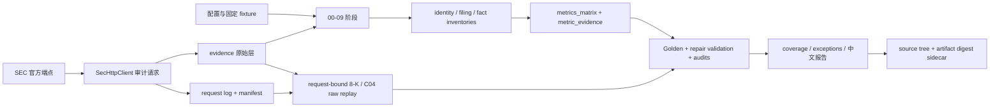
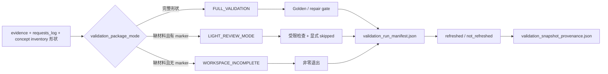

# SEC_metrics 架构说明

本文档描述当前可运行的 SEC-only 单财年批处理，以及已经由 recorded tests 证明但尚未切流的 vNext shadow 原语。它以代码、配置、测试和已落盘产物为事实依据，不把 vNext shadow 写成 active Cutover，也不把 Databricks、前端或数据库方案写成当前能力。

本文档不负责：

- agent 工作规则：见 `AGENTS.md`
- PR 流程：见 `PR_Checklist.md`
- 测试策略：见 `TESTING.md`
- 能力与责任边界：见 `capability_contract.json`
- 用户可见行为：见 `interact.md`
- 业务人员教学：见 `docs/business_user_guide.md`
- 标准操作流程：见 `SOP.md`

## 0. 更新触发条件

以下变化必须同步更新本文档：

- 新增、删除或重排 `scripts/00_*.py` 至 `scripts/12_*.py` 的阶段
- `scripts/sec_pipeline.py` 的调用链、状态模型、数据 schema 或最终 gate 变化
- SEC endpoint、User-Agent、限速、重试或证据落盘方式变化
- `config/` 中公司、CIK role、行业 profile 或 extractor 路由变化
- `evidence/`、`outputs/` 的权威边界或生命周期变化
- validation manifest、snapshot provenance、artifact publication 或 full/light 判定变化
- Requirement Snapshot、MetricSpec、vNext object/state、Review/freeze/replay、Projector 或 publication transaction 原语变化
- 错误模型、测试边界或扩展入口变化

## 1. 系统目的与边界

SEC_metrics 是一个本地 Python CLI 批处理研究项目，面向需要复核 SEC 申报数据的分析、财务方法和审计人员。它对 `config/company_registry.csv` 中配置的逻辑公司定位最新年度申报，计算适用的财务指标，并抽取治理、风险和财年窗口事件信号。

输入包括三份配置、SEC 官方公开端点、前序阶段文件，以及测试 fixture。输出包括原始响应与请求审计、规范化 inventory、指标与证据矩阵、coverage、Golden、repair validation、分层审计、validation run manifest、成功终态的 snapshot provenance sidecar 和中文报告。

当前运行时不是 API、Web 前端、聊天系统、daily scheduler、报价模型、数据库服务或已切换的 vNext 发布系统。13 个阶段脚本每次只运行一个阶段；完整批次由操作者按照 `README_RUN.md` 的顺序执行。

## 2. 架构不变量

| 不变量 | 正向陈述 | 禁止情况 | Review / 自动检测 | 违反后果 |
|---|---|---|---|---|
| SEC 官方来源 | 每次显式网络请求只访问精确的 `https://www.sec.gov` 或 `https://data.sec.gov` origin，并统一经过 `SecHttpClient`；HTTP redirect 不自动跟随 | 生产脚本直连第三方数据源、绕过请求日志，或由 urllib 隐式发出未单独审计的下一跳 | 检查 `scripts/sec_urls.py`、`scripts/sec_http.py` 与 repair gate 的 SEC-only 检查 | 来源边界失真，批次不得验收 |
| 请求可审计 | 发出前验证可预知的 working/log/snapshot-root 目标，读完 body 后验证 content-hash 动态路径；immutable body/header 先完整写同目录 exclusive 临时 inode，再以 no-overwrite hardlink 发布最终名并用 descriptor 校验 regular/single-link/inode/bytes；同一 repository 的 ledger publication 在 cooperating threads / POSIX processes 间串行化，每次已发请求都记录 UTC 时间、URL、状态、用途、User-Agent、重试次数；请求后持久化失败也先写明确 failure observation 再 fail fast；严格 manifest schema、base/HEAD 每条 current/legacy row 的精确行形状、已审核 Git ledger 的有序前缀、下游 locator 与已存 sidecar 共同约束 request row 完整集合；legacy locator 总是优先按 ledger body hash 解析 content-addressed body，同 body 多 attempt 以不晚于 ledger timestamp 的最新 `saved_at_utc` 归属 single-link regular headers sidecar；snapshot body 不存在才验证原 working pair，body 存在但身份错误、header 缺失/歧义、reserved namespace 大小写别名及 snapshot 内 symlink/hardlink 均不得回退 | 已发请求零日志、并发丢行、symlink/hardlink/别名覆盖审计状态、删行或重排后重签并把旧响应重新定义为最新、畸形 JSON/CSV 冒充 exact schema，用后续响应覆盖前次 attempt 的唯一证据，或对缺失/歧义的历史 snapshot 猜测候选 | 核对 `evidence/requests_log_manifest.json`、HEAD/base 严格行形状与有序前缀、下游反向覆盖、request log、body hash 及响应侧车 | manifest/行形状/顺序/身份/反向覆盖不一致为 FAIL；Git history baseline 或历史 bytes 缺失为 NOT_EVALUATED；批次不得验收 |
| 8-K 事件链闭合 | full validation 从 manifest 验证后的有序 request ledger 取得 request-bound 原始 bytes；mutable submissions 必须匹配同 URL/document 的最新成功 200，再由 submissions 推导 FY inventory；filing-bound hdr/primary 的所有成功 bodies 必须一致，随后重放 item 并与 `events.csv` 做 exact multiset。阶段 07 与 repair 共用 event→metric/evidence 实现，正向 count 每个组件各保留一行 filing identity，零值必须有完整 scan evidence | 回滚到旧成功 submissions 后同步缩减 inventory/events、由删减后的 events 自证完整、只保留第一个正向 evidence、伪增 value/accession，或把真实命中改成零 | `eightk_event_chain_exact_set` 与 `eightk_event_outputs_match_events` | 任一 request/submissions/filing/item/component 缺失、重复、多余、版本/身份不匹配或输出漂移均使 full gate 失败 |
| C04 双 filing 原始重放 | repair 先检查 filed `target_10k`（含 amendment），只有 AuditorName 不可用时才回退同 CIK、同期间原始 10-K；比较期间只能由同 CIK prior 定义。full validation 对当期候选 filing 与上期 10-K 分别从 request-bound accession index 重建实例文档集；filing-bound index/instance 的所有成功 bodies 必须一致，再解析官方 DEI `AuditorName`。validator 不复用生产 row builder，并对成功、缺失、冲突分支分别重建完整 metric/evidence 行 | 原始 10-K 抢先覆盖 amendment、跨 successor/predecessor CIK 拼接期间、用可缩减的 material/concept inventory 定义证据集、共享生产 builder 自证，或把降级 evidence 换成同 accession 的无关文档 | `check_c04_auditorname_all_companies` | 缺原始材料时 NOT_EVALUATED；损坏 row schema、请求版本/身份、派生输出、降级状态或 scan locator 不一致时 FAIL；真实缺失/冲突只有在正确降级且绑定对应 raw scan 时才可通过该一致性 gate |
| 配置驱动范围 | 公司身份、CIK role、行业 profile 与能力路由来自 `config/`；metrics matrix 必须等于 registry/profile/applicability contract 推导的 unique key set，coverage 必须与 matrix exact key set 对齐 | 在 `scripts/` 或 `tools/` 中按公司名、CIK、ticker、固定 accession 或固定财年日期写业务分支，或用固定行数/剩余行合法替代完整集合 | `tools/check_no_company_literals.py`、第 11 家公司 fixture 与 matrix/coverage exact-set gate | 新公司扩展需改生产分支或集合缺失/重复/多余，gate 失败 |
| 数值与证据闭合 | 可采信的非空数值状态必须追溯到 value、unit、period、accession、SEC source、concept/section 与 extraction method 均匹配的 evidence | 为填满矩阵而猜数，或只给 `(company, metric_id)` 空壳证据 | Golden、coverage join、numeric-evidence repair checks | 结果降级或最终 gate 失败 |
| 不可比必须显式降级 | 实体连续性、期间、unit、accession、context 或 dimension 不满足条件时使用明确状态与说明 | 静默跨主体、跨期间或跨口径拼接 | continuity、debt、Basel、stub-period 等 validation checks | 指标不得作为正常值发布 |
| 验证模式不冒充 | raw evidence 不完整时不得默认为 full；light 必须显式声明，否则为 `WORKSPACE_INCOMPLETE` | 把空 failure list、skipped 或 `NOT_EVALUATED` 写成 PASS | `validation_package_mode()`、五值 validation status 与 `ReportVerdictTest` | full 非零退出；light 只能给显式 caveat |
| 运行证据不复用旧文件 | reviewer 先读 `validation_run_manifest.json` 的 refreshed/not-refreshed 清单 | 因 CSV 文件存在就声称本次已刷新 | validation manifest 回归与 report freshness gate | stale artifact 不进入本次报告判定 |
| Validation snapshot 与 source/artifact bytes 绑定 | `config/validation_source_policy.json` 分类 runtime/acceptance source、full artifact directory 与非 source 文档角色；stage 11/12 开始时使旧 provenance sidecar 失效；stage 12 只有在 policy 与 SOP 权威引用对齐、source-input closure clean、terminal manifest 成功、核心 artifact 与 full `evidence/request_attempts/` recursive exact set 的 SHA-256/size sidecar 原子发布并从磁盘自验成功后才返回零。无 Git light 包仍要求全部显式 acceptance source 文件存在 | 用旧 success sidecar证明新报告；只比较 commit 字符串；让权威运行文档落在 closure 外；把解释性文档作为 SOP 权威；删除治理/契约文件缩小 light source closure；运行后删除、新增、篡改或 alias policy-bound request attempt；postflight 失败仍保留 PASSED/GO | `tests/test_validation_provenance.py`、`tests/test_validation_provenance_light_package.py`、`tools/check_validation_snapshot.py` | policy/SOP role、source/tree/file-count、manifest identity、artifact exact key/hash/size/single-link 或 publication 任一失配均使 snapshot 不可验收；postflight 尝试降为 FAILED/NO-GO并非零退出 |
| 最终态有顺序 | 从干净工作区依序完成 `00` 至 `11`，再运行 `12_validate_repair.py`；阶段 11/12 先以原子 lexical replace 写入非 symlink 的 regular report/README，确认报告 run_id/result 后才发布 terminal manifest；stage 12 随后发布 provenance | 把中间阶段、旧报告、仅有成功 manifest 或缺 provenance 的结果视为最终通过 | 阶段级 report/manifest 回归；阶段 10/12 gate；snapshot checker | 产物可能仍是中间态、跨 run 错配、带 P0 失败或未经 byte binding |

适用边界：上述不变量描述当前本地批处理实现。进程内限速不等于多进程全局限速；已落盘报告也不等于独立 repair gate 与 snapshot checker 已通过。

## 3. 模块职责边界

| 模块 / 目录 | 职责 | 非职责 | 依赖 |
|---|---|---|---|
| `scripts/00_*.py`—`scripts/10_*.py` | 无参数的单阶段 CLI 入口，将固定 `stage_name` 交给 `run_stage()` | 全链路编排、业务计算 | `scripts/sec_pipeline.py` |
| `scripts/11_build_report.py` | 使旧 provenance 失效，运行 stage 11，并对生成的 README/report 注入稳定验收入口 | 最终通过证明、独立 repair gate | `scripts/sec_pipeline.py`、`scripts/validation_provenance.py` |
| `scripts/12_validate_repair.py` | 在 clean source snapshot 上执行 stage 12，随后发布并自验 provenance；postflight 异常 fail closed | live 数据采集、外部审计接受 | `scripts/sec_pipeline.py`、`scripts/validation_provenance.py` |
| `scripts/sec_pipeline.py` | 当前单体内核：阶段调度、解析、计算、富化、修复、验证、审计与报告 | Web/API 服务、事务存储、分布式调度 | `config/`、本地文件、`sec_http`、`sec_urls` |
| `scripts/sec_http.py` | SEC 域名限制、进程内节流、重试、写前 containment、raw body/headers/hash、请求日志与 exact-set manifest | 跨进程限速、第三方数据、业务语义 | `config/sec_config.json`、Python 标准库 |
| `scripts/sec_urls.py` | 集中构造官方 SEC endpoint URL | 发请求、解析响应 | 显式 CIK、accession、document name |
| `scripts/git_workspace.py` | 清理会重定向仓库或 object lookup 的 Git 环境/配置，并在解析前逐级校验普通 checkout 与已登记 linked worktree 的 gitdir/commondir locator，再校验 metadata、object store 和 refs 不含检查时已存在的 symlink/alternate 借用 | Git 业务历史解释、完整仓库取证、对抗主动同 UID namespace 切换或工作树修复 | Python 标准库、Git CLI |
| `scripts/validation_provenance.py` | 读取并验证 source policy、检查 SOP 权威引用角色、捕获 tree identity，原子发布/验证 sidecar，并执行 terminal fail-closed rewrite | 指标业务正确性、外部签名或 WORM | Git workspace、Python 标准库、source policy、manifest/report/artifact files |
| `config/` | HTTP 参数、公司与 CIK role、SIC/profile 与 extractor 路由，以及 validation source/document/full-artifact role policy | 运行结果或临时状态 | 人工维护、结构校验与 provenance policy loader |
| `evidence/` | 原始 SEC 响应、请求日志、请求 exact-set manifest 与响应侧车 | 指标业务结论 | `SecHttpClient` 与阶段下载逻辑 |
| `outputs/` | inventory、矩阵、证据、coverage、Golden、validation、审计与 snapshot provenance | 独立于代码的永久真相源 | 前序阶段文件与当前代码版本 |
| `tools/check_validation_snapshot.py` | 只读验证 manifest、source tree 与 artifact digest sidecar | 生成、修复、重签或替代 Golden/repair | `scripts/validation_provenance.py` |
| `tools/check_no_company_literals.py` | 生产 Python identity literal 的静态扩展性 gate | 完整业务回归 | registry 与 AST 扫描 helper |
| `tools/check_capability_contract_alignment.py` | 清除仓库重定向 Git 环境变量，要求 repo root 等于实际 Git toplevel；禁用 replacement refs 后，对 HEAD regular blob、工作树 bytes、entry/Markdown anchor grammar、枚举、document path 与 `file::symbol` 做机械对齐；提供 base 时同时约束 tombstone，先验证 base/HEAD 每条 current/legacy request row 的精确行形状，再把 legacy row 独立规范化为 portable 完整字段、对 current row 执行逐字段有序前缀检查 | claim 语义或证据强度证明 | capability contract、Git object、request ledger、Markdown 与 Python AST |
| `tests/`、`tests/fixtures/` | 快速回归、篡改检测与确定性边界样本 | 替代 full evidence 或 live SEC 场景 | 临时工作区、固定 fixture、部分本地 evidence |

### 3.1 边界规则

- `sec_pipeline.py` 中的 extractor 类目前是 marker 与配置校验入口，不是具有统一 `extract()` 协议的插件对象；真实执行仍由函数和 `has_extractor(...)` 分支完成。
- 新增同行业公司应优先只改 registry 与 fixture；新增一种 extractor 能力仍需代码、registry、profile 配置和验证共同变化。
- `outputs/` 和最终报告是可再生成的派生产物。报告只解释矩阵、证据和 gate，不独立定义指标口径或成功状态。
- 新写入的 locator-bearing artifact 使用 `source_url`、`repo_relative_path`、`content_sha256`、`accession` 与 `document_name`。对 filing raw material，这五项必须联合指向同一 accession/document，fallback 不得借用另一 accession 的同名同 hash 文件；多 source/accession 对单一 path/hash/document 的派生豁免只属于显式 `eightk_zero_item_scan` 产生的 `outputs/events.csv`，不允许根据字段数量猜测 artifact 类型。`evidence/requests_log.csv` 的 response body 使用同一组字段，headers 使用 `headers_repo_relative_path`；新 attempt 的 locator 指向 `evidence/request_attempts/<hash>/...` 下的 immutable copy，调用者的稳定 working path仍供当次 parser 消费。working body/header、log 与 manifest 都通过同目录 UUID exclusive 临时 inode 后 lexical replace，避免既有 hardlink 被原地改写。`evidence/requests_log_manifest.json` 绑定整份 CSV 的 row count 与 hash，client 在 append 前校验 predecessor、append 后原子刷新；validation 要求 working ledger 保留 Git HEAD 已审核 ledger 的有序前缀，并以同一严格 current-schema parser 读取 working 与 committed HEAD rows。PR checker 独立要求 base/HEAD 的每条 legacy/current row 精确同宽，再对 legacy base 规范化 portable path、hash、URL-derived accession/document、对 current base 比较完整 row，之后只允许合法尾部追加；下游 locator 与磁盘 response sidecar 提供反向覆盖。对会变化的 submissions，重放使用该受保护顺序中的最新成功 200；对 accession index、instance、hdr 与 primary filing 文档，多个成功 observation 必须只有一个 body identity。常规 client/阶段路径不会为缺 manifest 的 legacy log 自动重签；一次性 legacy bootstrap 必须在独立边界显式授权。历史 `url` / `local_path` / `source_path` / `sha256` 只作为该显式迁移或其他 artifact relocation 的 hint；读取优先当前 clone 的仓库相对路径。绝对 hint 出现多个 `evidence` / `outputs` / `tests` / `config` anchor 时，生产迁移枚举所有候选，并以当前 clone 中的 hash、URL、accession、document 和 filing directory 选择唯一身份；request body 与 headers 还必须从同一个 lexical 旧仓库根迁移，不能把两个候选根各自命中的文件拼成一条 observation。无匹配、多匹配或跨根拼接均 fail closed。PR checker 对 legacy request path 独立执行同一不变量，不复用生产选择函数。原作者机器路径绝不是权威地址；历史 attempt 若已被覆盖且记录 hash 无法对应当前 bytes，只能是 `NOT_EVALUATED_MISSING_EVIDENCE`。

## 4. 运行时调用链

```text
单阶段 wrapper
  -> sec_pipeline.run_stage(stage_name=...)
  -> 对应 stage_* 函数
  -> 配置 + 前序 CSV/JSON/XML/HTML
  -> sec_urls + SecHttpClient（阶段需要网络时）
  -> raw evidence / normalized inventory / derived outputs
  -> 后续富化、Golden、repair validation 与报告
```

| 阶段 | 主要职责 | 关键产物或结果 |
|---|---|---|
| `00`—`01` | SEC 连通性、公司与 CIK role 解析 | 请求日志、submissions、`company_resolution.csv` |
| `02`—`03` | filing 与 companyfacts inventory | `latest_filings_inventory.csv`、companyfacts inventories |
| `04` | 标准指标与初始覆盖行 | `metrics_matrix.csv`、`metric_evidence.csv` |
| `05`—`06` | accession material 下载与 XBRL/iXBRL 解析 | raw materials、instance inventories |
| `07`—`09` | 8-K、DEF 14A、MD&A/风险/行业 KPI 富化；阶段 07 将 raw filing 规范化为 event components，再由共享函数生成指标与逐组件 evidence | events、governance、risk 与更新后的矩阵/证据 |
| `10` | Golden assertions | full 模式可能联网并重写 Golden outputs；失败非零退出 |
| `11` | 先使旧 provenance 失效，再迁移 portable locator、应用 primarily-local bounded repair，生成 coverage、审计、报告与 validation manifest；C04 repair 仅在有序本地候选均不足时条件式补抓 SEC XBRL material | 可能追加 request log/manifest、raw response、headers/hash 与 material/instance inventory；报告可以生成，即使内部 validation 存在失败；不会发布新的 success provenance |
| `12` | 捕获 clean source snapshot，执行独立最终 repair gate；报告写入后发布 manifest 终态，再发布并自验 provenance | P0 FAIL、workspace 不完整、full 关键 NOT_EVALUATED 或 provenance postflight 失败时非零退出；报告失败则 manifest 保持 `IN_PROGRESS`，postflight 失败则尝试降为 `FAILED/NO-GO` |

阶段依赖通过文件系统传递，没有统一 orchestrator、数据库事务、checkpoint 或跨阶段锁。多个阶段不得并发运行；同一 repository 的 `requests_log.csv` publication 由线程锁与 POSIX 进程锁串行化，但其他阶段 artifact 没有并发事务。需要可重复的完整结果时，应从干净工作区按顺序执行。

## 5. 数据流主干


```mermaid
flowchart LR
    Config["配置与固定 fixture"] --> Stages["00-09 阶段"]
    SEC["SEC 官方端点"] --> HTTP["SecHttpClient 审计请求"]
    HTTP --> Raw["evidence 原始层"]
    HTTP --> Ledger["request log + manifest"]
    Raw --> Stages
    Stages --> Inventory["identity / filing / fact inventories"]
    Inventory --> Matrix["metrics_matrix + metric_evidence"]
    Ledger --> Replay["request-bound 8-K / C04 raw replay"]
    Raw --> Replay
    Replay --> Gates
    Matrix --> Gates["Golden + repair validation + audits"]
    Gates --> Report["coverage / exceptions / 中文报告"]
    Report --> Provenance["source tree + artifact digest sidecar"]
```

验证包状态是独立子链：


```mermaid
flowchart LR
    Shape["evidence + requests_log + concept inventory 形状"] --> Mode{"validation_package_mode"}
    Mode -->|完整形状| Full["FULL_VALIDATION"]
    Mode -->|缺材料且有 marker| Light["LIGHT_REVIEW_MODE"]
    Mode -->|缺材料且无 marker| Broken["WORKSPACE_INCOMPLETE"]
    Full --> Gate["Golden / repair gate"]
    Light --> Limited["受限检查 + 显式 skipped"]
    Broken --> Fail["非零退出"]
    Gate --> Manifest["validation_run_manifest.json"]
    Limited --> Manifest
    Fail --> Manifest
    Manifest --> Fresh["refreshed / not_refreshed"]
    Fresh --> Snapshot["validation_snapshot_provenance.json"]
```

## 6. 数据与状态模型

- 源响应层：`evidence/` 保存请求观察、整表 exact-set manifest、raw bytes 和 headers/hash 侧车。
- 规范化中间层：company resolution、filing、companyfacts、accession 与 instance inventories。
- 指标层：`metrics_matrix.csv` 保存 value、unit、status、formula、期间、来源类别与说明；`metric_evidence.csv` 保存逐指标 provenance。
- 解释与验证层：coverage、Golden、repair validation、implementation map、scalability audit、stratified audit 与 `validation_run_manifest.json`。manifest 只回答本次刷新范围，不恢复 runtime state；`source_commit` 后缀 `+dirty` 明示运行时整个工作树含未提交改动。
- Snapshot provenance 层：`config/validation_source_policy.json` 是 source/document/full-artifact 角色真相源；policy 文件自身始终进入 closure，不能通过从 runtime 目录移除 `config/` 来自我排除。成功 stage 12 的 `validation_snapshot_provenance.json` 记录 source checkout 状态、source commit、deterministic source tree digest/file count，以及 manifest/report/README、核心业务 artifact、request ledger、本轮 refreshed validation artifact 和 full `evidence/request_attempts/` recursive exact set 的 SHA-256/size。它与 manifest 职责分离。
- 展示层：`REPORT_十公司财务指标.md` 和异常清单是派生阅读入口。

指标状态包含精确/近似/结构化/文本成功状态，以及 `NOT_AVAILABLE_SEC`、`NOT_EXTRACTED`、`NOT_MEANINGFUL`、`N_A_STRUCTURAL`、`PARSE_FAILED`、`NEEDS_REVIEW`。repair validation 另只允许 `PASS`、`FAIL`、`SKIPPED_LIGHT_PACKAGE`、`NOT_EVALUATED_MISSING_EVIDENCE`、`WORKSPACE_INCOMPLETE`；mode 和 manifest result 不复用 status 列。两类状态都不能折叠成简单的“有值/没值”或“没有发现失败”。

## 7. 错误模型

| 场景 | 当前行为 |
|---|---|
| 缺配置、缺 required key、未知 profile/extractor、非法状态或未知 stage | 抛异常并终止当前进程 |
| 关键 JSON 请求非预期 HTTP 状态 | `RuntimeError`，当前阶段失败 |
| 403、429、500、502、503、504 | 在单个 client 实例内指数退避；耗尽后返回最终状态 |
| HTTP 3xx | 禁止 urllib 自动跟随；保留首跳 body、headers、Location、`RedirectDisabled` error 与一条 observation，目标 URL 如需访问必须重新显式调用并通过官方 origin 校验 |
| response read 的 `HTTPException`（含 `IncompleteRead`）、`TimeoutError`、`URLError` 或其他 transport `OSError` | 已发 attempt 记录 `status_code=0` 与具体错误；当前不进入 HTTP 状态重试集合 |
| 可预知的 response working/log/snapshot-root 路径越界、别名或经过 symlink | transport 前 fail fast，不发请求、不改写审计文件 |
| 读取响应后才能确定的 content-hash snapshot 路径不可写 | 首次 artifact 写入前拒绝；追加 `status_code=0` persistence-failure observation 后原异常 fail fast |
| immutable 最终文件名在预检后被 symlink/hardlink 占用 | no-overwrite publication 不跟随别名，descriptor 校验失败；victim 不被覆盖，并追加 persistence-failure observation |
| request-log manifest 缺失、row count/hash/CSV 行形状不一致、HEAD 历史行缺失，或下游/sidecar observation 无反向覆盖 | manifest missing 为 `NOT_EVALUATED_MISSING_EVIDENCE`；其余完整性缺口为 FAIL；client 不允许在失配 predecessor 上继续 append |
| accession 文档非 200 | 保存请求结果，由后续阶段过滤或降级，不一定立即终止 |
| 阶段 11 补抓 AuditorName material 非 200 | 保留请求与 material 审计证据，并将相关结果降级为 `NEEDS_REVIEW`；报告构建仍可能继续 |
| 历史 request row 的 working path 已被覆盖 | legacy locator 优先查找 exact content-addressed pair；同 body 多 attempt 只取不晚于 ledger timestamp 的最新匹配 `saved_at_utc`。snapshot body 不存在时才验证原 working pair；body 存在但 header 缺失为 `NOT_EVALUATED_MISSING_EVIDENCE`，body identity 错、多条同时间匹配、大小写 namespace alias、symlink 或 hardlink 为 FAIL，禁止猜测或重新请求来冒充旧证据 |
| legacy 绝对 locator 含多个仓库 anchor | 枚举候选并要求当前 clone 联合身份唯一命中；同一 request 的 body/header 必须来自同一旧仓库根；无匹配、多匹配或跨根拼接立即失败，不猜测仓库根 |
| CSV 缺失 | `read_csv_file()` 对通用阶段仍打印提示并返回空集合；repair gate 的 required-input 与 evidence check 必须把关键缺口写成 `WORKSPACE_INCOMPLETE` 或 `NOT_EVALUATED_MISSING_EVIDENCE`，不能由空列表形成 PASS |
| source policy schema/角色重叠、SOP 权威引用未分类或引用解释性非权威文件 | 在 source capture 前失败；不得以 Python allowlist 漏扫或文档身份含混继续 |
| stage 12 source-input closure dirty、显式 acceptance source 文件缺失、symlink 或 Git metadata 不可信 | 在运行主 gate 前失败；无 Git 仅允许显式 light package，且不能通过删文件缩小 source closure |
| provenance sidecar 缺失、schema/run/manifest identity 不一致，或 source tree/file count、artifact key/hash/size 失配 | 独立 checker 非零退出；结果不能作为当前 checkout 的可验收 snapshot |
| provenance postflight 在 terminal manifest/report 成功后失败 | 删除可安全识别的 sidecar，尝试把 manifest 改为 `FAILED`、报告改为 `NO-GO`，随后非零退出；其他已写 artifact 不做通用事务回滚 |
| 阶段中途失败 | 无通用事务回滚；request attempt 仍以日志/manifest fail-closed，请求后 persistence failure 记为 `status_code=0` observation 并保留响应 status/length/hash 诊断；其他阶段可能留下部分派生产物 |
| `11_build_report` 内部 P0 失败 | 仍生成基于本次 manifest 的 NO-GO 报告；不能替代阶段 12 |
| 阶段 11/12 报告或 README 写入失败 | validation manifest 保持 `IN_PROGRESS`，不得留下“成功 manifest + 旧/缺报告”终态 |

## 8. 外部依赖与配置

- 运行时代码当前只使用 Python 标准库与本地模块；支持边界为 POSIX 本地文件系统上的 Python 3.9+，由 `TESTING.md` 的双解释器回归维护，仓库尚无 CI 或第三方依赖清单。
- 外部网络依赖仅为 `www.sec.gov` 和 `data.sec.gov`。
- `config/sec_config.json` 管理 organization、contact email、每秒请求数、重试次数和退避初值。`SecHttpClient` 与 acceptance runner 共用同一个 identity validator：organization 必须是非空文字，邮箱必须具有基本合法的 dotted domain 且不能使用 example 域。当前联系邮箱是示例值；live 运行前必须由运行负责人替换为有效联系信息。
<!-- capability-anchor: BEHAVIOR.sec_identity_shared_fail_fast -->
- 限速状态保存在单个 `SecHttpClient` 实例中，只提供进程内 pacing，不是跨阶段进程或多进程协调器；request-ledger publication 的 POSIX 锁只防丢行，不提供全局限速，也不承诺网络文件系统锁语义。
- `config/metric_applicability.yaml` 由 `json.load` 读取，虽然后缀为 YAML，内容必须保持 JSON 兼容语法。

## 9. 扩展点

- 新增同行业公司：更新 `config/company_registry.csv` 和对应 fixture，并证明无需修改生产 pipeline。
- 新增行业 profile：更新 SIC/profile 配置、extractor 列表与相应回归。
- 新增 extractor 能力：实现代码路径、登记 marker/registry、接入 profile、更新状态/证据与 validation。
- 新增 SEC endpoint：只在 `scripts/sec_urls.py` 建模，并通过 `SecHttpClient` 请求。
- 新增字段或状态：同步 CSV schema、写入/读取方、coverage、Golden/repair checks、报告和用户文档。
- 新增会影响运行或验收的 source path：在 `config/validation_source_policy.json` 分类，确保 SOP 权威引用对齐，并同步专项文档与缺失/篡改负例；不得恢复 Python 硬编码 allowlist。
- 新增 terminal acceptance artifact：同步 artifact closure、sidecar exact-key 验证与 checker 回归。

## 10. 当前约束与架构债务

- `scripts/sec_pipeline.py` 是职责集中的单体流水线内核。
- extractor 只是 marker/config gate，尚未形成统一插件协议。
- 文件状态机没有通用的跨 artifact 事务或幂等保证；只有同一 repository 的 request-log CSV/manifest publication 在 cooperating threads / POSIX processes 间串行化，富化阶段的其他 evidence 追加仍可能在局部重跑时重复。
- immutable request snapshot 假设一次调用期间父目录 namespace 稳定；它防预存和最终名竞态别名，但不是对抗恶意同 UID 进程的 WORM。Git workspace guard 会在 `resolve()` 前拒绝检查时已存在的 gitdir/commondir 路径 component alias，但检查与后续 Git CLI 不是同一原子操作，不宣称抵御主动同 UID 进程在两者之间切换 namespace。Git HEAD baseline 也不能恢复尚未提交、无 body 的 `status_code=0` observation 被人工删除并重新签名后的历史。
- validation provenance sidecar 是仓库内自证明，不是外部签名、透明日志或 WORM；能同时改写全部 source/artifact 并重签的人仍在本地信任边界内。
- 非 validation 的通用阶段仍可能因缺 CSV 返回空集合而把错误推迟；关键 validation 输入已由显式状态 gate 收口。
- `status_code=0` transport failure 当前不参与 retryable HTTP status 重试。
- 报告生成与最终通过判定是两个步骤，操作者必须显式运行阶段 12 和 snapshot checker。
- `outputs/` 是可发布 snapshot 还是纯可再生产物，仓库尚未冻结长期生命周期策略。
- 8-K full gate 与生产路径共用 item parser；固定 hdr/primary fixture 只是已支持格式的行为锚点，不是独立的通用 SEC 文档 parser oracle。因此该 gate 能捕获 request/raw/derived 链的集合与交接漂移，但不能单独证明未见格式的解析完整性。

## 11. vNext recorded shadow（尚未切流）

### 11.1 当前身份与不可越过的边界

`scripts/vnext/` 是 Issue #12 的离线 recorded/shadow 实现，不是第二套 active 批处理入口。它当前可以编译 Spec、消费 recorded Reader response、生成 Evidence/ReviewUnit、追加 HUMAN decision、freeze/replay Run、计算 B03、投影完整 legacy rows，并在临时目录验证 publication transaction primitives。
<!-- capability-anchor: CAPABILITY.vnext_recorded_shadow -->

当前根目录 `outputs/`、`REPORT_十公司财务指标.md`、`outputs/validation_run_manifest.json` 与 snapshot checker 仍由 00–12 现行路径负责。仓库没有已提交的 `artifacts/vnext/active_publication.json`，现行 stage 11 也没有改为消费 vNext `PublicationView`。D-01 remote provider/egress 决策、有效 SEC 联系身份、第二真实 lodging 布局、实现冻结后的独立 holdout、live 三轮稳定性、全量 staging parity、旧 producer 退出、真实 Cutover 和 rollback/full validation 均未完成。
<!-- capability-anchor: BOUNDARY.vnext_cutover_not_complete -->

### 11.2 核心对象与事实所有权

| 对象 | 唯一职责 | 关键绑定 |
|---|---|---|
| Requirement Snapshot | 冻结 exact FSD/Issue、Decision Register、baseline 与旧路径 inventory | 文件 SHA-256、baseline commit/tree/artifact anchors、Decision supersedes 单链 |
| RawBlob / SourceReference | 分离相同 bytes 与不同 filing observation identity | repo-relative path、content hash、SEC URL、accession、document、request attempt |
| DerivedAsset / ReaderInputManifest | 把目标文档全部表格转成 metric-neutral table-grid，并精确列出 Reader 输入 | transform semantic version、parent raw IDs、完整有序 table IDs/hash |
| AIExtractionAttempt / Candidate | 把 exact request、Spec-derived task contract 与 raw response 保存为 Run 内 content-addressed bytes；remote attempt 另存 transport 实际观察，Candidate 的业务 hash 不含随机 attempt ID，但 freeze 必须从这些 bytes 重建请求与 Candidate | attempt ID、三类 bytes/path/hash、ReaderInputManifest、TransportObservation 的 egress/host/region/timeout/retry/payload；失败不回退 |
| EvidenceCheck | 只按 Candidate 提供的 locator 重读 cell 与 local labels，并运行 Spec generic constraint；freeze 从原表与约束重放，不信任自报 PASS | Candidate、asset、source、manifest、ordered checks、compiled Spec constraints；不搜索替代值 |
| ReviewUnit / ReviewDecision | 绑定 reviewer 实际看到的整张表、selected/competing/unresolved、Evidence 与完整 compiled Spec/source | canonical context hash、rendered review hash、Spec-derived required/approved claims、HUMAN identity、单链 supersedes |
| VerifiedObservation / ExecutionTrace / MetricResult | 把已审事实、通用角色选择、guard、Decimal step 与结果分层 | observation IDs、Spec closure、semantic runtime versions、scope、quality、publication |
| Run / ValidationReceipt | 隔离 OPEN/FROZEN/FAILED 与 NOT_RUN/PASSED/FAILED，并冻结 company traits 与相互一致的 fiscal year/精确 period start/end（允许跨日历年，最长 53 周） | exact record graph、Spec/source/review/attempt bytes、validation artifact exact set、content/audit manifest hash |
| release plan / BatchManifest / ProjectionManifest / PublicationManifest | release plan 定义迁移指标；BatchManifest 聚合完整 verified Run 集合；Projector 生成完整 legacy-compatible candidate；publisher 从 bundle 内 proof 决定 candidate 状态 | registry/display mapping、traits/applicability、release config、baseline schema、Requirement、Run、从实际消费 SourceReference 派生并由声明 locator/immutable attempt 验证的最小已用 ledger prefix、gate execution、bundle files |
| active pointer / latest run status | active 只指向一个已验证完整 bundle；latest 单独暴露最近尝试 | lock+CAS、previous publication、manifest hash、stale-active message |

对象采用 strict canonical JSON、NFC、显式 ordered/set collection、固定点 Decimal 28/ROUND_HALF_EVEN 与 semantic version hash。Calculator、constraint interpreter、Projector 倍率换算与 Golden 容差比较共用这一显式 arithmetic context，不继承调用进程可变的全局 Decimal context。日期只接受跨 Python 3.9+ 一致的扩展 `YYYY-MM-DD`，UTC 时间只接受扩展日期/时间字段和 `Z`/`+00:00`；unit-policy Calculator、Spec interpreter 与 timestamp canonicalizer 的语义变更分别递增组件版本。必需字段缺失、duplicate JSON key、NaN/Infinity、非法 surrogate、未知字段/状态/op/guard/quality、dependency cycle、AST 超过 depth 32/node 256 时 fail fast。
<!-- capability-anchor: BEHAVIOR.vnext_projector_decimal_context -->

### 11.3 Recorded 数据流


```mermaid
flowchart LR
    Req["Requirement + Decision"] --> Spec["Compiled MetricSpec closure"]
    Raw["SEC-bound raw fixture"] --> Grid["Complete table-grid"]
    Grid --> Input["Exact ReaderInputManifest"]
    Spec --> Attempt["Recorded AI attempt"]
    Input --> Attempt
    Attempt --> Candidate
    Candidate --> Evidence["Mechanical EvidenceCheck"]
    Evidence --> Review["Rendered whole ReviewUnit"]
    Review --> Human["HUMAN ReviewDecision"]
    Human --> Obs["VerifiedObservation"]
    Spec --> Calc["Generic Calculator"]
    Obs --> Calc
    Calc --> Trace["Trace + MetricResult"]
    Trace --> Frozen["Validated FROZEN Run"]
    Frozen --> Replay["AI-free replay"]
    Authority["Registry + traits + release plan"] --> Batch["Content-addressed BatchManifest"]
    Frozen --> Batch
    Legacy["Complete legacy snapshot"] --> Project["Run-derived complete projection"]
    Batch --> Project
    Project --> Gates["Executed staging gates"]
    Gates --> Bundle["Prepared immutable bundle"]
```

Trait applicability 在 source/AI 前判断；company traits 只能由现有 registry、profile 配置与 trait catalog 确定性投影，workflow 不接受调用方注入，freeze 会再次从仓库重算。workflow 只接收 disclosure Spec locator 和 adapter，不接收 compiled Spec、Spec path/hash set、Requirement hashes、derived URI、sampling mapping 或 response-validator callback；这些事实分别从 repository、RawBlob identity 与固定 Reader contract 派生。non-lodging recorded case 不创建 source/AI record，但仍从仓库 Spec 生成并持久化 `N_A_STRUCTURAL` Result/Trace 与 Run，因此可以 freeze、replay 和进入 batch projection；AI attempt 数保持为零。lodging Reader 必须一次消费 target document 的全部 table-grid，一次返回 occupancy、RevPAR、ADR 角色以及 competing/unresolved；代码不能用业务词预筛表格。
<!-- capability-anchor: BEHAVIOR.vnext_review_workflow_repository_authority -->

完整输入只适用于集中资源预算内的数据。`resource_limits.py` 固定原始 HTML、表数、行列、span/entity 数字词法、解析期 source cell、span 展开 cell、单元格/表文字、全 filing cells、review 总 bytes 与物理行上限；`table_grid.py` 在 Python 3.9 大整数解析、创建下一项 source cell 或矩形物化前预检并以稳定 `TableGridError` 失败，不静默裁剪 filing 内容。untrusted filing text 始终是数据，renderer 只做 visible escaping/control visualization，不把它当指令；超长 cell 通过 HTML comment 内换行保留全部可见字符并限制物理行，review 总 bytes 超限则明确 `RenderError`，不生成残缺审核页。
<!-- capability-anchor: BEHAVIOR.vnext_company_traits_repository_authority -->
<!-- capability-anchor: BEHAVIOR.vnext_table_grid_resource_budget -->
<!-- capability-anchor: BEHAVIOR.vnext_review_renderer_resource_budget -->

Evidence Checker 的能力刻意不对称：它能证明给定 locator 的 cell/text/label 与 Candidate 声明机械一致，也能执行 Spec 中的 generic arithmetic identity；它不能自行选择经济 scope、搜索另一个相似值或批准业务口径。整个 ReviewUnit 的任何实质、source/Spec 或 rendered bytes 变化都会让旧决定失效。HUMAN CLI 只接收真正的审核选择与身份；APPROVE/REJECT 的 claims 从 ReviewUnit 派生，不再让 reviewer 上传两份系统已有的 claims 文件。
<!-- capability-anchor: BEHAVIOR.vnext_review_binds_visible_unit -->

### 11.4 Spec 与 Calculator

业务语义只进入 `catalog/`：B01 concept priority、`legacy_companyfacts_v1` selection policy 与 `preserve_reported` unit policy；lodging disclosure group 的三角色、role→MetricSpec/supporting-unit contract、required claims、forbidden confusions 与 1% identity；B03 的 B01 reuse、OI direct/reconstruction、D&A direct/composed、optional CostsAndExpenses cross-check、top-level equality/annual/nonzero guards、formula、quality 与 legacy projection。

`scripts/vnext/calculator.py` 只执行 compiled data 表达的通用 role、`choose_first`、cardinality、guard、四则运算、unit policy 和 quality propagation，不按 B03、公司、行业或业务 scope 词分支。B01 保留被选 Company Facts 的 reported unit，与现行 legacy 行为一致；B03 component unit 必须一致；B10 执行 percent→ratio；B11/ADR 在没有换汇能力时只接受 USD，否则整单 WITHHELD。每个 rejected branch 与 reason 进入 Trace，但只有通过全部 guard/cross-check 的 accepted branch 才贡献 `DERIVED_BRANCH_SELECTED` 和 component Observation IDs；被拒分支只保留机械 cross-check 与 rejection 证据。数值结果 quality 取 input Observation 与 accepted Spec branch quality 中更保守者，因此 exact 组件的 OI reconstruction 仍为 APPROX，而 exact D&A composition 不降级。B03 可由 Spec、Observation IDs 和 Trace 重算。Revenue 为零时结果保留为 `PUBLISHED / NOT_MEANINGFUL / DENOMINATOR_ZERO`；source identity、unit 不兼容、候选歧义或 cross-check 超界时为 WITHHELD。

### 11.5 双网络边界与安全声明

- SEC 网络仍只归 `SecHttpClient` 所有；vNext source records 只消费已经审计和落盘的 SEC bytes/ledger identity。
- AI 网络只允许由仓库代码注册的 provider transport 所有；`run_ai_attempt` 只接受 adapter、Reader factory 生成并联合绑定 manifest/task/request/Spec identity 的 prepared request 和 clock，temperature 固定为 0，响应固定进入严格 Reader validator，调用方不能传 sampling mapping 或 no-op callback。adapter 必须分别由 `build_recorded_adapter` 或 `build_approved_transport_adapter` 构造为模块私有 exact type；`run_ai_attempt` 在生成 attempt 或调用 `complete` 前验证 factory authority，并直接分派到该私有类的仓库实现，因此 duck object、子类或实例级方法替换都不能先取得 filing bytes 再伪造 no-egress observation。approved builder 不接受 caller policy、root 或 transport，而是从自身模块路径推导固定 repository root，验证 Requirement closure，把唯一 effective APPROVED D-01 的十个 `choice` 字段编译成不可变 `TransportPolicy`；`create_review_run` 使用 approved adapter 时还会在读取 Spec/filing bytes 前要求 payload root 解析为同一物理 repository，因此 D-01 与实际请求不存在可自由组合的第二 root。approved adapter 不保存 transport 对象；每次 outbound request 前重新加载 policy/closure、执行 payload 上限，然后按 provider 从模块注册表新建 transport 并核对其 exact policy/API，因此调用方新增或替换 adapter `_transport` 字段没有调用点。transport 返回 `TransportObservation` 的实际 egress、provider/model/host、region、timeout/retry、retention/data-use、payload 与 request size，attempt 顶层标签从该 observation 构造。观察与批准不一致、带完整 observation 的 timeout/transport failure 都形成独立 FAILED attempt；异常或旧式 tuple 等结果缺少 observation 时直接失败，不能猜测并写入获批 host。freeze/load 对磁盘重读的每条 SUCCEEDED attempt 都重新执行 response schema 和 recorded/effective D-01 验证，即使没有 Candidate 引用也不能绕过。D-01 pending/absent/rejected 或 provider factory 未实现时构造失败；recorded adapter 明确记录 no-egress 且不开网络。
- 这是调用图、依赖和 egress authority 的收窄，不是同一 Python 进程内的强安全沙箱，也不抵御能改代码、环境或全部 artifact 的主体。
- secret 只可从环境或未提交 store 注入。recorded acceptance 用一次性 canary 证明 semantic gate 能扫描 publishable roots；receipt 不复制 token，声明 root 或递归 namespace 中出现任意文件、目录、broken 或 looping symlink 都 fail closed。当前没有已启用的 secret-consuming remote producer，因此该证据不证明 canary 已穿过真实产物生成链路；启用 live transport 前必须补齐这一闭环。
<!-- capability-anchor: BEHAVIOR.vnext_remote_transport_repository_authority -->
<!-- capability-anchor: BEHAVIOR.vnext_remote_transport_policy_enforced -->
<!-- capability-anchor: BEHAVIOR.vnext_ai_adapter_factory_authority -->
<!-- capability-anchor: BEHAVIOR.vnext_remote_transport_success_replayed -->
<!-- capability-anchor: BEHAVIOR.vnext_secret_scan_symlink_fail_closed -->

### 11.6 Freeze、投影与事务原语

OPEN Run 可以追加 record/decision/review asset；`PASSED`、`FAILED` 与 `NOT_RUN` validation receipt 都允许 freeze，以便把成功、失败或未执行事实封成不可变 audit/replay Run，但只有 `PASSED` 满足 publication 的 validation 状态门。AI attempt 的 STARTED snapshot 只属于 OPEN 工作过程；freeze/load 要求每条 attempt 已到 SUCCEEDED 或 FAILED，并对每条 SUCCEEDED raw response 重放 Reader schema。Run manifest 若声明 `missing_required_source_roles` 非空，可以封存全 WITHHELD 的失败审计，但不能同时携带任何 PUBLISHED Result。workflow 与 review 后的 finalizer 都不接受 caller-supplied traits，finalizer 只接收 `run_dir` 与 `repo_root`，也不再接收 compiled MetricSpec、metric/unit 或期间。Run 入口要求 fiscal-year 标签落在精确起止日覆盖的日历年内，期间最长 53 周，既拒绝 FY2025/2030 这类自相矛盾输入，也允许零售等跨年财年。freeze 会重新读取 Requirement、Run-bound Spec、registry/profile trait projection、RawBlob/source、derived table-grid、content-addressed request/task/raw-response、Evidence、review context 与 rendered bytes：它从仓库 Spec 重建 task contract 和完整 request，重新解析 raw response 得到 Candidate，按原 payload/locator/constraint 重放 Evidence；结构化路径则从 SourceReference 绑定的 Company Facts raw bytes 重建 fact set、选择与计算，包括即使没有独立 B01 Result 也必须先重算的 B03→B01 复用 Observation。ExecutionTrace 还保存 exact calculation target，因此没有 selected Observation 的 structured WITHHELD 也必须从 raw bytes 重跑；合法的 1.01% cross-check rejection 可以 FROZEN/replay，不能把可发布事实伪装成调用方自报失败。每个 ReviewUnit 必须已有唯一有效 HUMAN decision；ReviewDecision 自身也必须满足 `REJECT ⇒ approved_claims={}` 与 `APPROVE ⇒ approved_claims=ReviewUnit.required_claims`，这两条语义在 record load、低层 append、finalizer、freeze 和 replay 全部重放，而不只由 CLI 构造器保证。每个 decision 的 published/supporting Observation role 与 published Result/Trace 必须是 exact set，不能只验证幸存记录。freeze 还会逐字段重建全部 reviewed Observation，并重新调用仓库 Spec Calculator 比较完整 Result/Trace；所有非 supporting Observation 必须被 Trace 精确消费，不能把游离记录带入 FROZEN projection。metric/spec closure/unit/company/精确期间、scope、quality、applicability、publication 与 reason 同样逐项回绑；其中 numeric quality 必须由已重放的 input Observation 和 accepted Spec branch quality 共同派生，不能仅凭组件 Observation 全为 EXACT 就覆盖 Spec 声明的 APPROX。`source_mode=ai_table` 的 Observation 不得以空 approval effect 冒充 structured input。Trace 以无环 `result_contract_hash` 绑定完整 Result；Run validation receipt 以无自引用 immutable-view hash 绑定 company/period/Spec/Requirement 等 Run 身份，并以 path/SHA-256/size 绑定除自身和 manifest 外的 exact audit artifact set。上述检查全部通过后才生成 FROZEN content/audit hash。FROZEN 文件 API 不可追加，任何 byte drift 使 load/replay 失败；replay API 不接受模型或网络对象。当前 Run mutation primitive 按单 Run 单写者使用；recorded publication 的 request-ledger prefix/membership closure 已实现，但跨进程多写者编排、权威 required-source plan、remote transport live staging 与该 ledger adapter 的真实十公司 full staging 尚未完成，不能据此宣称 production orchestration ready。
<!-- capability-anchor: BEHAVIOR.vnext_freeze_rebinds_authority -->
<!-- capability-anchor: BEHAVIOR.vnext_result_business_state_rebound -->
<!-- capability-anchor: BEHAVIOR.vnext_reviewed_calculator_replay -->
<!-- capability-anchor: BEHAVIOR.vnext_structured_raw_replay -->
<!-- capability-anchor: BEHAVIOR.vnext_structured_dependency_replay -->
<!-- capability-anchor: BEHAVIOR.vnext_structured_withheld_replay -->
<!-- capability-anchor: BEHAVIOR.vnext_observation_consumption_exact -->
<!-- capability-anchor: BEHAVIOR.vnext_freeze_rebuilds_ai_bytes -->
<!-- capability-anchor: BEHAVIOR.vnext_supporting_observation_authority -->
<!-- capability-anchor: BEHAVIOR.vnext_review_decision_required -->
<!-- capability-anchor: BEHAVIOR.vnext_review_decision_semantics_replayed -->
<!-- capability-anchor: BEHAVIOR.vnext_ai_observation_requires_review -->
<!-- capability-anchor: BEHAVIOR.vnext_run_period_exact -->
<!-- capability-anchor: BEHAVIOR.vnext_run_validation_receipt_exact -->
<!-- capability-anchor: BEHAVIOR.vnext_freeze_accepts_audit_validation_states -->
<!-- capability-anchor: BEHAVIOR.vnext_publication_requires_passed_validation -->
<!-- capability-anchor: BEHAVIOR.vnext_attempts_terminal_and_replayable -->
<!-- capability-anchor: BEHAVIOR.vnext_missing_sources_withhold -->

Batch authority 不改变单 Run 单写者模型。`write_projection_batch_manifest()` 接收 Run locators，但只把全部 locator 下的真实 `PASSED`、verified FROZEN Runs 聚合成 content-addressed BatchManifest；expected `(company_id, metric_id, applicability)` exact set 从 `company_registry.csv`、release plan、MetricSpec applicability 与仓库 traits 联合派生，display-name 映射只认 registry。所有 Run 必须绑定同一 Requirement、同一 fiscal year；同一公司的 split Runs 还必须绑定同一精确 period。缺公司、缺 N/A、重复坐标、额外结果、跨 period、非 PASSED receipt、Run bytes 漂移或中间 symlink locator 都失败。单公司 Run 无法自行证明完整 release。

Projector 的 candidate/manifest 入口只接收 `repo_root`、`batch_manifest_path`、`legacy_snapshot_dir` 与 `staging_dir` 四个稳定 locator。它重载 BatchManifest 及全部 FROZEN Runs，并要求 legacy metrics/evidence/Golden 的 schema、row count、size 与 SHA-256 全部匹配 Requirement 中的 frozen baseline；合法表头但任意增加的非迁移行也会在投影前失败。随后它调用共享 row projection、component reconciliation 与 compatibility checks，实际生成并逐 byte 重验 staging metrics/evidence/compatibility、复制已冻结且通过的 Golden bytes，并从本次 batch/parity/result-row 执行事实生成固定 repair rows，而不是登记调用方给出的 hash 或 PASS。Projector 的 declarative value multiplier 与 Golden tolerance comparison 都在 canonical 28/ROUND_HALF_EVEN context 内执行，因此外部代码修改全局 Decimal precision 不会改变 candidate bytes 或 gate verdict。migrated metric exact set 完整取自仓库 `config/vnext_release_plan.json`；不能从当前 Result 或 Spec closure 缩小 release 范围。非迁移 rows 原序保留，迁移 keys 按 registry display mapping 原位替换；Spec 显式常量覆盖对应 legacy 字段，review source model 不拥有的 `form/filed_date` 等 metadata 只能保留 frozen baseline，不能因缺 key 崩溃或猜值。同一内部 `(company_id, metric_id)` 只允许一个结果，不允许两个 scope grain留给 legacy 行层隐式覆盖。B03 component evidence 以一个 source binding 一行输出，并由 reconciliation receipt 精确重建冻结的 `;`/`+` 聚合；evidence 的 identity/period exact cells 与 `evidence_quote`、`extraction_method`、`parser_version` old→new cells 也进入 receipt。任何 APPLICABLE/WITHHELD、compatibility FAIL 或 gate FAIL 都使 candidate 为 BLOCKED。
<!-- capability-anchor: BEHAVIOR.vnext_withheld_cannot_publish -->
<!-- capability-anchor: BEHAVIOR.vnext_projector_verified_release -->
<!-- capability-anchor: BEHAVIOR.vnext_legacy_projection_key_unique -->

Publication receipt 只能由 `write_publication_validation_receipt()` 的 gate runner 产生。runner 与 `prepare_publication_bundle()` 不接受 caller `ledger_binding`；二者从 verified Batch 中有 Observation 的 SourceReference 与实际 AI attempt 引用的 ReaderInputManifest source exact set 派生已消费来源，再以 current-schema request row 的有序位置和完整字段重算 SEC `request_attempt_id`。publisher 先验证当前整表 manifest，再要求每个 row 声明的 portable body/header locator 与由联合身份选出的 immutable attempt 完全相同，并只把截至最后一个已消费 row 的最小有序 prefix hash/row count 写进 candidate view；后续未被该 Batch 使用的合法 ledger append 不改变该 view。不存在的 ledger、自报 attempt、已用 prefix/locator/bytes 漂移都不能得到 PASS receipt 或 `PUBLISHABLE`。runner 还重新执行 Projector、真实 semantic-audit executable 与真实 company-literal scalability executable；scalability source set 递归覆盖 `scripts/`、`tools/`，包括 `scripts/vnext/`。runner 从同一 candidate 生成 coverage、scalability、全量 migrated numeric stratified audit、`PASSED_RECORDED_ONLY` validation manifest 及 recorded-only README/report；已有同名 caller bytes 只有逐 byte 相等才可保留。semantic receipt 除被审计源码外还绑定 semantic checker 自身、scalability checker 与其 `sec_pipeline` producer 的精确 bytes；publisher 在调用 checker 前独立核对这些 hash，不能用替换后的 checker 重放旧 PASS。随后 runner 验证 CSV/schema、frozen Golden binding、compatibility/result-row/全部 evidence、Projector repair rows 与每项 required check，并保存 execution evidence hash。prepare 再次重跑同一 Projector、semantic gate 与 scalability gate，并要求 staged ProjectionManifest、receipt view、BatchManifest、Requirement、派生 ledger prefix、prepared predecessor，以及全部非 receipt artifact 的 path/SHA-256/size 完全一致。仅有八个 PASS 名称、header-only scalability CSV、自写 repair/report/validation PASS 或自洽 artifact hash、但没有这些可重算 execution bytes 的 receipt 无法 prepare。这里的 Golden 证明依赖 Phase 1 strict parity 与 frozen baseline，不等于已在 active pinned view 上重新执行现行 Stage 10/12；真实十公司 staging/full gate 仍是 Cutover 前置项。

Immutable read-back 不依赖已经搬移或清理的 historical Run/legacy locator，也不重新运行会随 checkout 漂移的 semantic executable；它把可信 prepare 时持久化的 Batch/Run/Result row proof、gate evidence hashes、ProjectionManifest 与 exact bundle bytes 作为复验边界，重新解析 CSV/JSON、重算 row/check/content identity并核对全部 byte bindings。这是“prepare 时重执行业务语义，read-back 时验证持久化证明与 byte integrity”的明确边界，不是对历史外部 full validation 的再次执行，也不把 recorded publication primitive 升格为 active/full PASS。

bundle namespace 必须只有声明的 regular files/directories，不接受 symlink、额外文件或大小写别名。commit、rollback、recovery、PublicationView 与 latest writer 只接受单一 `publication_root`，内部固定派生 immutable storage、pointer、lock、status 与 compatibility mirrors；调用方不能分别命名一套互相矛盾的路径。commit 使用 POSIX lock、expected active ID CAS、已验证 bundle manifest 与唯一 active pointer。rollback 只允许当前 pointer 已证明的 committed predecessor，不接受 prepared-only sibling。固定根 mirror 在 pointer 前准备，失败时恢复上一 bytes；崩溃后的 mirror 可从 active pointer 重建。`PublicationView` 只解析一次 pointer 并 pin 一个 bundle ID；`scripts/vnext/report.py` 只从一个 view 读取 report inputs，不开网络、不 repair、不写 authoritative artifact。latest status 独立于 active：单个 latest Run 最多派生 BLOCKED/NOT_EVALUATED，不能冒充完整 batch PUBLISHABLE；prepared publication 使用 BatchManifest identity。writer 在同一个 pointer lock 内加载真实 Run/bundle并派生状态，不接受调用方自报枚举、boolean、view 或 manifest。若 active batch 中同一 Run identity 被 locator 解析为 FAILED 或不同 content/audit hash，状态写入必须失败。
<!-- capability-anchor: BEHAVIOR.vnext_publication_receipt_exact -->
<!-- capability-anchor: BEHAVIOR.vnext_rollback_committed_predecessor -->
<!-- capability-anchor: BEHAVIOR.vnext_latest_active_separate -->
<!-- capability-anchor: BEHAVIOR.vnext_latest_lock_snapshot -->
<!-- capability-anchor: BEHAVIOR.vnext_publication_authority_isolated -->
<!-- capability-anchor: BEHAVIOR.vnext_mirror_authority_isolated -->
<!-- capability-anchor: BEHAVIOR.vnext_latest_status_path_isolated -->
<!-- capability-anchor: BEHAVIOR.vnext_publication_paths_not_self_reported -->

上述都是 recorded transaction primitives 的能力说明。只有实际 staged complete bundle、现行 consumers 切换、旧 producer throw-test、active pointer、rollback→report→snapshot checker→restore 和最终 full acceptance receipt 都完成后，才能删除本节的“尚未切流”边界。
