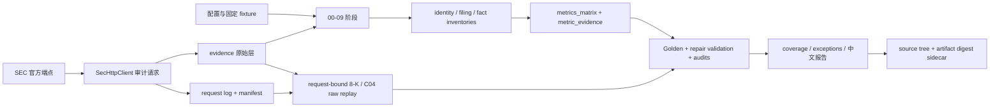
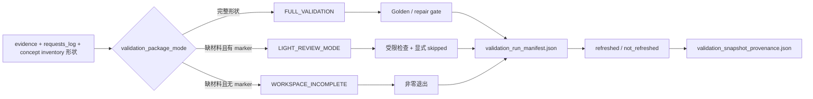

# SEC_metrics 架构说明

本文档描述当前SEC-only单财年批处理、已正式发布到R2的Issue #15 zero-AI ratchet、后续vNext Cutover与full acquisition/inventory编排。它严格区分R2 active、后续未完成scope与full acceptance。

本文档不负责：

- agent 工作规则：见 `AGENTS.md`
- PR 流程：见 `PR_Checklist.md`
- 测试策略：见 `TESTING.md`
- 能力与责任边界：见 `capability_contract.json`
- 用户可见行为：见 `interact.md`
- 业务人员教学：见 `docs/business_user_guide.md`
- 标准操作流程：见 `SOP.md`

## 0. 更新触发条件

以下变化必须同步更新本文档：

- 新增、删除或重排 `scripts/00_*.py` 至 `scripts/12_*.py` 的阶段
- `scripts/sec_pipeline.py` 的调用链、状态模型、数据 schema 或最终 gate 变化
- SEC endpoint、User-Agent、限速、重试或证据落盘方式变化
- `config/` 中公司、CIK role、行业 profile 或 extractor 路由变化
- `evidence/`、`outputs/` 的权威边界或生命周期变化
- validation manifest、snapshot provenance、artifact publication 或 full/light 判定变化
- Requirement Snapshot、MetricSpec、vNext object/state、Review/freeze/replay、Projector 或 publication transaction 原语变化
- 错误模型、测试边界或扩展入口变化

## 1. 系统目的与边界

SEC_metrics 是一个本地 Python CLI 批处理研究项目，面向需要复核 SEC 申报数据的分析、财务方法和审计人员。它对 `config/company_registry.csv` 中配置的逻辑公司定位最新年度申报，计算适用的财务指标，并抽取治理、风险和财年窗口事件信号。

输入包括三份配置、SEC 官方公开端点、前序阶段文件，以及测试 fixture。输出包括原始响应与请求审计、规范化 inventory、指标与证据矩阵、coverage、Golden、repair validation、分层审计、validation run manifest、成功终态的 snapshot provenance sidecar 和中文报告。

当前运行时不是 API、Web 前端、聊天系统、daily scheduler、报价模型或数据库服务。仓库当前 committed active pointer 仅证明Issue #15 zero-AI R2的22指标范围，不能把它写成39指标最终Cutover。

## 2. 架构不变量

| 不变量 | 正向陈述 | 禁止情况 | Review / 自动检测 | 违反后果 |
|---|---|---|---|---|
| SEC 官方来源 | 每次显式网络请求只访问精确的 `https://www.sec.gov` 或 `https://data.sec.gov` origin，并统一经过 `SecHttpClient`；HTTP redirect 不自动跟随 | 生产脚本直连第三方数据源、绕过请求日志，或由 urllib 隐式发出未单独审计的下一跳 | 检查 `scripts/sec_urls.py`、`scripts/sec_http.py` 与 repair gate 的 SEC-only 检查 | 来源边界失真，批次不得验收 |
| 请求可审计 | 发出前验证可预知的 working/log/snapshot-root 目标，读完 body 后验证 content-hash 动态路径；immutable body/header 先完整写同目录 exclusive 临时 inode，再以 no-overwrite hardlink 发布最终名并用 descriptor 校验 regular/single-link/inode/bytes；同一 repository 的 ledger publication 在 cooperating threads / POSIX processes 间串行化，每次已发请求都记录 UTC 时间、URL、状态、用途、User-Agent、重试次数；请求后持久化失败也先写明确 failure observation 再 fail fast；严格 manifest schema、base/HEAD 每条 current/legacy row 的精确行形状、已审核 Git ledger 的有序前缀、下游 locator 与已存 sidecar 共同约束 request row 完整集合；legacy locator 总是优先按 ledger body hash 解析 content-addressed body，同 body 多 attempt 以不晚于 ledger timestamp 的最新 `saved_at_utc` 归属 single-link regular headers sidecar；snapshot body 不存在才验证原 working pair，body 存在但身份错误、header 缺失/歧义、reserved namespace 大小写别名及 snapshot 内 symlink/hardlink 均不得回退 | 已发请求零日志、并发丢行、symlink/hardlink/别名覆盖审计状态、删行或重排后重签并把旧响应重新定义为最新、畸形 JSON/CSV 冒充 exact schema，用后续响应覆盖前次 attempt 的唯一证据，或对缺失/歧义的历史 snapshot 猜测候选 | 核对 `evidence/requests_log_manifest.json`、HEAD/base 严格行形状与有序前缀、下游反向覆盖、request log、body hash 及响应侧车 | manifest/行形状/顺序/身份/反向覆盖不一致为 FAIL；Git history baseline 或历史 bytes 缺失为 NOT_EVALUATED；批次不得验收 |
| 8-K 事件链闭合 | full validation 从 manifest 验证后的有序 request ledger 取得 request-bound 原始 bytes；mutable submissions 必须匹配同 URL/document 的最新成功 200，再由 submissions 推导 FY inventory；filing-bound hdr/primary 的所有成功 bodies 必须一致，随后重放 item 并与 `events.csv` 做 exact multiset。阶段 07 与 repair 共用 event→metric/evidence 实现，正向 count 每个组件各保留一行 filing identity，零值必须有完整 scan evidence | 回滚到旧成功 submissions 后同步缩减 inventory/events、由删减后的 events 自证完整、只保留第一个正向 evidence、伪增 value/accession，或把真实命中改成零 | `eightk_event_chain_exact_set` 与 `eightk_event_outputs_match_events` | 任一 request/submissions/filing/item/component 缺失、重复、多余、版本/身份不匹配或输出漂移均使 full gate 失败 |
| C04 双 filing 原始重放 | repair 先检查 filed `target_10k`（含 amendment），只有 AuditorName 不可用时才回退同 CIK、同期间原始 10-K；比较期间只能由同 CIK prior 定义。full validation 对当期候选 filing 与上期 10-K 分别从 request-bound accession index 重建实例文档集；filing-bound index/instance 的所有成功 bodies 必须一致，再解析官方 DEI `AuditorName`。validator 不复用生产 row builder，并对成功、缺失、冲突分支分别重建完整 metric/evidence 行 | 原始 10-K 抢先覆盖 amendment、跨 successor/predecessor CIK 拼接期间、用可缩减的 material/concept inventory 定义证据集、共享生产 builder 自证，或把降级 evidence 换成同 accession 的无关文档 | `check_c04_auditorname_all_companies` | 缺原始材料时 NOT_EVALUATED；损坏 row schema、请求版本/身份、派生输出、降级状态或 scan locator 不一致时 FAIL；真实缺失/冲突只有在正确降级且绑定对应 raw scan 时才可通过该一致性 gate |
| 配置驱动范围 | 公司身份、CIK role、行业 profile 与能力路由来自 `config/`；metrics matrix 必须等于 registry/profile/applicability contract 推导的 unique key set，coverage 必须与 matrix exact key set 对齐 | 在 `scripts/` 或 `tools/` 中按公司名、CIK、ticker、固定 accession 或固定财年日期写业务分支，或用固定行数/剩余行合法替代完整集合 | `tools/check_no_company_literals.py`、第 11 家公司 fixture 与 matrix/coverage exact-set gate | 新公司扩展需改生产分支或集合缺失/重复/多余，gate 失败 |
| 数值与证据闭合 | 可采信的非空数值状态必须追溯到 value、unit、period、accession、SEC source、concept/section 与 extraction method 均匹配的 evidence | 为填满矩阵而猜数，或只给 `(company, metric_id)` 空壳证据 | Golden、coverage join、numeric-evidence repair checks | 结果降级或最终 gate 失败 |
| 不可比必须显式降级 | 实体连续性、期间、unit、accession、context 或 dimension 不满足条件时使用明确状态与说明 | 静默跨主体、跨期间或跨口径拼接 | continuity、debt、Basel、stub-period 等 validation checks | 指标不得作为正常值发布 |
| 验证模式不冒充 | raw evidence 不完整时不得默认为 full；light 必须显式声明，否则为 `WORKSPACE_INCOMPLETE` | 把空 failure list、skipped 或 `NOT_EVALUATED` 写成 PASS | `validation_package_mode()`、五值 validation status 与 `ReportVerdictTest` | full 非零退出；light 只能给显式 caveat |
| 运行证据不复用旧文件 | reviewer 先读 `validation_run_manifest.json` 的 refreshed/not-refreshed 清单 | 因 CSV 文件存在就声称本次已刷新 | validation manifest 回归与 report freshness gate | stale artifact 不进入本次报告判定 |
| Validation snapshot 与 source/artifact bytes 绑定 | `config/validation_source_policy.json` 分类 runtime/acceptance source、full artifact directory 与非 source 文档角色；legacy stage 11 的 artifact mutation会使旧sidecar立即失配，stage 12开始时显式删除旧sidecar。stage 12只有在policy与SOP权威引用对齐、source-input closure clean、terminal manifest成功、核心artifact与full `evidence/request_attempts/` recursive exact set的SHA-256/size sidecar原子发布并从磁盘自验成功后才返回零。active Stage 11不碰sidecar/mirrors，active Stage 12失败只失效新sidecar并按official pointer恢复mirrors。无Git light包仍要求全部显式acceptance source文件存在 | 用旧 success sidecar证明新报告；只比较 commit 字符串；让权威运行文档落在 closure 外；把解释性文档作为 SOP 权威；删除治理/契约文件缩小 light source closure；运行后删除、新增、篡改或 alias policy-bound request attempt；postflight 失败仍保留 PASSED/GO | `tests/test_validation_provenance.py`、`tests/test_validation_provenance_light_package.py`、`tools/check_validation_snapshot.py` | policy/SOP role、source/tree/file-count、manifest identity、artifact exact key/hash/size/single-link 或 publication 任一失配均使 snapshot 不可验收；active postflight失败不得把bundle-derived root manifest/report改成synthetic FAILED/NO-GO |
| 最终态有顺序 | 内部legacy candidate只在源码checkout外的绝对隔离根执行`00`至`11`且不发布active；正式刷新由full acceptance完成Cutover，并让new/rollback/restore每轮以一个pinned transaction依序执行Stage10/11/12与snapshot verify | 把candidate中间阶段、旧报告、recorded receipt、仅有成功manifest或缺full receipt的结果视为正式通过 | candidate边界、terminal-cycle、report/manifest、stage 12与snapshot checker回归 | 产物可能仍是中间态、跨run错配、带P0失败、未经byte binding或根本未Cutover |

适用边界：上述不变量描述当前本地批处理实现。进程内限速不等于多进程全局限速；已落盘报告也不等于独立 repair gate 与 snapshot checker 已通过。

## 3. 模块职责边界

| 模块 / 目录 | 职责 | 非职责 | 依赖 |
|---|---|---|---|
| `scripts/00_*.py`—`scripts/10_*.py` | 薄单阶段CLI；04/09必须显式`--workspace-dir`并调用legacy-candidate边界，其余wrapper把固定`stage_name`交给`run_stage()`；完整candidate统一使用`sec_pipeline.py --workspace-dir ... <stage>` | 全链路编排、formal publication | `scripts/sec_pipeline.py` |
| `scripts/11_build_report.py` | 无参数时只尝试active pinned read-back；legacy candidate必须显式`--workspace-dir`并由stage producer生成README/report | 最终通过证明、独立 repair gate、active authoritative write | `scripts/sec_pipeline.py`、`scripts/validation_provenance.py` |
| `scripts/12_validate_repair.py` | 在 clean source snapshot 上执行 stage 12，随后发布并自验 provenance；postflight 异常 fail closed | live 数据采集、外部审计接受 | `scripts/sec_pipeline.py`、`scripts/validation_provenance.py` |
| `scripts/sec_pipeline.py` | 当前单体内核：阶段调度、解析、计算、富化、修复、验证、审计与报告 | Web/API 服务、事务存储、分布式调度 | `config/`、本地文件、`sec_http`、`sec_urls` |
| `scripts/sec_http.py` | SEC 域名限制、进程内节流、重试、写前 containment、raw body/headers/hash、请求日志与 exact-set manifest | 跨进程限速、第三方数据、业务语义 | `config/sec_config.json`、Python 标准库 |
| `scripts/sec_urls.py` | 集中构造官方 SEC endpoint URL | 发请求、解析响应 | 显式 CIK、accession、document name |
| `scripts/git_workspace.py` | 清理会重定向仓库或 object lookup 的 Git 环境/配置，并在解析前逐级校验普通 checkout 与已登记 linked worktree 的 gitdir/commondir locator，再校验 metadata、object store 和 refs 不含检查时已存在的 symlink/alternate 借用 | Git 业务历史解释、完整仓库取证、对抗主动同 UID namespace 切换或工作树修复 | Python 标准库、Git CLI |
| `scripts/validation_provenance.py` | 读取并验证source policy、检查SOP权威引用角色、捕获tree identity并原子发布/验证sidecar；legacy postflight可执行terminal fail-closed rewrite，active postflight只失效sidecar并恢复mirrors | 指标业务正确性、外部签名或 WORM | Git workspace、Python 标准库、source policy、manifest/report/artifact files |
| `scripts/vnext/` | Requirement/Spec、Reader/Evidence/Review、Run/replay、Batch/Projector、qualification、Cutover、PublicationView、publication/rollback 与 latest/active 状态 | UI/API/scheduler、隐式 HUMAN 决定、外部审计接受 | exact R2/R3/Decision、catalog、SEC ledger、DeepSeek/SEC env、root artifacts |
| `tools/vnext_operator.py` / `tools/vnext_review.py` | 同一 recorded/live operator、fixture catalog list/show、稳定错误/JSON 与可选 HUMAN review | 第二套 live-only 业务逻辑、caller fixture business override、伪装 HUMAN 的自动 approval | `scripts/vnext/` |
| `tools/vnext_terminal_cycle.py` | 每次formal new/rollback/restore只启动一个进程并pin一次publication transaction，依序验证Stage10 Golden、Stage11 report、Stage12 active publication、snapshot publish/verify | 重新读取pointer、AI/SEC调用、repair、report authoritative write、publication mutation | `scripts/vnext/terminal_cycle.py`、PublicationView、validation provenance |
| `tools/vnext_capture_qualification_fixture.py` / `tools/vnext_qualification.py` / `tools/vnext_cutover.py` / `tools/run_acceptance.py` | 受控真实 SEC layout capture、production freeze、第二布局/holdout资格、formal Cutover、三次单进程terminal validation、rollback/restore 与 full receipt；capture只从 fixture catalog 选择业务坐标，经 `SecHttpClient` 与固定DeepSeek transport形成可重放 recorded bytes；其余受控 recorded shortcut 还在固定 workspace 内完成同一 Run→Batch→Projector→sandbox PublicationView；acceptance 另负责process-tree离线边界、source/Requirement authority、portable runtime binding与隔离gate artifact exact binding、失败后official state read-back/补偿恢复 | 用 NOT_RUN、TEST_ONLY review 或 recorded sandbox PASS 冒充 formal review/full；用较弱 socket patch 代替 acceptance 所需 OS sandbox；把恢复成功改写成原步骤成功 | vNext operator/publication、fixture catalog、terminal cycle、macOS `/usr/bin/sandbox-exec` |
| `config/` | HTTP 参数、公司与 CIK role、SIC/profile 与 extractor 路由，以及 validation source/document/full-artifact role policy | 运行结果或临时状态 | 人工维护、结构校验与 provenance policy loader |
| `evidence/` | 原始 SEC 响应、请求日志、请求 exact-set manifest 与响应侧车 | 指标业务结论 | `SecHttpClient` 与阶段下载逻辑 |
| `outputs/` | inventory、矩阵、证据、coverage、Golden、validation、审计与 snapshot provenance | 独立于代码的永久真相源 | 前序阶段文件与当前代码版本 |
| `tools/check_validation_snapshot.py` | 只读验证 manifest、source tree 与 artifact digest sidecar | 生成、修复、重签或替代 Golden/repair | `scripts/validation_provenance.py` |
| `tools/check_no_company_literals.py` | 生产 Python identity literal 的静态扩展性 gate | 完整业务回归 | registry 与 AST 扫描 helper |
| `tools/check_capability_contract_alignment.py` | 清除仓库重定向 Git 环境变量，要求 repo root 等于实际 Git toplevel；禁用 replacement refs 后，对 HEAD regular blob、工作树 bytes、entry/Markdown anchor grammar、枚举、document path 与 `file::symbol` 做机械对齐；提供 base 时同时约束 tombstone，先验证 base/HEAD 每条 current/legacy request row 的精确行形状，再把 legacy row 独立规范化为 portable 完整字段、对 current row 执行逐字段有序前缀检查 | claim 语义或证据强度证明 | capability contract、Git object、request ledger、Markdown 与 Python AST |
| `tests/`、`tests/fixtures/` | 快速回归、篡改检测与确定性边界样本 | 替代 full evidence 或 live SEC 场景 | 临时工作区、固定 fixture、部分本地 evidence |

### 3.1 边界规则

- `sec_pipeline.py` 中的 extractor 类目前是 marker 与配置校验入口，不是具有统一 `extract()` 协议的插件对象；真实执行仍由函数和 `has_extractor(...)` 分支完成。
- 新增同行业公司应优先只改 registry 与 fixture；新增一种 extractor 能力仍需代码、registry、profile 配置和验证共同变化。
- `outputs/` 和最终报告是可再生成的派生产物。报告只解释矩阵、证据和 gate，不独立定义指标口径或成功状态。
- 新写入的 locator-bearing artifact 使用 `source_url`、`repo_relative_path`、`content_sha256`、`accession` 与 `document_name`。对 filing raw material，这五项必须联合指向同一 accession/document，fallback 不得借用另一 accession 的同名同 hash 文件；多 source/accession 对单一 path/hash/document 的派生豁免只属于显式 `eightk_zero_item_scan` 产生的 `outputs/events.csv`，不允许根据字段数量猜测 artifact 类型。`evidence/requests_log.csv` 的 response body 使用同一组字段，headers 使用 `headers_repo_relative_path`；新 attempt 的 locator 指向 `evidence/request_attempts/<hash>/...` 下的 immutable copy，调用者的稳定 working path仍供当次 parser 消费。working body/header、log 与 manifest 都通过同目录 UUID exclusive 临时 inode 后 lexical replace，避免既有 hardlink 被原地改写。`evidence/requests_log_manifest.json` 绑定整份 CSV 的 row count 与 hash，client 在 append 前校验 predecessor、append 后原子刷新；validation 要求 working ledger 保留 Git HEAD 已审核 ledger 的有序前缀，并以同一严格 current-schema parser 读取 working 与 committed HEAD rows。PR checker 独立要求 base/HEAD 的每条 legacy/current row 精确同宽，再对 legacy base 规范化 portable path、hash、URL-derived accession/document、对 current base 比较完整 row，之后只允许合法尾部追加；下游 locator 与磁盘 response sidecar 提供反向覆盖。对会变化的 submissions，重放使用该受保护顺序中的最新成功 200；对 accession index、instance、hdr 与 primary filing 文档，多个成功 observation 必须只有一个 body identity。常规 client/阶段路径不会为缺 manifest 的 legacy log 自动重签；一次性 legacy bootstrap 必须在独立边界显式授权。历史 `url` / `local_path` / `source_path` / `sha256` 只作为该显式迁移或其他 artifact relocation 的 hint；读取优先当前 clone 的仓库相对路径。绝对 hint 出现多个 `evidence` / `outputs` / `tests` / `config` anchor 时，生产迁移枚举所有候选，并以当前 clone 中的 hash、URL、accession、document 和 filing directory 选择唯一身份；request body 与 headers 还必须从同一个 lexical 旧仓库根迁移，不能把两个候选根各自命中的文件拼成一条 observation。无匹配、多匹配或跨根拼接均 fail closed。PR checker 对 legacy request path 独立执行同一不变量，不复用生产选择函数。原作者机器路径绝不是权威地址；历史 attempt 若已被覆盖且记录 hash 无法对应当前 bytes，只能是 `NOT_EVALUATED_MISSING_EVIDENCE`。

## 4. 运行时调用链

```text
单阶段 wrapper
  -> active/普通阶段：sec_pipeline.run_stage(stage_name=...)
  -> legacy candidate：sec_pipeline.main_from_argv(...)
     -> configure_legacy_candidate_workspace(workspace_dir=...)
     -> sec_pipeline.run_stage(stage_name=...)
  -> 对应 stage_* 函数
  -> 配置 + 前序 CSV/JSON/XML/HTML
  -> sec_urls + SecHttpClient（阶段需要网络时）
  -> raw evidence / normalized inventory / derived outputs
  -> 后续富化、Golden、repair validation 与报告
```

| 阶段 | 主要职责 | 关键产物或结果 |
|---|---|---|
| `00`—`01` | SEC 连通性、公司与 CIK role 解析 | 请求日志、submissions、`company_resolution.csv` |
| `02`—`03` | filing 与 companyfacts inventory | `latest_filings_inventory.csv`、companyfacts inventories |
| `04` | 只在`sec_pipeline.py --workspace-dir <absolute-isolated-root>`显式选择的candidate数据根生成非迁移标准指标；源码repository root与有active pointer的workspace都拒绝legacy stage，且不得写 B01/B03/B10/B11 | 非迁移 candidate rows；越界写入 fail closed |
| `05`—`06` | accession material 下载与 XBRL/iXBRL 解析 | raw materials、instance inventories |
| `07`—`09` | 8-K、DEF 14A、MD&A/风险/行业 KPI 富化；Stage 09只可在显式绝对隔离candidate数据根运行且不得写B10/B11 | events、governance、risk与非迁移candidate更新 |
| `10` | 无 active pointer 时走 legacy Golden；有 pointer 时只读一次 pinned PublicationView 验 bundle Golden | active 分支不开网络、不写 authoritative artifact |
| `11` | 无 pointer时只允许在显式绝对隔离candidate数据根构建legacy报告，源码repository root fail closed；有pointer时只从同一PublicationView读取bundle report | active分支AI/SEC socket=0、repair=0、authoritative write=0 |
| `12` | 无pointer时执行既有repair/provenance gate；有pointer时验证formal receipt、完整mirrors与active provenance | active分支只写provenance sidecar，不改bundle/root mirrors；任一mirror/pointer/bundle/provenance失配非零退出 |

legacy 阶段依赖仍通过文件系统传递；vNext formal flow 由 Cutover/acceptance orchestrator 串接 Run、Batch、publication 与 terminal cycles。publication 使用 POSIX lock/CAS 和 immutable bundle，request ledger 使用独立 append-only 锁；两者不是数据库事务。需要可重复的完整结果时，应从干净工作区按 `README_RUN.md` 的当前入口执行。

## 5. 数据流主干


```mermaid
flowchart LR
    Config["配置与固定 fixture"] --> Stages["00-09 阶段"]
    SEC["SEC 官方端点"] --> HTTP["SecHttpClient 审计请求"]
    HTTP --> Raw["evidence 原始层"]
    HTTP --> Ledger["request log + manifest"]
    Raw --> Stages
    Stages --> Inventory["identity / filing / fact inventories"]
    Inventory --> Matrix["metrics_matrix + metric_evidence"]
    Ledger --> Replay["request-bound 8-K / C04 raw replay"]
    Raw --> Replay
    Replay --> Gates
    Matrix --> Gates["Golden + repair validation + audits"]
    Gates --> Report["coverage / exceptions / 中文报告"]
    Report --> Provenance["source tree + artifact digest sidecar"]
```

验证包状态是独立子链：


```mermaid
flowchart LR
    Shape["evidence + requests_log + concept inventory 形状"] --> Mode{"validation_package_mode"}
    Mode -->|完整形状| Full["FULL_VALIDATION"]
    Mode -->|缺材料且有 marker| Light["LIGHT_REVIEW_MODE"]
    Mode -->|缺材料且无 marker| Broken["WORKSPACE_INCOMPLETE"]
    Full --> Gate["Golden / repair gate"]
    Light --> Limited["受限检查 + 显式 skipped"]
    Broken --> Fail["非零退出"]
    Gate --> Manifest["validation_run_manifest.json"]
    Limited --> Manifest
    Fail --> Manifest
    Manifest --> Fresh["refreshed / not_refreshed"]
    Fresh --> Snapshot["validation_snapshot_provenance.json"]
```

## 6. 数据与状态模型

- 源响应层：`evidence/` 保存请求观察、整表 exact-set manifest、raw bytes 和 headers/hash 侧车。
- 规范化中间层：company resolution、filing、companyfacts、accession 与 instance inventories。
- 指标层：`metrics_matrix.csv` 保存 value、unit、status、formula、期间、来源类别与说明；`metric_evidence.csv` 保存逐指标 provenance。
- 解释与验证层：coverage、Golden、repair validation、implementation map、scalability audit、stratified audit 与 `validation_run_manifest.json`。manifest 只回答本次刷新范围，不恢复 runtime state；`source_commit` 后缀 `+dirty` 明示运行时整个工作树含未提交改动。
- Snapshot provenance 层：`config/validation_source_policy.json` 是 source/document/full-artifact 角色真相源；policy 文件自身始终进入 closure，不能通过从 runtime 目录移除 `config/` 来自我排除。成功 stage 12 的 `validation_snapshot_provenance.json` 记录 source checkout 状态、source commit、deterministic source tree digest/file count，以及 manifest/report/README、核心业务 artifact、request ledger、本轮 refreshed validation artifact 和 full `evidence/request_attempts/` recursive exact set 的 SHA-256/size。它与 manifest 职责分离。
- 展示层：`REPORT_十公司财务指标.md` 和异常清单是派生阅读入口。

指标状态包含精确/近似/结构化/文本成功状态，以及 `NOT_AVAILABLE_SEC`、`NOT_EXTRACTED`、`NOT_MEANINGFUL`、`N_A_STRUCTURAL`、`PARSE_FAILED`、`NEEDS_REVIEW`。repair validation 另只允许 `PASS`、`FAIL`、`SKIPPED_LIGHT_PACKAGE`、`NOT_EVALUATED_MISSING_EVIDENCE`、`WORKSPACE_INCOMPLETE`；mode 和 manifest result 不复用 status 列。两类状态都不能折叠成简单的“有值/没值”或“没有发现失败”。

## 7. 错误模型

| 场景 | 当前行为 |
|---|---|
| 缺配置、缺 required key、未知 profile/extractor、非法状态或未知 stage | 抛异常并终止当前进程 |
| 关键 JSON 请求非预期 HTTP 状态 | `RuntimeError`，当前阶段失败 |
| 403、429、500、502、503、504 | 在单个 client 实例内指数退避；耗尽后返回最终状态 |
| HTTP 3xx | 禁止 urllib 自动跟随；保留首跳 body、headers、Location、`RedirectDisabled` error 与一条 observation，目标 URL 如需访问必须重新显式调用并通过官方 origin 校验 |
| response read 的 `HTTPException`（含 `IncompleteRead`）、`TimeoutError`、`URLError` 或其他 transport `OSError` | 已发 attempt 记录 `status_code=0` 与具体错误；当前不进入 HTTP 状态重试集合 |
| 可预知的 response working/log/snapshot-root 路径越界、别名或经过 symlink | transport 前 fail fast，不发请求、不改写审计文件 |
| 读取响应后才能确定的 content-hash snapshot 路径不可写 | 首次 artifact 写入前拒绝；追加 `status_code=0` persistence-failure observation 后原异常 fail fast |
| immutable 最终文件名在预检后被 symlink/hardlink 占用 | no-overwrite publication 不跟随别名，descriptor 校验失败；victim 不被覆盖，并追加 persistence-failure observation |
| request-log manifest 缺失、row count/hash/CSV 行形状不一致、HEAD 历史行缺失，或下游/sidecar observation 无反向覆盖 | manifest missing 为 `NOT_EVALUATED_MISSING_EVIDENCE`；其余完整性缺口为 FAIL；client 不允许在失配 predecessor 上继续 append |
| accession 文档非 200 | 保存请求结果，由后续阶段过滤或降级，不一定立即终止 |
| 阶段 11 补抓 AuditorName material 非 200 | 保留请求与 material 审计证据，并将相关结果降级为 `NEEDS_REVIEW`；报告构建仍可能继续 |
| 历史 request row 的 working path 已被覆盖 | legacy locator 优先查找 exact content-addressed pair；同 body 多 attempt 只取不晚于 ledger timestamp 的最新匹配 `saved_at_utc`。snapshot body 不存在时才验证原 working pair；body 存在但 header 缺失为 `NOT_EVALUATED_MISSING_EVIDENCE`，body identity 错、多条同时间匹配、大小写 namespace alias、symlink 或 hardlink 为 FAIL，禁止猜测或重新请求来冒充旧证据 |
| legacy 绝对 locator 含多个仓库 anchor | 枚举候选并要求当前 clone 联合身份唯一命中；同一 request 的 body/header 必须来自同一旧仓库根；无匹配、多匹配或跨根拼接立即失败，不猜测仓库根 |
| CSV 缺失 | `read_csv_file()` 对通用阶段仍打印提示并返回空集合；repair gate 的 required-input 与 evidence check 必须把关键缺口写成 `WORKSPACE_INCOMPLETE` 或 `NOT_EVALUATED_MISSING_EVIDENCE`，不能由空列表形成 PASS |
| source policy schema/角色重叠、SOP 权威引用未分类或引用解释性非权威文件 | 在 source capture 前失败；不得以 Python allowlist 漏扫或文档身份含混继续 |
| stage 12 source-input closure dirty、显式 acceptance source 文件缺失、symlink 或 Git metadata 不可信 | 在运行主 gate 前失败；无 Git 仅允许显式 light package，且不能通过删文件缩小 source closure |
| provenance sidecar 缺失、schema/run/manifest identity 不一致，或 source tree/file count、artifact key/hash/size 失配 | 独立 checker 非零退出；结果不能作为当前 checkout 的可验收 snapshot |
| provenance postflight 在 terminal validation 成功后失败 | legacy/light删除可安全识别的sidecar并尝试把manifest改为`FAILED`、报告改为`NO-GO`；active只删除新sidecar、按official pointer恢复mirrors且不改bundle-derived manifest/report；两者均非零退出 |
| recorded acceptance 缺 `/usr/bin/sandbox-exec` | 在启动 recorded gate 前以 `OFFLINE_PROCESS_SANDBOX_REQUIRED` 失败；不得退化为只覆盖当前 Python 进程的 socket blocker |
| recorded 子进程改写 active pointer、root mirrors 或 provenance sidecar | runner 以开始前的 exact byte backup 恢复；即使恢复成功，receipt 仍返回 `RECORDED_ACTIVE_STATE_CHANGED`。若结束状态不可读，先恢复再以 `RECORDED_GATE_EXECUTION_FAILED` 失败 |
| recorded gate artifact 缺失、多出、路径逃逸或 hash 漂移，或 source/Requirement authority 在执行中改变 | exact-set/path/hash 或开始/结束 authority equality 失败；不得复用 root scanner artifact、旧 receipt 或 dirty source 形成 PASS |
| acceptance 子命令超过 timeout | command row 为 `FAILED`、reason=`COMMAND_TIMEOUT`；默认 7200 秒只是单命令上限，不产生任何成功推断 |
| Cutover 子进程非零、返回 `HUMAN_REVIEW_REQUIRED` 或返回结构非法，却已意外改变 official publication | 每次子进程返回后 read-back official pointer/mirrors；已有 predecessor 时走受验证 rollback，首次无 pointer 时恢复原 root bytes，并保留原 blocker。恢复 receipt 不是 HUMAN Decision，也不把失败升级为 full PASS |
| publication switch在pointer/receipt之间hard crash | mirror mutation前在同一exclusive lock写content-addressed switch intent；共享锁reader看到pending、多份或tamper只fail closed。writer recovery按exact pointer判断：已是proposed则补齐receipt并从proposed bundle重建mirrors，仍是previous则移除本事务receipt并恢复previous state；其他pointer状态失败 |
| 阶段中途失败 | 无通用事务回滚；request attempt 仍以日志/manifest fail-closed，请求后 persistence failure 记为 `status_code=0` observation 并保留响应 status/length/hash 诊断；其他阶段可能留下部分派生产物 |
| `11_build_report` 内部 P0 失败 | 仍生成基于本次 manifest 的 NO-GO 报告；不能替代阶段 12 |
| 阶段 11/12 报告或 README 写入失败 | validation manifest 保持 `IN_PROGRESS`，不得留下“成功 manifest + 旧/缺报告”终态 |

## 8. 外部依赖与配置

- 运行时代码当前只使用 Python 标准库与本地模块；支持边界为 POSIX 本地文件系统上的 Python 3.9+，由 `TESTING.md` 的双解释器回归维护，仓库尚无 CI 或第三方依赖清单。
- recorded acceptance 的强离线执行目前有额外的 macOS operator 前提：`/usr/bin/sandbox-exec` 对整个子进程树应用 `(deny network*)`，并保护正式 pointer/mirrors/sidecar 不可写；Python audit hook 只是纵深保护。缺少该 OS primitive 时 runner fail closed，不声明跨平台弱等价实现。
- 外部网络依赖仅为 `www.sec.gov`、`data.sec.gov`，以及 explicit live vNext 的 `api.deepseek.com`。
- SEC organization 固定为 `axaxl`；contact email 只从 `SEC_CONTACT_EMAIL` 读取。`SecHttpClient` 与 acceptance runner 共用同一个 identity validator，缺失、畸形或 example/reserved-domain email 在联网前失败；运行时凭据只在进程环境中存在。
<!-- capability-anchor: BEHAVIOR.sec_identity_shared_fail_fast -->
- Issue #15 effective D-01 固定 DeepSeek OpenAI-compatible Chat Completions、`deepseek-v4-flash`、`api.deepseek.com`、120 秒、transport 内部 retry 0、8 MiB、公开 SEC table-grid only；API key 只从 `DEEPSEEK_API_KEY` 读取并不得进入 artifact。只有 WB-3 orchestrator 可按 D-35 对 429/timeout/recoverable 5xx 追加最多一次独立 attempt。
- 限速状态保存在单个 `SecHttpClient` 实例中，只提供进程内 pacing，不是跨阶段进程或多进程协调器；request-ledger publication 的 POSIX 锁只防丢行，不提供全局限速，也不承诺网络文件系统锁语义。
- `config/metric_applicability.yaml` 由 `json.load` 读取，虽然后缀为 YAML，内容必须保持 JSON 兼容语法。

## 9. 扩展点

- 新增同行业公司：更新 `config/company_registry.csv` 和对应 fixture，并证明无需修改生产 pipeline。
- 新增行业 profile：更新 SIC/profile 配置、extractor 列表与相应回归。
- 新增 extractor 能力：实现代码路径、登记 marker/registry、接入 profile、更新状态/证据与 validation。
- 新增 SEC endpoint：只在 `scripts/sec_urls.py` 建模，并通过 `SecHttpClient` 请求。
- 新增字段或状态：同步 CSV schema、写入/读取方、coverage、Golden/repair checks、报告和用户文档。
- 新增会影响运行或验收的 source path：在 `config/validation_source_policy.json` 分类，确保 SOP 权威引用对齐，并同步专项文档与缺失/篡改负例；不得恢复 Python 硬编码 allowlist。
- 新增 terminal acceptance artifact：同步 artifact closure、sidecar exact-key 验证与 checker 回归。

## 10. 当前约束与架构债务

- `scripts/sec_pipeline.py` 是职责集中的单体流水线内核。
- extractor 只是 marker/config gate，尚未形成统一插件协议。
- 文件状态机没有通用的跨 artifact 事务或幂等保证；只有同一 repository 的 request-log CSV/manifest publication 在 cooperating threads / POSIX processes 间串行化，富化阶段的其他 evidence 追加仍可能在局部重跑时重复。
- immutable request snapshot 假设一次调用期间父目录 namespace 稳定；它防预存和最终名竞态别名，但不是对抗恶意同 UID 进程的 WORM。Git workspace guard 会在 `resolve()` 前拒绝检查时已存在的 gitdir/commondir 路径 component alias，但检查与后续 Git CLI 不是同一原子操作，不宣称抵御主动同 UID 进程在两者之间切换 namespace。Git HEAD baseline 也不能恢复尚未提交、无 body 的 `status_code=0` observation 被人工删除并重新签名后的历史。
- validation provenance sidecar 是仓库内自证明，不是外部签名、透明日志或 WORM；能同时改写全部 source/artifact 并重签的人仍在本地信任边界内。
- 非 validation 的通用阶段仍可能因缺 CSV 返回空集合而把错误推迟；关键 validation 输入已由显式状态 gate 收口。
- provider egress 后的 `status_code=0`/无 terminal receipt 被封存为 `UNKNOWN_REMOTE_OUTCOME`，不自动重试。
- 报告生成与最终通过判定是两个步骤，操作者必须显式运行阶段 12 和 snapshot checker。
- `outputs/` 是可发布 snapshot 还是纯可再生产物，仓库尚未冻结长期生命周期策略。
- 8-K full gate 与生产路径共用 item parser；固定 hdr/primary fixture 只是已支持格式的行为锚点，不是独立的通用 SEC 文档 parser oracle。因此该 gate 能捕获 request/raw/derived 链的集合与交接漂移，但不能单独证明未见格式的解析完整性。

## 11. vNext formal Cutover 实现与 zero-AI R2 active 证据

### 11.0 Issue #15 authority layer（WB-1）

`requirements/issue_15_v1/` 是未来开发的首要 Requirement authority。它以 exact `CONTRACT.md`、自包含 Decision history、parent transfer/baseline、39 指标 legacy semantic producer inventory、当前 matrix baseline 和 foundation verification 构成一个可独立验证的 child closure；`scripts/vnext/requirements.py::load_requirement_snapshot` 只支持 `ai_first_v3_3_1` 与 `issue_15_v1` 两个显式 schema，不建设通用多版本平台。`load_run_requirement_snapshot` 不接受调用方选择：它仅由持久化的`task_contract_bindings`形状选择，非空catalog binding固定为Issue #15，空绑定的保留historical disclosure Run固定为父snapshot。

WB-1 只增加 authority 数据和 loader 分支。Issue #15 owner 随后以同 ID 链追加 D-36/D-35/D-26 effective tips，在不修改 frozen `CONTRACT.md` 或 inherited parent 任何 byte 的前提下更新 child closure。loader 绑定三个 exact tip hash 与 Issue 评论证据：仓库金额预算执法禁用，外部 API 账户余额是花费权威，cost/token/usage/cache 仅作非阻断 observability；`BUDGET_EXCEEDED` 不再是金额 terminal class，HTTP 402 仍零自动重试并停止 execution/batch，payload/context/resource limit 仍是独立 fail-closed 安全边界。Requirement-only 修订本身不是 runtime 证据；现由 WB-3 injected/mock transport 矩阵独立证明这些语义。父目录任何 byte drift、13 条历史 Decision 任一 canonical hash 漂移、Contract/receipt hash 漂移、producer/matrix exact set 不闭合都会使 child loader fail closed。

Stage-C owner decision继续沿同一`decision_id=D-07`链追加tip：普通table qualification仍以200000 inclusive estimated-input门阻断超限family，全表、原序、无selector/prefilter及provider/model/API authority均不变；唯一新增的是绑定Marriott development bytes、`lodging_occupancy_table_v2`和serializer v2的一次性actual-token measurement exception。该tip只批准实现执行边界，`live_measurement_authorized=false`；真实provider execution必须另有绑定当时exact repository HEAD的外部授权。Requirement closure变化本身不构成actual-token、qualification、business Result或publication evidence。
<!-- capability-anchor: CAPABILITY.issue_15_requirement_authority -->
<!-- capability-anchor: BEHAVIOR.issue_15_repository_monetary_budget_disabled -->

#### 11.0.1 WB-2 SourceStrategy Registry

`config/source_strategy_registry.json` 对 WB-1 冻结的 39 metric exact set 各保存一条 target route。`config/issue_15_release_plan.json`只是content-addressed active索引；不可变R1/R2 plan分别位于`config/release_plans/`，每档完整保存parent plan/content edge、added delta、cumulative IDs/keys、retired producers、reader family versions、Requirement closure与authority hashes。loader先机械计算parent-child的`removed_metric_ids`、`removed_vnext_result_keys`与`unretired_legacy_producer_ids`并要求三个exact set均为空，再验证added delta和当前档完整集合；即使攻击者同步重签plan/content/index/authority hashes，删除也会在语义no-removal gate失败。R2为16个DET_ONLY加C01/E01–E05共22项，ratchet不再只有可覆盖的“当前余额”。

family 拥有 `forbidden_production_literals`，metric 不复制该词表。`tools/check_vnext_semantics.py` 每次从经 Requirement byte-binding 验证的 family union 编译 scanner；`risk` / `value` / `event` / `income` / `current` 被 schema 显式拒绝为禁词，避免把共享引擎普通语言变成假阳性。WB-2 只建立 routing authority，没有执行 adapter、修改 root outputs 或证明 structured-only provider 零调用；后两者属于 WB-2B/WB-3 联合证据。
<!-- capability-anchor: CAPABILITY.issue_15_source_strategy_registry -->

#### 11.0.2 WB-2B Deterministic Source Router

`scripts/vnext/deterministic_router.py` 为 companyfacts、accession XBRL、ECD XBRL、auditor fact 与 8-K item index 提供五个有界、无模型 adapter。Release input plan 的公司条目只使用 `sources[]`；每个 role 中 `source_reference_ids` 始终是 array，即使只有一个 source，并绑定一个 content-addressed SourceSetManifest。Manifest 保存 company/role/form/window/discovery policy、SEC submissions RawBlob hash、inventory SourceReference、ordered source IDs 与cutoff；构建和replay都从 pinned submissions bytes 重算 in-window accession exact set，因此不能通过删掉一份 8-K 后重签空集。

五个 adapter 产生一级 `DETERMINISTIC_VERIFIED_CLAIM` record，该 record 同时绑定 SourceReference、SourceSetManifest、locator、value/unit 与adapter attributes；通用投影再生成 VerifiedObservation、MetricResult 与 ExecutionTrace。`catalog/event_routes.json` 拥有 C01/E01–E05 的 item/关键词语义。C01/E03 共用同一 Item 5.02 claim set 后各自投影；E02/E04 的零值仍绑定完整 FY 8-K source set；E01 对 1.01/2.01 直接命中，8.01 按 catalog 中 `merger/acquisition/combine/transaction` 与 NFKC+casefold+whitespace normalization 匹配。新 router 的 matched `(source_url, accession, item_code)` exact set 与 legacy matcher 逐项比较；共享 Python 不存在 E01 metric identity branch。

R2新增的14个财务deterministic指标由`catalog/deterministic_metrics.json`声明concept priority、current/prior accession与period role、维度、formula branch、applicability和entity continuity。source plan只从pinned submissions发现当前/上一份original 10-K，再从catalog候选SEC facts机械派生target period；财务producer函数不接收legacy row/evidence/expected value。事件source set先由submissions current/history shards发现，再以request-ledger绑定的immutable acquisition namespace通用扫描补齐SEC submissions响应中缺失但已收购的in-window 8-K；补集receipt逐个重验hdr form/date/accession、primary bytes、SourceReference和attempt identity，不读取legacy events。事件Result/Trace完成后才在独立compatibility函数中比较legacy event key set。

`catalog/zero_ai_public_projection.json`是22指标完整public-row字段authority。共享renderer只接收registry、Result/Trace、claims/observations、SourceReference、filing inventory与catalog，不接收legacy row/value/evidence/template/hash；R1先生成20 rows、R2在屏蔽legacy migrated rows/events时先生成220 rows，随后才分别比较18×20和141×20字段。默认每格exact equal，当前approved delta exact set为空。`tools/check_zero_ai_projection.py`对R1/R2 producer参数、renderer AST及render→compare调用顺序生成content-addressed independence receipt；retirement receipt绑定该证明与projection closure。
<!-- capability-anchor: CAPABILITY.issue_15_deterministic_source_router -->

#### 11.0.3 WB-3 Invocation Control

`scripts/vnext/invocation_control.py` 显式区分 `release_input_plan_id`、`ai_invocation_plan_id` 与 `execution_id`。exact response/single-flight identity 由 provider request body SHA-256 + provider + model + API 构成；semantic invocation identity 另绑定 source/representation/task/schema/serialization/model。plan 同时绑定当前 Issue #15 Requirement closure 与 D-35/D-36 tip hashes。Workflow先从live SEC authority构造exact provider envelope，再由受控adapter调用controller；provider-request reservation 使用 `O_CREAT|O_EXCL`，只有创建者能写egress marker并进入真正的repository transport/socket。旁路旧`run_ai_attempt→adapter→socket`不再是Cutover/CLI生产路径。

每个 plan/request/egress/attempt/acceptance/response/execution 都是immutable audit state。provider response只在严格UTF-8/schema、required roles、source/DerivedAsset、disclosure/task contract、Candidate构造与真实`check_evidence`全部闭合且Evidence为`PASS`后，才写`INVOCATION_ACCEPTANCE_RECEIPT`、SUCCEEDED attempt与可复用`SUCCESS_RESPONSE_RECEIPT`；reuse会重新验证response bytes、plan/request identity和持久Candidate/Evidence记录。`SUCCESS_RESPONSE_RECEIPT`先于execution seal持久化时，dead reservation的marker、attempt、acceptance和response会机械重建为原`SUCCEEDED` execution并归档原reservation；不得在同一marker execution写`REUSED_SUCCESS`。execution已seal而archive未完成时，随后调用只归档同一reservation。Workflow随后独立重算Candidate/Evidence并要求其hash/ID与controller acceptance exact相同。模型provider的直接opener exact set只有`ai_adapter.py::_open_provider_request`，且private capability只由`_InvocationControllerTransport.send`在reservation与egress marker之后传递；context-free factory与qualification capture分别以`WB3_EXECUTION_CONTEXT_REQUIRED`和`AI_QUALIFICATION_EGRESS_NOT_ENABLED`在socket构造前失败。provider/model context上限来自`config/provider_model_runtime.json`，当前估算明确标记为`UTF8_BYTE_UPPER_BOUND`而非exact token count，并将estimator version/method与authority hash绑定plan。`paid_model_provider_call_count`定义为billing class=`PAID_MODEL_ENDPOINT`的真实provider egress marker数，不代表已确认账单；mock marker始终不计paid。HTTP 400/401/402/422、schema/evidence/payload/context/resource 为 terminal；429/timeout/recoverable 5xx 在同一execution内最多一次重试，exhausted terminal必须精确记录`FAILED_RETRYABLE`→`FAILED_RETRYABLE_FINAL`、两条marker与最后provider request ID；402 零自动重试并停止整批与后续 stability ordinal。terminal reservation先绑定execution再归档释放，因而新的显式execution authorization可在402余额问题消失后重新取得reservation；活owner仍返回held。reservation 未写 egress marker 可恢复为 `ABANDONED_BEFORE_EGRESS`；真实子进程在egress后死亡时，dead PID + marker +无terminal receipt会从磁盘封存 `UNKNOWN_REMOTE_OUTCOME`，不调用transport。usage/token/cache 与 estimated/actual cost 全部保留为非阻断 observability；payload/context hard limit仍在reservation前fail closed。三种计数从marker/attempt exact set推导；R1/R2再由structured-only route closure与专属空invocation namespace机械得到三个0，而不是注入常量。
<!-- capability-anchor: CAPABILITY.issue_15_invocation_control -->

#### 11.0.4 PR-3 阶段 A：WB-4/5/6 table qualification freeze

`scripts/vnext/table_grid.py`继续保存完整 expanded grid，作为唯一本地 Evidence Authority；`scripts/vnext/table_payload.py`只为模型传输生成 versioned compact payload。compact encoder保留全部表、document order、caption、scope text与origin cell，省略仅能由origin span重建的non-origin展开cell及仅能由矩形shape重建的synthetic blank cell；decoder在不搜索或选择表格的前提下恢复逐字段相等的expanded grid。Reader payload、adapter与Evidence同时绑定`table_payload_serialization_version`、`expanded_derived_asset_id`、`expanded_grid_sha256`、`compact_payload_sha256`、`decoder_semantic_version`和`round_trip_receipt_id`；review renderer始终直接读取expanded grid。D-31允许一个scope locator支持多个dimension：Evidence先逐字节重取完整locator raw text，再以唯一、边界严格的literal/token-sequence proof证明每个raw value，最后仅由MetricSpec exact-enum alias产生canonical值。effective D-07仍要求完整文档表集和原始顺序、禁止selector/prefilter；`utf8_byte_upper_bound` v1 的family/request门为inclusive 200000，等于阈值通过，超过阈值只阻断对应family。

scope contract v2由MetricSpec拥有：模型只能返回`dimension/raw_value/evidence_locator_ids`及exact raw scope-evidence locator；Evidence从expanded grid重取raw text后，只使用Spec的exact enum alias生成canonical scope。未知alias或缺维度使Candidate为`REVIEW_REQUIRED`，但不新增VerifiedObservation quality enum；SYSTEM approval仅在全部alias已解析、normalized scope满足contract且无unresolved/competing事实时可用，HUMAN仍可在同一contract内决定canonical scope。ReviewUnit、ReviewDecision、reviewed observation和scope key均绑定该事实链，历史VerifiedObservation schema不增加claim kind。

`catalog/table_task_contracts.json`静态声明每个table target的single-role contract；共享Reader/Evidence/Projector不按metric、company或table ID分支。每个请求仍接收全部compact tables，模型通过同一locator约束选择一张target table；合并角色只可在未来qualification提供共表证据后作为成本优化。`config/table_qualification_matrix.json`与content-addressed`artifacts/vnext/table_qualification_freeze/receipts/`冻结所有table family的source/second-layout/holdout policy、task/schema/prompt hashes、11组round trip、WB-3 regression、token/context测算、R2 active/root bytes与protected closure。schema-v3 freeze持久化每个family的`context_gate/resource_gate/protected_closure_gate/live_ready/blocking_reason_codes`及`live_ready_family_ids`；shared dependency drift传播到全部依赖family，matrix/task/MetricSpec等local drift和context/resource failure只阻断owner family。阶段A仅生成离线freeze，不执行capture、qualification、SEC请求或model请求，也不改变active publication。未来 LIVE terminal 的本地恢复则以WB-3持久化的marker/execution/attempt/success或UNKNOWN receipt为事实源：Run records、receipt-owned provider ledger与qualification evidence必须与实际WB-3 egress terminal exact set一一对应。失败或UNKNOWN Run attempt缺payload、ledger、evidence或cycle closure时仍是未物化状态，只可在同一deterministic Run内补齐，绝不可再次调用provider；`egress_attempted=false` local preflight/credential failure不写伪remote ledger/evidence，修复本地条件后可继续同一ordinal。Review tail只有在payload hash、Candidate/Evidence/ReviewUnit cross-binding、两份review asset和checkpoint清理均完成后才是`COMPLETE_OPEN_PENDING_REVIEW`；任一中断继续在同一deterministic Run内幂等物化，不删除Run目录重试。

`tools/investigate_table_context_minimization.py`是与production Reader隔离的Stage-B研究工具。它从现有Marriott、Hilton、Hyatt四个distinct source hash及两个single-role task机械重建完整DeepSeek envelope，分别归因system/schema/task/manifest/table bytes，再对raw/normalized、重复字符串与坐标编码做exact census。CANDIDATE-1–4只存在于工具内的decoder；CANDIDATE-5只在四个source的既有response都证明occupancy/RevPAR共表后构造research-only合并task估算。receipt连续两次重建同ID，五个maximum依次为286407/337587/337056/386572/392671，均未过200000；这证明仍有无损压缩空间，但不证明模型准确率或可读性，尤其dictionary/indirection必须另行live qualification。工具不改变`table_payload.py`、task catalog、root/active或三类egress。
<!-- capability-anchor: BEHAVIOR.vnext_table_stage_b_context_investigation -->

`tools/investigate_jpm_financial_grid.py`复用production `_AllTablesParser`取得60348个raw origins，但以每行non-overlap span intervals继续完整计数，不建立124761个expanded cell dict的全量对象。它得到679表、62748个span duplicate coordinates、1665个synthetic blanks；blank/span ratios分别为0.01334552/0.50294563，table_000588使累计99975→100050首次越过production 100000门。逐行cell只为canonical-size核算短暂构造；完整DerivedAsset估计22174365 bytes，64-bit CPython planning interval为56947869–152764317 bytes。OPTION-A/B/C都保持`implementation_selected=false`，benchmark因未授权raise cap/full allocation而记录`NOT_RUN_RESOURCE_SAFETY`；工具不改parser/resource limits、不实施shard/lazy/source replacement，也不作最终推荐。
<!-- capability-anchor: BEHAVIOR.vnext_table_stage_b_financial_census -->

schema-v3 owner packet只在current freeze、Stage-A overlay、Requirement、context receipt与census receipt全部逐byte/content-ID重验后生成。`OWNER_APPROVED`固定记录已实施的200000 inclusive threshold、全表/原序/no-prefilter、family-scoped readiness与shared-global/local-owner drift policy；`STILL_UNDECIDED`的serializer、actual-token live measurement、financial cap-vs-shard、development source和selector值全部为null。packet同时绑定`live_ready_family_ids=[]`、`actual_prompt_tokens=NOT_RUN`、R2 active/309 rows/key-set/root hashes和0/0/0 egress；它不把Stage-B写成任何family已qualification或Issue #15完成。
<!-- capability-anchor: BEHAVIOR.vnext_table_stage_b_owner_packet -->
<!-- capability-anchor: BEHAVIOR.vnext_table_transport_scope_and_freeze -->

Stage C-A的`scripts/vnext/table_context_measurement.py`建立独立于qualification的窄执行边界。offline plan从latest same-ID D-07 exception、PR-19 exact freeze/cycle/Stage-A/owner packet、matrix-owned Marriott immutable attempt、`lodging_occupancy_table_v2`、serializer v2、current prompt/schema/provider envelope及其protected source closure重建，392447只在该exact measurement plan中越过普通200000门。真实capability必须由`AUTHORIZE_ONE_TOKEN_MEASUREMENT`与当前clean exact HEAD共同签发；authorization在每次使用前重建HEAD/tree、protected closure、family/task/source/prompt/schema/request/provider identity。`ai_adapter.py`仍拥有唯一socket opener，新measurement transport只能由opaque authorization factory构造，并在socket open立即前回调写一次永久marker；credential/source等marker前失败不消费，marker后成功、HTTP 402、其他terminal或UNKNOWN都永久消费且绝不重试。terminal只写`TABLE_CONTEXT_MEASUREMENT_EVIDENCE`与raw provider response：usage缺prompt/input token时为`FAILED_USAGE_UNAVAILABLE`，不会猜值；该类型不进入通用record schema，不产生Run、Candidate、EvidenceCheck、ReviewUnit、VerifiedObservation、qualification receipt或publication candidate。Stage C-A只以mock覆盖这条路径，real/paid/SEC egress保持0/0/0，真实执行仍待独立exact-head授权。
<!-- capability-anchor: BEHAVIOR.vnext_table_stage_c_token_measurement -->

### 11.1 当前身份与不可越过的边界

`scripts/vnext/` 是从 Issue #12 继承到 Issue #15 的同一套recorded/live生产实现，不是与正式流程分离的demo。full live Cutover在release planning前固定运行SEC Stage00/01/02/03/05，逐条保存原样命令、return code/duration/stdout-stderr digest，验证request ledger只合法尾部追加并持久化inventory/acquisition receipt；随后编译Spec、运行固定DeepSeek Chat Completions adapter、生成Evidence/ReviewUnit、优先采用HUMAN decision或由D-06写入明确SYSTEM decision、freeze/replay Run、形成complete Batch、投影strict-compatible legacy rows，并通过正式publication/rollback primitives供Stage10/11/12读取pinned `PublicationView`。
<!-- capability-anchor: CAPABILITY.vnext_recorded_shadow -->

R1通过module-owned `zero_ai_release`完成verified legacy A→B→A→B。R2通过`zero_ai_r2`把companyfacts、accession XBRL及完整8-K submissions+acquisition receipt union转换为deterministic claims/observations/results/traces，再独立渲染public rows并CAS提交R2 successor。最终active含22指标、220坐标、141×20个strict-equal legacy字段、79个新增`N_A_STRUCTURAL` keys和309行matrix；real model egress与paid call均为0。8-K raw bytes若没有content-addressed request-attempt locator，只允许使用同一request row、body/header hash及当前commit Git blob三重绑定的`IMMUTABLE_GIT_BLOB`，不发起网络请求。
R1/R2 ReleasePlan是已发布content-addressed authority，继续绑定发布时的Requirement closure `sha256:161da433701e133c6e388356225fb01fa245847450b39a2a8b5335189a69624f`；post-publication same-ID D-07 tip使current closure成为`sha256:fcd308ed51fe3b7cd6d4dcc82ba373d31832f0f1f522c3b8b765e766693a5822`，但不得重签历史plan/active bundle。`source_strategy`分别返回historical active-plan closure与current Requirement closure，并以plan ID→frozen closure exact mapping拒绝完整重签后的任意closure伪造；未来新增plan需代码显式登记当时current closure。
<!-- capability-anchor: CAPABILITY.issue_15_zero_ai_r1_active -->
<!-- capability-anchor: CAPABILITY.issue_15_zero_ai_r2_active -->

`config/source_strategy_fallback_representation.json`以base SourceStrategy SHA-256和structured-first metric exact set绑定table/text fallback representation；`table_task_contracts.py`据此而非catalog反推table family/metric集合，并以catalog→MetricSpec→scope/schema/prompt closure构造单角色runtime task。matrix 的 `task_contract_ids` 是 future qualification ordinal 的唯一 task authority；`qualification.table_qualification_task_plan()` 先重建该matrix/task binding。任何catalog LIVE Workflow还必须接收由唯一`qualification.execute_table_qualification_task()`路径从current matrix→freeze→Stage-A snapshot→immutable source→task plan→provider policy重建的opaque authorization；共享`_create_review_run_with_traits()`在读source、建payload、`run_ai_attempt`、WB-3 reservation和provider transport之前机械重验它。authorization还从matrix重建exact `target_period`、`source_media_type`、deterministic Run ID/目录和ordinal terminal ID；同一authorization不得重用于别的财年、期间、媒体或Run。它把plan/cycle/freeze/family/task/ordinal/matrix/task/schema/prompt/source/Requirement/serialization/provider identity绑定到module-owned cycle workspace；同一binding进入Run manifest、AI attempt、freeze receipt指定的唯一provider ledger、qualification evidence和fresh replay。远端catalog attempt（`egress_attempted=true`）若缺Run/attempt authorization、`TABLE_QUALIFICATION_EVIDENCE`或同一ledger entry，即使其response是本地recorded bytes也不能finalize、freeze或replay；仅`egress_attempted=false`的recorded catalog Run可作离线测试。ledger在append前重验freeze的before row-count/SHA prefix并以独占锁追加，entry/evidence各自content-addressed且逐字段回绑Run、attempt、request、transport和nested authorization。cycle closure额外从receipt-owned WB-3 workspace读取plan、egress marker、attempt/execution、success/UNKNOWN和abandoned-before-egress receipt；它要求WB-3实际egress terminal、Run remote attempt、ledger和qualification evidence四个exact set相等。marker已发生而Run尚未物化时稳定阻断为`TABLE_QUALIFICATION_CYCLE_PENDING_MATERIALIZATION`，包括另一个terminal的finalize/freeze/load/replay。deterministic Run恢复只在同一目录内进行：review tail必须同时有hash匹配的attempt payload、Candidate/Evidence/ReviewUnit cross-binding、review context/Markdown资产和已删除的recovery checkpoint，才可报告`COMPLETE_OPEN_PENDING_REVIEW`；普通远端terminal failure报告`FAILED_TERMINAL`，不重走success materialization或再次打开transport。recorded catalog Run不生成或转交该capability。catalog Run 的 Requirement snapshot也按同一task binding机械选择：非空 catalog binding 固定为`requirements/issue_15_v1`，从创建、optional SYSTEM review到remote transport replay都重用其 effective D-01/D-06；无 catalog binding 的历史 disclosure Run 才保留`requirements/ai_first_v3_3_1`。因此 catalog task 与 parent Requirement hashes 的组合在freeze/replay时fail closed。catalog task不得静默退回 schema-v1 disclosure contract：旧 `create_layout_qualification_run` 和 `tools/vnext_qualification.py prepare` 在选择任何family gate前直接以`TABLE_TASK_CONTRACT_REQUIRED`拒绝，不能把只声明 disclosure group 的 legacy fixture 伪装成 explicit task。历史 lodging disclosure group 仅保留既有 replay。freeze 的 protected closure 由 Workflow/Run replay/qualification/provider/Spec 等入口的本地传递 import closure形成 shared engine部分，再对每个family单独绑定matrix fragment、task fragment和实际MetricSpec bytes；shared drift使相关全部family失效，单family语义 drift不连带另一family。离线measurement保留11组WB-4 round-trip，并覆盖每个已有本地development source × task envelope。protected closure另持久化shared WB-4 current-input closure：Marriott provenance、10份Hilton/Hyatt manifest、按固定顺序的11个source path、declared/actual SHA、size及exact-set hash；requested-family gate每次只重哈希这些authority/source bytes，missing/extra/order/manifest/SHA变化统一形成`shared_measurement:round_trip_source_set`并阻断全部family，不需重跑table parse或加载sibling local task。`RECORDED_LAYOUT_FIXTURE` local binding也打开manifest声明的source并验证actual SHA/size。validator随后重验immutable receipt内的aggregate D-07与shared evidence；无`family_id`时继续完整加载全部family供离线freeze/packet checker使用，execution传入requested family时则从matrix/task catalog的shared schema/index开始，只解引用该family的development/second-layout/holdout source、task contracts、MetricSpecs和local measurements。source missing/SHA mismatch、task exact-set失败或MetricSpec无法编译会形成owner family的结构化`family_failure:*`与稳定reason code，siblings不必先成功重建；aggregate maximum/any只作receipt evidence而不再成为跨family执行门，unexplained round-trip或estimator drift仍作为shared measurement drift传播到全部依赖family。effective D-07已决，因此全局`d07_decision_required=false`；超过200000记录`ESTIMATED_CONTEXT_LIMIT`，完整expanded grid触发本地资源门时记录`NOT_AVAILABLE_RESOURCE_LIMIT`与`EXPANDED_GRID_RESOURCE_LIMIT`，两者都只阻断对应family且不产生selector。当前lodging最大392447、financial为resource blocked，故`live_ready_family_ids=[]`。Stage-A对source closure的改动不覆盖R2 provenance：`stage_a_snapshot.py`先要求历史checker只报告source drift，再绑定当前clean source tree、freeze receipt和R2 root bytes；`check_validation_snapshot.py`只有该双层closure都通过才返回零。Requirement authority 由 exact FSD、immutable R2、exact R3 Addendum、Decision Register、legacy baseline、release plan 与 semantic versions 联合组成。R1/R2无需AI qualification；尚缺的是WB-4以后、AI指标迁移、39指标最终Cutover与full receipt。
`validate_table_qualification_freeze()`还会独立重算receipt identity中的R2 active publication、active pointer和四个root business artifact hashes；任一不等以稳定`r2_root:*`标签作为shared protected-closure drift使全部authorized family失效。`require_table_qualification_freeze(family_id=...)`调用targeted validator，只读取shared authority与该family的context/resource/protected-closure/local-loader gates；另一family即使source bytes缺失/不符、task缺失或MetricSpec无法编译也不会在当前family gate之前抛出；唯一LIVE executor随后以同一`family_id`调用`validate_stage_a_snapshot()`的execution scope，在source/provider前重验snapshot identity、historical R2 bytes、root state、freeze binding，以及freeze已验证的shared与requested-family closure。无`family_id`的离线snapshot checker仍严格比较完整source-input tree/file count并保留artifact-only equivalent-tree模型；另一family的local drift不会再通过该全树检查越权变成当前family的authorization blocker。

为避免同一无漂移进程反复构造完整expanded grid，freeze validator可以复用仅进程内的measurement result；命中前仍重新哈希matrix、task catalog、effective D-07 record、provider runtime、measurement engine以及全部round-trip/development source实际bytes。该cache没有持久化路径、不会写入receipt，也不能覆盖任何binding；任一上述输入变化必定重新运行完整本地measurement。

freeze内的WB-3 regression receipt采用schema v2：每个强制不变量只绑定`test_id`、`return_code`、test source SHA-256和`PASSED` outcome，receipt validator也按此exact字段重算ID。unittest elapsed line、stdout/stderr、PID、临时目录和平台局部输出均不进入content-addressed identity；同一clean source tree、freeze commit和`frozen_at_utc`连续构造两次必须得到完全相同的freeze receipt ID。
<!-- capability-anchor: BOUNDARY.vnext_cutover_not_complete -->

### 11.2 核心对象与事实所有权

| 对象 | 唯一职责 | 关键绑定 |
|---|---|---|
| Requirement Snapshot | 冻结 exact FSD、immutable R2、exact R3 Addendum、Decision Register、baseline 与旧路径 inventory | 文件 SHA-256、baseline commit/tree/artifact anchors、Decision supersedes 单链 |
| RawBlob / SourceReference | 分离相同 bytes 与不同 filing observation identity；release input plan 按 exact source identity 绑定 ledger 中最后一个验证通过的 request attempt；recorded可保留严格验证的legacy tier，formal只认immutable tier | repo-relative path、content hash、SEC URL、accession、document、request attempt、body/header locator tier/class |
| DerivedAsset / ReaderInputManifest | 把目标文档全部表格转成 metric-neutral table-grid，并精确列出 Reader 输入 | transform semantic version、parent raw IDs、完整有序 table IDs/hash |
| AIExtractionAttempt / Candidate | 把exact request、Spec-derived task contract、provider envelope与其中提取的structured assistant output分别保存为Run内content-addressed bytes；remote attempt另存transport实际观察。Candidate绑定`assistant_output_sha256`而不是provider envelope hash，业务hash不含随机attempt ID；freeze同时重验assistant output与envelope的独立audit binding | attempt ID、request/task/schema/assistant-output/provider-envelope path+hash、ReaderInputManifest、TransportObservation 的egress/host/region/timeout/retry/payload；失败不回退 |
| EvidenceCheck | 只按 Candidate 提供的 locator 重读 cell 与 local labels，并运行 Spec generic constraint；freeze 从原表与约束重放，不信任自报 PASS | Candidate、asset、source、manifest、ordered checks、compiled Spec constraints；不搜索替代值 |
| ReviewUnit / ReviewDecision | 绑定 reviewer 实际看到的整张表、selected/competing/unresolved、Evidence 与完整 compiled Spec/source | canonical context hash、rendered review hash、Spec-derived required/approved claims、HUMAN 或D-06固定SYSTEM identity、单链 supersedes |
| VerifiedObservation / ExecutionTrace / MetricResult | 把已审事实、通用角色选择、guard、Decimal step 与结果分层 | observation IDs、Spec closure、semantic runtime versions、scope、quality、publication |
| Run / ValidationReceipt | 隔离 OPEN/FROZEN/FAILED 与 NOT_RUN/PASSED/FAILED，并冻结 company traits 与相互一致的 fiscal year/精确 period start/end（允许跨日历年，最长 53 周） | exact record graph、Spec/source/review/attempt bytes、validation artifact exact set、content/audit manifest hash |
| release plan / BatchManifest / ProjectionManifest / PublicationManifest | release plan 定义迁移指标；BatchManifest 聚合完整 verified Run 集合；Projector 生成完整 legacy-compatible candidate；publisher 从 bundle 内 proof 决定 candidate 状态 | registry/display mapping、traits/applicability、release config、baseline schema、Requirement、Run、从实际消费 SourceReference 派生并按recorded/formal locator tier验证的最小已用 ledger prefix与portable closure、gate execution、bundle files |
| active pointer / latest run status | active 只指向一个已验证完整 bundle；latest 单独暴露最近尝试 | lock+CAS、previous publication、manifest hash、stale-active message |

对象采用 strict canonical JSON、NFC、显式 ordered/set collection、固定点 Decimal 28/ROUND_HALF_EVEN 与 semantic version hash。Calculator、constraint interpreter、Projector 倍率换算与 Golden 容差比较共用这一显式 arithmetic context，不继承调用进程可变的全局 Decimal context。日期只接受跨 Python 3.9+ 一致的扩展 `YYYY-MM-DD`，UTC 时间只接受扩展日期/时间字段和 `Z`/`+00:00`；unit-policy Calculator、Spec interpreter 与 timestamp canonicalizer 的语义变更分别递增组件版本。Candidate新增assistant-output binding使`canonicalizer_semantic_version`由2递增为3；release source plan新增latest verified request-attempt/locator-class binding并在live拒绝`LEGACY_WORKING_LOCATOR`，又使其由3递增为4；legacy inventory开始回读冻结Git blob使`projector_semantic_version`由2递增为3；D-06 SYSTEM review 渲染使`review_renderer_semantic_version`由2递增为3。当前`semantic_runtime_versions_hash`为`sha256:f724d52688b92935d5de6e2e8000fb3c65a3ee66b316dc8c646c8bef11b551a9`；任一阶段变化都使旧Requirement closure、approval、Run、Batch与publication失效。必需字段缺失、duplicate JSON key、NaN/Infinity、非法 surrogate、未知字段/状态/op/guard/quality、dependency cycle、AST 超过 depth 32/node 256 时 fail fast。
<!-- capability-anchor: BEHAVIOR.vnext_projector_decimal_context -->

### 11.3 同一 recorded/live 数据流


```mermaid
flowchart LR
    Req["Requirement + Decision"] --> Spec["Compiled MetricSpec closure"]
    SEC["Fixed live SEC Stage00/01/02/03/05"] --> Raw["Ledger-bound SEC raw + inventory receipt"]
    Raw --> SourcePlan["Exact source plan + verified attempt tier/class"]
    SourcePlan --> Grid["Complete table-grid"]
    Grid --> Input["Exact ReaderInputManifest"]
    Spec --> Attempt["Recorded 或 fixed live AI attempt"]
    Input --> Attempt
    Attempt --> Candidate
    Candidate --> Evidence["Mechanical EvidenceCheck"]
    Evidence --> Review["Rendered whole ReviewUnit"]
    Review --> Decision["HUMAN 或 D-06 SYSTEM ReviewDecision"]
    Decision --> Obs["VerifiedObservation"]
    Spec --> Calc["Generic Calculator"]
    Obs --> Calc
    Calc --> Trace["Trace + MetricResult"]
    Trace --> Frozen["Validated FROZEN Run"]
    Frozen --> Replay["AI-free replay"]
    Authority["Registry + traits + release plan"] --> Batch["Content-addressed BatchManifest"]
    Frozen --> Batch
    Legacy["Complete legacy snapshot"] --> Project["Run-derived complete projection"]
    Batch --> Project
    Project --> Gates["Executed staging gates"]
    Gates --> Bundle["Prepared immutable bundle"]
    Second["Second real layout + approved review receipt"] --> Freeze["Semantic freeze + pre-holdout inventory"]
    Freeze --> Holdout["Post-freeze independent holdout"]
    Holdout --> Gates
    Bundle --> Active["CAS active pointer + mirrors"]
    Active --> Terminal["Report + Stage 12 + checker"]
```

Trait applicability 在 source/AI 前判断；production company traits 只能由现有 registry、profile 配置与 trait catalog 确定性投影，workflow 不接受调用方注入，freeze 会再次从仓库重算。唯一例外是 `run:qualification:<fixture-id>`：其外部 issuer必须不在production registry，freeze只从该fixture的exact manifest/source重新绑定company、traits、period、CIK和SourceReference，不能接受调用方 traits。legacy workflow只接收 disclosure Spec locator；PR-3 table workflow必须经`create_table_task_review_run()`接收显式 catalog `task_contract_id`，并从Run manifest的task binding重建 runtime task，而不接收调用方 compiled Spec、Spec path/hash set、Requirement hashes、derived URI、sampling mapping 或 response-validator callback。release input plan先验证request-ledger manifest，再以URL/body hash/accession/document的exact identity选择有序ledger中最后一个验证通过的body/header attempt，并把attempt ID、两条locator和locator class纳入plan identity；后续重导不一致以`SOURCE_LEDGER_BINDING_AMBIGUOUS`失败。recorded离线Run可显式保留唯一`LEGACY_WORKING_LOCATOR`，但必须逐path/hash/headers/size重验并在portable closure保留tier/class；formal live只允许`IMMUTABLE_ATTEMPT`，必须以`LIVE_SOURCE_ATTEMPT_INCOMPLETE`拒绝legacy tier。non-lodging recorded case 不创建 source/AI record，但仍从仓库 Spec 生成并持久化 `N_A_STRUCTURAL` Result/Trace 与 Run，因此可以 freeze、replay 和进入 batch projection；AI attempt 数保持为零。历史lodging三角色disclosure record只服务既有frozen replay，不是PR-3新live task merge证明；阶段A的future table qualification仅接受catalog声明的single-role contracts，且仍输入全文档全部table-grid，代码不能用业务词预筛表格。
<!-- capability-anchor: BEHAVIOR.vnext_review_workflow_repository_authority -->

完整输入只适用于集中资源预算内的数据。`resource_limits.py` 固定原始 HTML、表数、行列、span/entity 数字词法、解析期 source cell、span 展开 cell、单元格/表文字、全 filing cells、review 总 bytes 与物理行上限；`table_grid.py` 在 Python 3.9 大整数解析、创建下一项 source cell 或矩形物化前预检并以稳定 `TableGridError` 失败，不静默裁剪 filing 内容。untrusted filing text 始终是数据，renderer 只做 visible escaping/control visualization，不把它当指令；超长 cell 通过 HTML comment 内换行保留全部可见字符并限制物理行，review 总 bytes 超限则明确 `RenderError`，不生成残缺审核页。
<!-- capability-anchor: BEHAVIOR.vnext_company_traits_repository_authority -->
<!-- capability-anchor: BEHAVIOR.vnext_table_grid_resource_budget -->
<!-- capability-anchor: BEHAVIOR.vnext_review_renderer_resource_budget -->

Evidence Checker 的能力刻意不对称：它能证明给定 locator 的cell/text/label与Candidate声明机械一致，也能执行Spec中的generic arithmetic identity；scope v2只在重取raw text后应用exact enum alias，不能自行选择经济scope、搜索另一个相似值或批准业务口径。整个ReviewUnit的任何实质、source/Spec或rendered bytes变化都会让旧决定失效。HUMAN CLI只接收真正的审核选择与身份；无HUMAN时仅D-06固定SYSTEM identity可写入APPROVE。v2 scope下APPROVE必须满足Spec contract，SYSTEM只接受Evidence exact-enum生成的normalized scope；旧v1 record继续按required claims exact binding重放，二者都不让调用方上传两份系统已有的claims文件。
<!-- capability-anchor: BEHAVIOR.vnext_review_binds_visible_unit -->

### 11.4 Spec 与 Calculator

业务语义只进入 `catalog/`：B01 concept priority、`legacy_companyfacts_v1` selection policy 与 `preserve_reported` unit policy；lodging disclosure group 的三角色、role→MetricSpec/supporting-unit contract、required claims、forbidden confusions 与 1% identity；B03 的 B01 reuse、OI direct/reconstruction、D&A direct/composed、optional CostsAndExpenses cross-check、top-level equality/annual/nonzero guards、formula、quality 与 legacy projection。

`scripts/vnext/calculator.py` 只执行 compiled data 表达的通用 role、`choose_first`、cardinality、guard、四则运算、unit policy 和 quality propagation，不按 B03、公司、行业或业务 scope 词分支。B01 保留被选 Company Facts 的 reported unit，与现行 legacy 行为一致；B03 component unit 必须一致；B10 执行 percent→ratio；B11/ADR 在没有换汇能力时只接受 USD，否则整单 WITHHELD。每个 rejected branch 与 reason 进入 Trace，但只有通过全部 guard/cross-check 的 accepted branch 才贡献 `DERIVED_BRANCH_SELECTED` 和 component Observation IDs；被拒分支只保留机械 cross-check 与 rejection 证据。数值结果 quality 取 input Observation 与 accepted Spec branch quality 中更保守者，因此 exact 组件的 OI reconstruction 仍为 APPROX，而 exact D&A composition 不降级。B03 可由 Spec、Observation IDs 和 Trace 重算。Revenue 为零时结果保留为 `PUBLISHED / NOT_MEANINGFUL / DENOMINATOR_ZERO`；source identity、unit 不兼容、候选歧义或 cross-check 超界时为 WITHHELD。

### 11.5 双网络边界与安全声明

- SEC 网络仍只归 `SecHttpClient` 所有；vNext source records 只消费已经审计和落盘的 SEC bytes/ledger identity。
- AI 网络只允许仓库固定 transport。remote adapter 从同一 physical repository 的 Issue #15 Requirement closure 编译唯一 effective APPROVED D-01，不接受 caller policy/root/transport。它只调用 `https://api.deepseek.com/chat/completions` 与 `deepseek-v4-flash`，请求固定temperature=0、thinking disabled、JSON output、strict Reader schema与无工具，API key 只从 `DEEPSEEK_API_KEY` 读取。D-01 transport 内部 retry 为0；WB-3 以 D-35 在 orchestrator 层最多创建一次新 retry attempt，terminal 或 UNKNOWN 不得进入后续 attempt/stability ordinal。exact outbound/response/usage 落盘，freeze/load 重放每条 SUCCEEDED response 与 policy；recorded adapter 明确 no-egress。
- 这是调用图、依赖和 egress authority 的收窄，不是同一 Python 进程内的强安全沙箱，也不抵御能改代码、环境或全部 artifact 的主体。
- secret 只可从环境注入。recorded acceptance 用一次性 canary 证明 semantic gate 能扫描 publishable roots；receipt 不复制 token，声明 root 或递归 namespace 中出现任意文件、目录、broken 或 looping symlink 都 fail closed。当前尚无成功的secret-consuming live evidence。
<!-- capability-anchor: BEHAVIOR.vnext_remote_transport_repository_authority -->
<!-- capability-anchor: BEHAVIOR.vnext_remote_transport_policy_enforced -->
<!-- capability-anchor: BEHAVIOR.vnext_ai_adapter_factory_authority -->
<!-- capability-anchor: BEHAVIOR.vnext_remote_transport_success_replayed -->
<!-- capability-anchor: BEHAVIOR.vnext_secret_scan_symlink_fail_closed -->

### 11.6 Freeze、投影与事务原语

OPEN Run 可以追加 record/decision/review asset；`PASSED`、`FAILED` 与 `NOT_RUN` validation receipt 都允许 freeze，以便把成功、失败或未执行事实封成不可变 audit/replay Run，但只有 `PASSED` 满足 publication 的 validation 状态门。AI attempt 的 STARTED snapshot 只属于 OPEN 工作过程；freeze/load 要求每条 attempt 已到 SUCCEEDED 或 FAILED，并对每条 SUCCEEDED assistant output重放Reader schema，同时独立验证provider envelope的`raw_response_sha256`审计bytes。OBSERVATION_CANDIDATE必须绑定同attempt的`assistant_output_sha256`，不能把另一个assistant output或仅同provider envelope替换进来。Run manifest 若声明 `missing_required_source_roles` 非空，可以封存全 WITHHELD 的失败审计，但不能同时携带任何 PUBLISHED Result。workflow 与 review 后的 finalizer 都不接受 caller-supplied traits，finalizer 只接收 `run_dir` 与 `repo_root`，也不再接收 compiled MetricSpec、metric/unit 或期间。Run 入口要求 fiscal-year 标签落在精确起止日覆盖的日历年内，期间最长 53 周，既拒绝 FY2025/2030 这类自相矛盾输入，也允许零售等跨年财年。freeze 会重新读取 Requirement、Run-bound Spec、registry/profile trait projection、RawBlob/source、derived table-grid、content-addressed request/task/schema/assistant-output/provider-envelope、Evidence、review context 与 rendered bytes：它从仓库 Spec 重建 task contract 和完整 request，从assistant output重建Candidate，按原 payload、locator 与 constraint 重放 Evidence；结构化路径则从 SourceReference 绑定的 Company Facts raw bytes 重建 fact set、选择与计算，包括即使没有独立 B01 Result 也必须先重算的 B03→B01 复用 Observation。ExecutionTrace 还保存 exact calculation target，因此没有 selected Observation 的 structured WITHHELD 也必须从 raw bytes 重跑；合法的 1.01% cross-check rejection 可以 FROZEN/replay，不能把可发布事实伪装成调用方自报失败。每个 ReviewUnit 必须已有唯一有效 HUMAN 或 D-06 SYSTEM decision；ReviewDecision 自身也必须满足 `REJECT ⇒ approved_claims={}` 与 `APPROVE ⇒ approved_claims=ReviewUnit.required_claims`，这两条语义在 record load、低层 append、finalizer、freeze 和 replay 全部重放，而不只由 CLI 构造器保证。每个 decision 的 published/supporting Observation role 与 published Result/Trace 必须是 exact set，不能只验证幸存记录。freeze 还会逐字段重建全部 reviewed Observation，并重新调用仓库 Spec Calculator 比较完整 Result/Trace；所有非 supporting Observation 必须被 Trace 精确消费，不能把游离记录带入 FROZEN projection。metric/spec closure/unit/company/精确期间、scope、quality、applicability、publication 与 reason 同样逐项回绑；其中 numeric quality 必须由已重放的 input Observation 和 accepted Spec branch quality 共同派生，不能仅凭组件 Observation 全为 EXACT 就覆盖 Spec 声明的 APPROX。`source_mode=ai_table` 的 Observation 不得以空 approval effect 冒充 structured input。Trace 以无环 `result_contract_hash` 绑定完整 Result；Run validation receipt 以无自引用 immutable-view hash 绑定 company/period/Spec/Requirement 等 Run 身份，并以 path/SHA-256/size 绑定除自身和 manifest 外的 exact audit artifact set。上述检查全部通过后才生成 FROZEN content/audit hash。FROZEN 文件 API 不可追加，任何 byte drift 使 load/replay 失败；replay API 不接受模型或网络对象。operator 为每个 Run 使用明确 lock 并保持 immutable history；模型、fixture 与 acceptance runner 没有自动 HUMAN approval 入口。真实十公司 formal staging 及其 live receipts仍未产生。
<!-- capability-anchor: BEHAVIOR.vnext_freeze_rebinds_authority -->
<!-- capability-anchor: BEHAVIOR.vnext_result_business_state_rebound -->
<!-- capability-anchor: BEHAVIOR.vnext_reviewed_calculator_replay -->
<!-- capability-anchor: BEHAVIOR.vnext_structured_raw_replay -->
<!-- capability-anchor: BEHAVIOR.vnext_structured_dependency_replay -->
<!-- capability-anchor: BEHAVIOR.vnext_structured_withheld_replay -->
<!-- capability-anchor: BEHAVIOR.vnext_observation_consumption_exact -->
<!-- capability-anchor: BEHAVIOR.vnext_freeze_rebuilds_ai_bytes -->
<!-- capability-anchor: BEHAVIOR.vnext_supporting_observation_authority -->
<!-- capability-anchor: BEHAVIOR.vnext_review_decision_required -->
<!-- capability-anchor: BEHAVIOR.vnext_review_decision_semantics_replayed -->
<!-- capability-anchor: BEHAVIOR.vnext_ai_observation_requires_review -->
<!-- capability-anchor: BEHAVIOR.vnext_run_period_exact -->
<!-- capability-anchor: BEHAVIOR.vnext_run_validation_receipt_exact -->
<!-- capability-anchor: BEHAVIOR.vnext_freeze_accepts_audit_validation_states -->
<!-- capability-anchor: BEHAVIOR.vnext_publication_requires_passed_validation -->
<!-- capability-anchor: BEHAVIOR.vnext_attempts_terminal_and_replayable -->
<!-- capability-anchor: BEHAVIOR.vnext_missing_sources_withhold -->

Batch authority 不改变单 Run 单写者模型。`write_projection_batch_manifest()` 接收 Run locators，但只把全部 locator 下的真实 `PASSED`、verified FROZEN Runs 聚合成 content-addressed BatchManifest；expected `(company_id, metric_id, applicability)` exact set 从 `company_registry.csv`、release plan、MetricSpec applicability 与仓库 traits 联合派生，display-name 映射只认 registry。所有 Run 必须绑定同一 Requirement、同一 fiscal year；同一公司的 split Runs 还必须绑定同一精确 period。缺公司、缺 N/A、重复坐标、额外结果、跨 period、非 PASSED receipt、Run bytes 漂移或中间 symlink locator 都失败。单公司 Run 无法自行证明完整 release。

Projector 的 candidate/manifest 入口只接收 `repo_root`、`batch_manifest_path`、`legacy_snapshot_dir` 与 `staging_dir` 四个稳定 locator。它重载 BatchManifest 及全部 FROZEN Runs，并要求 legacy metrics/evidence/Golden 的 schema、row count、size 与 SHA-256 全部匹配 Requirement 中的 frozen baseline；`legacy_invariant_migration_receipt`还会验证 inventory 的 baseline commit等于Requirement baseline，并从该冻结Git commit读取`sec_pipeline.py`与适用性配置的精确blob，不能用当前anchor、伪commit或伪hash冒充历史路径。合法表头但任意增加的非迁移行也会在投影前失败。随后它调用共享 row projection、component reconciliation 与 compatibility checks，实际生成并逐 byte 重验 staging metrics/evidence/compatibility、复制已冻结且通过的 Golden bytes，并从本次 batch/parity/result-row 执行事实生成固定 repair rows，而不是登记调用方给出的 hash 或 PASS。Projector 的 declarative value multiplier 与 Golden tolerance comparison 都在 canonical 28/ROUND_HALF_EVEN context 内执行，因此外部代码修改全局 Decimal precision 不会改变 candidate bytes 或 gate verdict。migrated metric exact set 完整取自仓库 `config/vnext_release_plan.json`；不能从当前 Result 或 Spec closure 缩小 release 范围。非迁移 rows 原序保留，迁移 keys 按 registry display mapping 原位替换；Spec 显式常量覆盖对应 legacy 字段，review source model 不拥有的 `form/filed_date` 等 metadata 只能保留 frozen baseline，不能因缺 key 崩溃或猜值。同一内部 `(company_id, metric_id)` 只允许一个结果，不允许两个 scope grain留给 legacy 行层隐式覆盖。B03 component evidence 以一个 source binding 一行输出，并由 reconciliation receipt 精确重建冻结的 `;`/`+` 聚合；evidence 的 identity/period exact cells 与 `evidence_quote`、`extraction_method`、`parser_version` old→new cells 也进入 receipt。任何 APPLICABLE/WITHHELD、compatibility FAIL 或 gate FAIL 都使 candidate 为 BLOCKED。
<!-- capability-anchor: BEHAVIOR.vnext_legacy_inventory_binds_frozen_git -->
<!-- capability-anchor: BEHAVIOR.vnext_withheld_cannot_publish -->
<!-- capability-anchor: BEHAVIOR.vnext_projector_verified_release -->
<!-- capability-anchor: BEHAVIOR.vnext_legacy_projection_key_unique -->

AI/recorded通用Publication receipt只能由既有gate runner产生；zero-AI ratchet只允许module-owned orchestrator派生formal binding。R1 bundle内嵌20-coordinate Run/public-projection closure；R2 bundle内嵌multi-source plan、220-coordinate index、deterministic graph、acquisition source-set closure、事后event-key parity、141×20 field comparison matrix hash、projection independence、request/Git locator provenance、zero-provider proof与projection-bound retirement receipt。outer marker绑定全部internal/public hashes。后续AI runner的完整门禁不能由R2豁免。

formal forward authority 只属于 `tools/vnext_cutover.py` 的单一编排。public `write_cutover_publication_validation_receipt()`、`commit_initial_publication_chain()` 与 `commit_publication()` 都是稳定 fail-closed tombstone，直接调用返回 `FORMAL_CUTOVER_AUTHORITY_REQUIRED`；generic operator `publish --commit` 同样返回 `FORMAL_COMMIT_REQUIRES_CUTOVER`。Cutover 在验证全部前置证据后才调用模块私有 mutation primitive，要求 clean committed source identity并生成 `FULL_VALIDATION/PASSED` candidate。qualification 顺序固定为第二真实布局的有效 HUMAN 或D-06 SYSTEM `APPROVE`、全量`PUBLISHED` Result与`PASSED` Run validation receipt → production semantic freeze → post-freeze独立holdout。未来 AI 档仍要求三次语义稳定 live success，但每个 stability ordinal 受 WB-3 single-flight 与 D-35 最多一次 retry 约束；terminal/UNKNOWN 立即停批。本 PR 的 R1/R2 是零 AI 档，不发起这些调用。缺 qualification、有效review、compatibility或任一 live evidence都停在 active pointer之前；首次A→B会在commit内建立可rollback predecessor。

尚无 active pointer 时，已失败的 qualification chain 只能用 `tools/vnext_qualification.py reset` 重启：它先验证当前chain不能通过，再把旧manifest、当前blocker和时间写成content-addressed reset receipt，最后才置回空索引。它不删除旧Run、fixture、receipt或SEC ledger，也拒绝在active publication存在时执行；重启后必须重新取得第二布局、freeze和post-freeze holdout，不能把旧链局部拼接成新资格。

三次 live attempt 不以可清理 Run workspace充当最终证据。Cutover把每次exact request body/schema、structured assistant output、完整provider envelope、provider model identity、TransportObservation、Candidate、Evidence、ReviewUnit与compatibility复制进`outputs/vnext_cutover_audits/<content-id>/`；Candidate绑定assistant-output hash，provider-envelope hash保持独立审计。portable path/hash/size exact-set manifest形成content-addressed audit closure；acceptance在原workspace被移除后仍重新验证closure ID与所有bytes，才允许把attempt绑定进full receipt。

Immutable read-back 不依赖已经搬移或清理的 historical Run/legacy locator，也不重新运行会随 checkout 漂移的 semantic executable；它把可信 prepare 时持久化的 Batch/Run/Result row proof、gate evidence hashes、ProjectionManifest 与 exact bundle bytes 作为复验边界，重新解析 CSV/JSON、重算 row/check/content identity并核对全部 byte bindings。这是“prepare 时重执行业务语义，read-back 时验证持久化证明与 byte integrity”的明确边界，不是对历史外部 full validation 的再次执行，也不把 recorded publication primitive 升格为 active/full PASS。

bundle namespace必须只有声明的regular files/directories，不接受symlink、额外文件或大小写别名。首次formal Cutover把冻结legacy root bytes与baseline manifest严格重验后导入为immutable predecessor A；该导入不运行旧parser、resolver、repair或网络。formal vNext bundle B明确绑定A，隔离publication root以同一A/B运行14项fault matrix；全部通过后先把SEC acquisition、staging parity、formal Cutover、portable live audit closure与fault receipts持久化并逐字节绑定，最后才允许私有initial-chain primitive在official root原子提交A→B。commit、rollback、recovery、PublicationView与latest writer只接受单一`publication_root`，内部固定派生immutable storage、pointer、lock、status与compatibility mirrors；调用方不能分别命名一套互相矛盾的路径。commit使用POSIX lock、expected active ID CAS、已验证bundle manifest与唯一active pointer。rollback只允许当前pointer已证明的committed predecessor，不接受prepared-only sibling，也绝不重新启用旧parser；导入的A由verified legacy identity支持终态read-back。每次switch在mirror mutation前、同一个exclusive lock内写`outputs/publication_switch_intents/<sha256>.json`：`PUBLICATION_SWITCH_INTENT`绑定previous/proposed pointer、previous switch tip、mode与每个mirror的present-or-null/hash/size。PublicationView取shared lock后先验证没有pending intent；pending/multiple/tamper只fail closed且reader不清理。writer recovery在pointer exact等于proposed时补齐或幂等验证switch receipt并从proposed immutable bundle重建全部mirrors；等于previous时移除本事务receipt、验证previous tip并恢复previous mirrors（首次无pointer按intent恢复原legacy bytes）；其他状态fail closed。固定根mirror在pointer前准备，失败时恢复上一bytes；pointer已写但receipt未写的hard crash也由上述intent收口。`PublicationView`只解析一次pointer并pin一个bundle ID；每个new/rollback/restore terminal cycle只启动一次`tools/vnext_terminal_cycle.py`，在单进程内用同一pinned transaction依序执行Stage10 Golden、Stage11 report、Stage12 active validation、snapshot publish与verify，不在cycle中重新读取pointer。上述consumer不开AI/SEC网络、不repair；Stage11完全只读，Stage12唯一允许的写入是provenance sidecar，失败时不得改bundle/root mirrors。root mirrors是兼容副本，不向绕过PublicationView的任意reader承诺跨文件组原子性。latest status独立于active，失败的新attempt只更新latest而不覆盖上一active。
<!-- capability-anchor: BEHAVIOR.vnext_publication_receipt_exact -->
<!-- capability-anchor: BEHAVIOR.vnext_rollback_committed_predecessor -->
<!-- capability-anchor: BEHAVIOR.vnext_latest_active_separate -->
<!-- capability-anchor: BEHAVIOR.vnext_latest_lock_snapshot -->
<!-- capability-anchor: BEHAVIOR.vnext_publication_authority_isolated -->
<!-- capability-anchor: BEHAVIOR.vnext_mirror_authority_isolated -->
<!-- capability-anchor: BEHAVIOR.vnext_latest_status_path_isolated -->
<!-- capability-anchor: BEHAVIOR.vnext_publication_paths_not_self_reported -->

### 11.7 Acceptance runner 的执行与补偿边界

Issue #15 effective D-26保留十一个fast/local直接用例，其中R2用例重验完整predecessor chain、309-key union、event parity、retirement与zero-provider read-back；整体仍是`PASSED_FAST_LOCAL_ONLY`，不能升级为CI或Issue #15 full acceptance。

acceptance 在任何 recorded/full gate 前先捕获 clean source commit/tree/file count，并把 baseline、Decision Register、FSD、immutable R2、legacy inventory、exact R3 Addendum、release plan 与 semantic runtime 的完整 hash map 固化为顶层 `authority_binding`。`--output-dir`若等于、包含或位于任一正式单文件/namespace下，会在首次写入或caller executable启动前失败。recorded gate 结束后重读并要求 exact 相等；full 还要求 Cutover formal evidence 回绑相同 authority。semantic/scalability artifacts 只能来自本次 `outputs/acceptance_receipts/recorded_gate_runs/<run-id>/` 的两个 exact files，full 会从 repo-owned path 重新打开并重算 hash，不能接受 caller 自报、旧 root artifact 或已漂移 source。live SEC acquisition receipt 只有一个 strict validator：它要求五条固定命令的 exact schema，把 `$PYTHON_CURRENT` 的 name/binary SHA-256 机械比对当前 `sys.executable`，并按当前 ledger prefix/tail、attempt exact set 与 inventory bytes重建；full binding初次和封口前都调用该validator。receipt写入前会递归把repository、output、current Python与sandbox executable替换为`$REPO_ROOT`、`$ACCEPTANCE_OUTPUT`、`$PYTHON_CURRENT`、`$SANDBOX_EXEC`；`runtime_bindings`保存executable name与binary SHA-256，无法归类的host绝对路径只保留path hash。

每次有效live Cutover调用（包括HUMAN 或SYSTEM/committed resume）仍fresh运行固定SEC阶段；旧disk receipt只重验历史pinned semantic plan，不能代替本次执行，本次receipt另以`invocation_sec_acquisition`进入audit/full closure。

recorded command 经 macOS process-tree sandbox 执行，并从所有子进程环境剥离 `DEEPSEEK_API_KEY`、旧`OPENAI_API_KEY`与`SEC_CONTACT_EMAIL`；sandbox除正式单文件外还递归拒绝live Cutover、qualification、immutable publications、publication switch intent/receipt、request attempts、fault receipts与live audit namespace写入，并单独保护active pointer lock和latest run status。runner前后捕获这些namespace的存在性、目录exact set、每个regular file的SHA-256/size，以及pointer lock、latest status与SEC ledger两文件bytes；alias、special file或任一漂移均fail closed。每个formal terminal cycle也在剥离secrets、禁止网络的一个子进程内完成全部五项gate。command evidence 同时保存逻辑 `argv`、实际 `executed_argv`、sandbox wrapper/profile hash、真实 return code、duration 与 stdout/stderr digest；结构化terminal result及其文件SHA-256另行绑定。持久化后的这些字段只含portable token，不含本机绝对路径。默认 7200 秒只是每条 command 的最大允许运行时间，超时仍是失败。

runner 把正式 pointer、root mirrors 与 provenance sidecar 作为需要防护和补偿的 authority state，并把formal namespace/SEC ledger作为不可由recorded子进程修改的exact观测边界。recorded 期间任何pointer/root漂移即使被 exact byte restore，也必须留下失败 receipt；namespace或ledger漂移只fail closed，不能把并发合法append误删。full 每次 Cutover child 返回后都独立 read-back official state：非零、review blocker 或非法结果如果意外 commit，则回到调用前 predecessor；首次链尚无 pointer 时恢复调用前 root bytes。补偿只恢复 publication authority，不伪造任何review、不回滚独立 request ledger，也不改变原失败语义。

### 11.8 Cold-start recorded fixture 与 sandbox publication

`fixtures/vnext/recorded/operator_fixture_catalog.json` 是 cold-start 选择入口，`fixture list/show` 只接受安全fixture ID，并在返回命令前验证 catalog、provenance、SEC source、table-grid excerpt、recorded response 与 disclosure Spec 的 exact bytes/hash。catalog拥有company、期间、accession、document、request-attempt与source role；`prepare --fixture-id`拒绝任何caller business override。该目录是测试/recorded source authority，不加入production company registry，也不成为live source。

`tools/vnext_cutover.py --fixture-id` 调用与formal live相同的`run_cutover()`状态机，但强制`execute_live=false`、`commit=false`并传入catalog绑定的recorded adapter。workspace第一层必须是`artifacts/vnext/recorded-*`；未显式指定时recorded使用`artifacts/vnext/recorded-cutover`。live workspace固定为repository-owned `artifacts/vnext/cutover`，任何caller `--workspace-dir`都在fixture/load/write前以`LIVE_WORKSPACE_OVERRIDE_FORBIDDEN`拒绝；formal/reserved recorded namespace同样在进入共享workflow前稳定拒绝。第一次调用从repository-derived release input plan创建每家公司的structured FROZEN Run及适用table公司的OPEN review Run；如无有效HUMAN decision，D-06会以固定可审计SYSTEM identity补充APPROVE并继续，绝不伪装为HUMAN。状态机随后重载原Run与当前source plan，完成reviewed Result/Trace、validation/freeze、无网络replay、complete BatchManifest与Projector，不建立第二套recorded业务逻辑。

live core在任何业务read/write前exact要求module-owned repository、`artifacts/vnext/cutover`、`outputs` legacy snapshot与formal publication root；fault-matrix public/core入口同样不接受caller root。recorded仍只受其`recorded-*` sandbox规则约束。

只有candidate为`PASSED_RECORDED_ONLY`时，CLI边界才调用固定authority `complete_recorded_publication_sandbox()`；core从workspace内部派生唯一`recorded-publication` child。publication closure按tier验证Batch实际消费的request rows：recorded允许唯一且exact验证path/hash/headers/size的`LEGACY_WORKING_LOCATOR`，并把其原bytes与tier/class写入portable closure；formal只允许`IMMUTABLE_ATTEMPT`。随后sandbox prepare以lock/CAS提交其pointer、生成其root mirrors，并立即用PublicationView/read-back hashes重验。调用方不能传第二个publication root。CLI在前后读取repository formal publication state，任何正式active/root漂移以`RECORDED_FORMAL_STATE_CHANGED`失败；sandbox pointer不进入`outputs/active_publication.json`，也不供业务用户读取。自动场景中的`TEST_ONLY_EXPLICIT_REVIEW`仅证明显式review和transaction，不能迁移为formal HUMAN/full receipt；generic `publish --commit`与public formal mutation tombstone保持不变。该路径的socket canary、sandbox CAS/read-back和formal-state不变由recorded scenario覆盖，但不构成live、active或full运行证据；只有对应测试在当前closure真实通过时才能报告recorded scenario PASS。

zero-AI R2已在clean committed implementation上形成active successor，且保留R1 A→B→A→B历史。传统AI live Reader三次仍因provider `Insufficient Balance`失败；WB-4以后与最终full Cutover未完成，只有各后续scope真实receipt及最终full return code 0才可扩大当前partial active声明。
